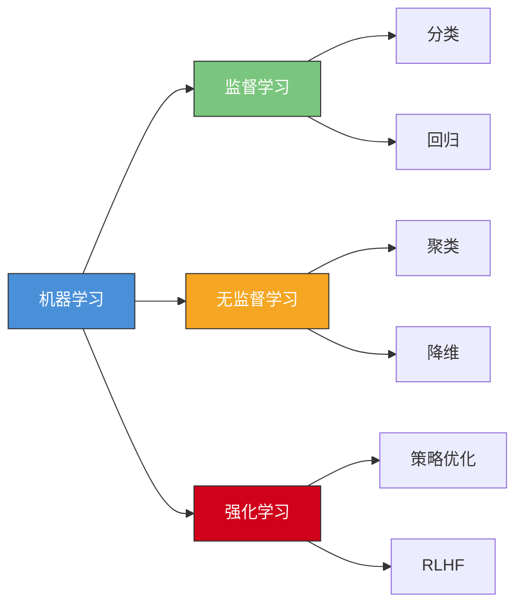
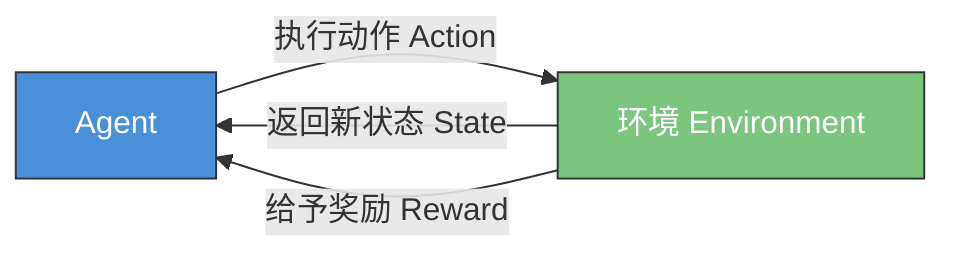
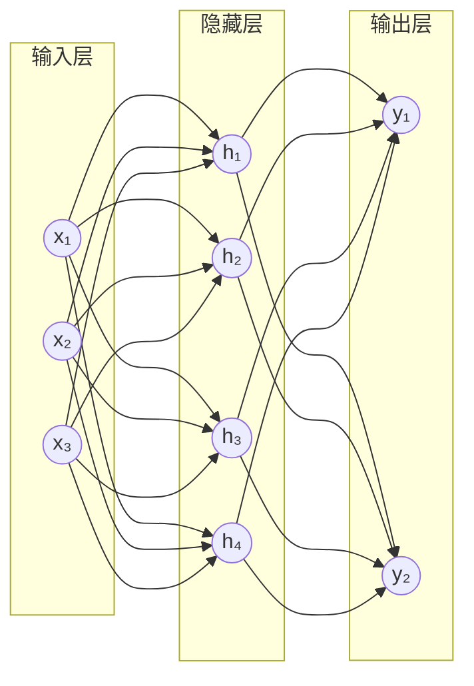
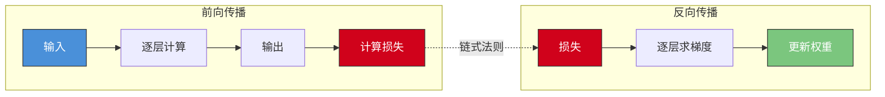
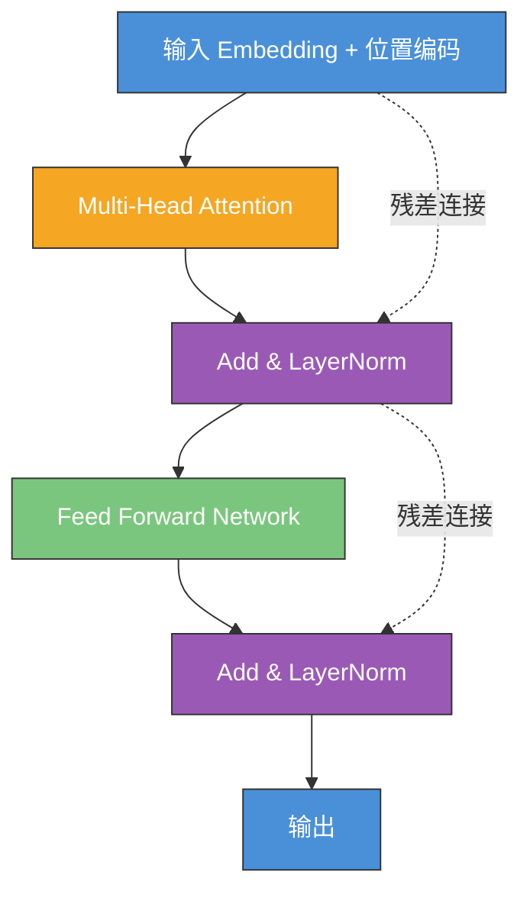
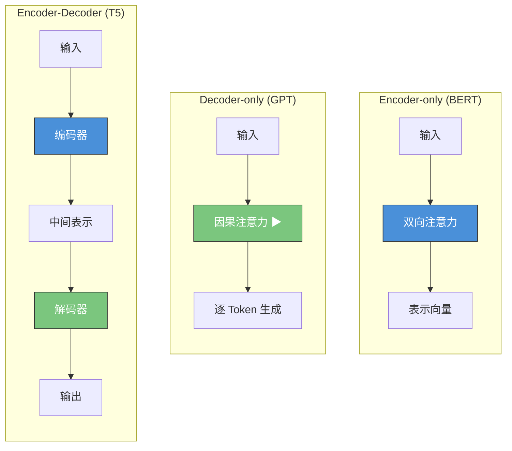
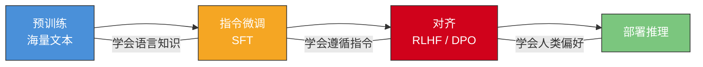
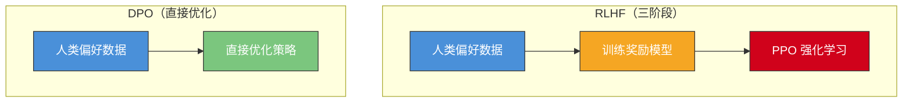
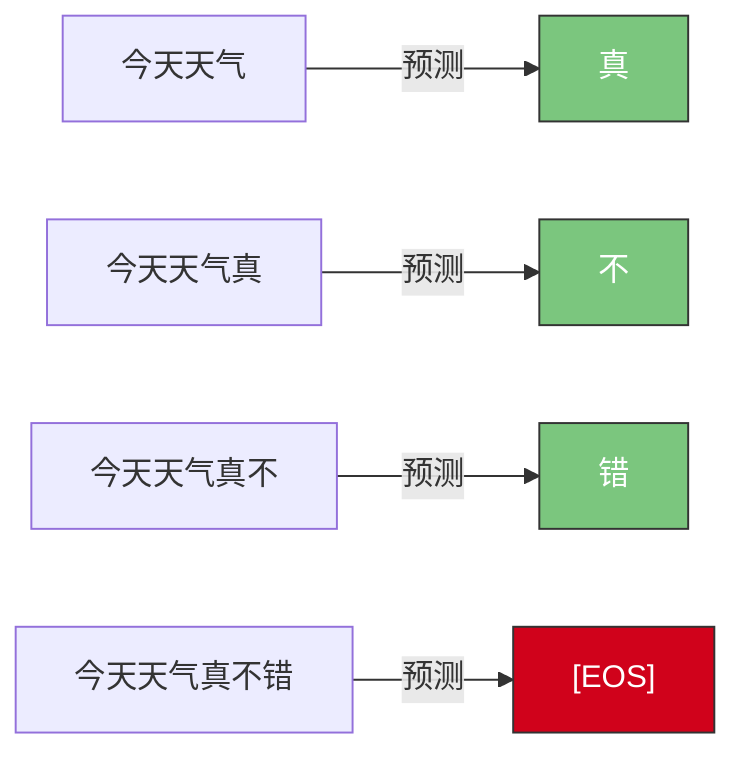

# AI/ML 基础

> 理解大语言模型背后的核心原理

## 学习目标

- 理解机器学习三大范式
- 掌握 Transformer 架构核心机制
- 了解 LLM 的训练与推理过程

---

## 1. 机器学习基础

机器学习是让计算机从数据中自动学习规律的技术，无需显式编程。根据学习方式的不同，分为三大范式。



### 1.1 监督学习

监督学习使用带标签的数据进行训练，模型学习输入到输出的映射关系。

**分类与回归**：

```
分类：输入 → 离散标签    （如：邮件 → 垃圾/正常）
回归：输入 → 连续数值    （如：房屋特征 → 价格）
```

**损失函数**衡量预测值与真实值的差距：

```python
# 均方误差（回归）
MSE = (1/n) * Σ(y_pred - y_true)²

# 交叉熵（分类）
CrossEntropy = -Σ y_true * log(y_pred)
```

**梯度下降**是最核心的优化算法——沿着损失函数梯度的反方向更新参数：

```python
# 梯度下降伪代码
for epoch in range(num_epochs):
    loss = compute_loss(model(X), y)
    gradients = compute_gradients(loss, parameters)
    parameters = parameters - learning_rate * gradients
```

### 1.2 无监督学习

无监督学习处理无标签数据，发现数据中的隐藏结构。

| 任务 | 目标 | 典型算法 |
|------|------|----------|
| 聚类 | 将相似数据分组 | K-Means, DBSCAN |
| 降维 | 压缩数据维度 | PCA, t-SNE, UMAP |
| 异常检测 | 识别异常样本 | Isolation Forest |

> 💡 Embedding（嵌入）本质上就是一种降维——将高维离散数据映射到低维连续向量空间，这是 LLM 和 RAG 的基础。

### 1.3 强化学习

强化学习通过 Agent 与环境交互，根据奖励信号学习最优策略。



**关键概念**：

- **策略（Policy）**：Agent 在给定状态下选择动作的规则
- **奖励（Reward）**：环境对动作的反馈信号
- **RLHF（人类反馈强化学习）**：用人类偏好作为奖励信号来对齐 LLM，是 ChatGPT 成功的关键技术之一

---

## 2. 神经网络基础

### 2.1 前馈神经网络

神经网络由多层神经元组成，每个神经元执行：加权求和 → 激活函数 → 输出。



**激活函数**引入非线性，使网络能拟合复杂模式：

```python
# ReLU：最常用，计算高效
ReLU(x) = max(0, x)

# GELU：Transformer 中广泛使用
GELU(x) = x * Φ(x)  # Φ 为标准正态分布的累积分布函数

# Softmax：将输出转为概率分布（用于分类/Token 预测）
Softmax(x_i) = exp(x_i) / Σ exp(x_j)
```

### 2.2 反向传播

反向传播是训练神经网络的核心算法：从输出层向输入层逐层计算梯度，然后更新权重。



**常见优化器**：

| 优化器 | 特点 |
|--------|------|
| SGD | 基础，需手动调学习率 |
| Adam | 自适应学习率，最常用 |
| AdamW | Adam + 权重衰减，Transformer 训练标配 |

### 2.3 常见架构

| 架构 | 特点 | 应用 |
|------|------|------|
| CNN | 卷积核提取局部特征 | 图像识别、视觉模型 |
| RNN/LSTM | 循环结构处理序列 | 早期 NLP（已被 Transformer 取代） |
| Seq2Seq | 编码器-解码器结构 | 机器翻译（Transformer 的前身） |

> 💡 Transformer 的出现彻底改变了 NLP 领域——它用 Attention 机制替代了 RNN 的循环结构，实现了并行计算，成为现代 LLM 的基石。

---

## 3. Transformer 架构

2017 年 Google 发表的 "Attention Is All You Need" 提出了 Transformer，奠定了现代 LLM 的基础。



> 上图为单个 Transformer Block 的结构，实际模型由多个 Block 堆叠而成（如 GPT-4 约 120 层）。

### 3.1 Self-Attention 机制

Self-Attention 让模型在处理每个 Token 时能"关注"序列中的所有其他 Token，捕获长距离依赖。

**Q/K/V（查询/键/值）**：

```
输入序列 X
  → Q = X · W_Q  （查询：我在找什么？）
  → K = X · W_K  （键：我有什么信息？）
  → V = X · W_V  （值：我的实际内容）

Attention(Q, K, V) = Softmax(Q · K^T / √d_k) · V
```

- `Q · K^T`：计算每对 Token 之间的相关性分数
- `√d_k`：缩放因子，防止点积过大导致梯度消失
- `Softmax`：将分数归一化为注意力权重
- 乘以 `V`：按权重聚合信息

**多头注意力（Multi-Head Attention）**：

```
MultiHead(Q, K, V) = Concat(head_1, ..., head_h) · W_O

每个 head_i = Attention(Q·W_Qi, K·W_Ki, V·W_Vi)
```

多个注意力头让模型从不同子空间捕获不同类型的关系（如语法关系、语义关系等）。

### 3.2 位置编码

Transformer 没有循环结构，需要额外注入位置信息。

| 编码方式 | 原理 | 使用模型 |
|----------|------|----------|
| 正弦编码 | 用不同频率的正弦/余弦函数 | 原始 Transformer |
| RoPE | 旋转位置编码，将位置信息融入 Q/K | LLaMA, Qwen, DeepSeek |
| ALiBi | 在注意力分数上加线性偏置 | BLOOM, MPT |

> 💡 RoPE 是目前最主流的位置编码方案，支持通过 NTK-aware 插值等技术扩展上下文长度。

### 3.3 编码器-解码器结构

Transformer 衍生出三种主要架构：



| 架构 | 代表模型 | 适用任务 |
|------|----------|----------|
| Encoder-only | BERT, RoBERTa | 文本分类、NER、Embedding |
| Decoder-only | GPT-4o, Claude, LLaMA, Qwen, DeepSeek | 文本生成、对话、代码 |
| Encoder-Decoder | T5, BART | 翻译、摘要 |

> 💡 当前主流 LLM 几乎都采用 Decoder-only 架构，因为它在自回归生成任务上表现最好，且更容易通过 Scaling 提升性能。

### 3.4 关键改进

**Layer Normalization**：

```
LayerNorm(x) = γ · (x - μ) / √(σ² + ε) + β
```

稳定训练过程，现代模型多用 Pre-Norm（先归一化再计算）而非原始的 Post-Norm。RMSNorm 是更高效的变体，被 LLaMA 等模型采用。

**残差连接**：

```
output = LayerNorm(x + SubLayer(x))
```

让梯度直接流过跳跃连接，解决深层网络的梯度消失问题。

**KV Cache**：

推理时缓存已计算的 Key 和 Value，避免重复计算：

```
无 KV Cache：每生成一个 Token，重新计算所有 Token 的 K/V
有 KV Cache：只计算新 Token 的 Q，复用之前的 K/V

效果：推理速度大幅提升，但显存占用增加
```

---

## 4. 大语言模型（LLM）



### 4.1 预训练

LLM 的预训练目标是**自回归语言建模**——给定前面的 Token，预测下一个 Token：

```
P(token_n | token_1, token_2, ..., token_{n-1})
```

**训练数据**：

- 规模：数万亿 Token（Common Crawl、Wikipedia、书籍、代码等）
- 质量：数据清洗和去重至关重要
- 多语言：中英文混合训练提升跨语言能力

**Scaling Laws**（Chinchilla 定律）：

```
模型性能 ≈ f(模型参数量 N, 训练数据量 D, 计算量 C)

经验法则：训练 Token 数 ≈ 20 × 模型参数量
例：7B 模型 → 约需 140B Token 训练数据
```

> 💡 Scaling Laws 表明：在固定计算预算下，模型大小和数据量需要均衡增长，而非一味增大模型。

### 4.2 指令微调（Instruction Tuning）

预训练后的模型只会"续写"，需要通过指令微调让它学会"遵循指令"。

**SFT（Supervised Fine-Tuning）**：

```json
{
  "instruction": "将以下英文翻译成中文",
  "input": "Large Language Models are transforming AI applications.",
  "output": "大语言模型正在变革 AI 应用。"
}
```

**指令数据集构建**：

- 人工标注：质量高但成本大
- Self-Instruct：用强模型生成指令数据
- Evol-Instruct：逐步增加指令复杂度（WizardLM 方法）

### 4.3 RLHF / DPO

让模型输出更符合人类偏好。



**RLHF（人类反馈强化学习）**：

```
1. 收集人类偏好数据：对同一 Prompt 的多个回答排序
2. 训练奖励模型（Reward Model）：学习人类偏好
3. PPO 优化：用奖励模型的分数作为强化学习的奖励信号
```

**DPO（直接偏好优化）**：

```
跳过奖励模型，直接从偏好数据优化策略：
Loss = -log σ(β · (log π(y_w|x)/π_ref(y_w|x) - log π(y_l|x)/π_ref(y_l|x)))

y_w = 人类偏好的回答（winner）
y_l = 人类不偏好的回答（loser）
```

> 💡 DPO 比 RLHF 更简单稳定，已成为主流对齐方法。DeepSeek、Qwen 等模型均采用 DPO 或其变体。

### 4.4 Tokenization

LLM 不直接处理文本，而是先将文本切分为 Token（子词单元）。

**BPE（Byte Pair Encoding）**：

```
原始文本: "lower"
字符级:   ['l', 'o', 'w', 'e', 'r']
BPE 合并: ['low', 'er']  （高频字符对逐步合并）
```

**常见 Tokenizer**：

| Tokenizer | 使用模型 | 词表大小 |
|-----------|----------|----------|
| tiktoken (BPE) | GPT-4o | ~200K |
| SentencePiece | LLaMA, Qwen | 32K~152K |

**Token 与成本的关系**：

```python
# 粗略估算
1 个英文单词 ≈ 1-2 个 Token
1 个中文字   ≈ 1-2 个 Token

# API 计费示例（以 GPT-4o 为例）
输入: $2.50 / 1M Token
输出: $10.00 / 1M Token

# 一次对话成本估算
输入 1000 Token + 输出 500 Token ≈ $0.0025 + $0.005 = $0.0075
```

---

## 5. 推理过程

### 5.1 自回归生成

LLM 逐个 Token 生成文本，每次将已生成的序列作为输入预测下一个 Token：



**KV Cache 加速**：

```
Step 1: 计算 "今天天气" 的 K/V → 缓存
Step 2: 只计算 "真" 的 Q，复用缓存的 K/V → 追加缓存
Step 3: 只计算 "不" 的 Q，复用缓存的 K/V → 追加缓存
...
```

### 5.2 采样策略

模型输出的是每个 Token 的概率分布，采样策略决定如何从中选择：

| 策略 | 说明 | 效果 |
|------|------|------|
| Temperature | 控制概率分布的"锐度" | 低值(0.1)→确定性高；高值(1.5)→更随机 |
| Top-p (Nucleus) | 只从累积概率达到 p 的 Token 中采样 | p=0.9 → 排除低概率长尾 |
| Top-k | 只从概率最高的 k 个 Token 中采样 | k=50 → 限制候选范围 |
| Greedy | 始终选概率最高的 Token | 确定性输出，但可能重复 |
| Beam Search | 维护多个候选序列，选全局最优 | 翻译等任务常用 |

```python
# 实际使用建议
# 创意写作
{"temperature": 0.9, "top_p": 0.95}

# 代码生成
{"temperature": 0.2, "top_p": 0.9}

# 数据提取/分类
{"temperature": 0.0}  # 等价于 Greedy
```

### 5.3 上下文窗口

上下文窗口是模型单次能处理的最大 Token 数，包括输入和输出。

| 模型 | 上下文长度 |
|------|-----------|
| GPT-4o | 128K |
| Claude 3.5 Sonnet | 200K |
| Gemini 1.5 Pro | 2M |
| DeepSeek-V3 | 128K |
| Qwen2.5 | 128K |

**长文本处理策略**：

- **滑动窗口**：将长文本分段处理，保留重叠部分
- **RAG**：检索相关片段而非塞入全部内容（详见 [RAG 章节](../02-core-tech/03-rag.md)）
- **摘要压缩**：先对长文本生成摘要，再基于摘要回答
- **长上下文模型**：直接使用支持超长上下文的模型

> 💡 虽然模型支持的上下文越来越长，但"大海捞针"测试表明，信息在上下文中间位置时检索效果会下降。合理使用 RAG 仍然是处理大量文档的最佳实践。

---

## 练习

1. 手绘 Transformer 架构图并标注各组件（Self-Attention、FFN、LayerNorm、残差连接）
2. 使用 OpenAI API 对比不同 Temperature 值（0.0 / 0.7 / 1.5）对生成结果的影响
3. 使用 `tiktoken` 库计算一段中英文混合文本的 Token 数量，并估算 API 调用成本

```python
import tiktoken

enc = tiktoken.encoding_for_model("gpt-4o")
text = "大语言模型 (LLM) 正在改变软件开发的方式。"
tokens = enc.encode(text)
print(f"Token 数量: {len(tokens)}")
print(f"Token 列表: {tokens}")
print(f"解码验证: {[enc.decode([t]) for t in tokens]}")
```

## 延伸阅读

- [Attention Is All You Need](https://arxiv.org/abs/1706.03762) — Transformer 原始论文
- [The Illustrated Transformer](https://jalammar.github.io/illustrated-transformer/) — 可视化讲解 Transformer
- [nanoGPT](https://github.com/karpathy/nanoGPT) — Karpathy 的极简 GPT 实现
- [Scaling Laws for Neural Language Models](https://arxiv.org/abs/2001.08361) — Scaling Laws 论文
- [Training Compute-Optimal Large Language Models](https://arxiv.org/abs/2203.15556) — Chinchilla 论文
- [Direct Preference Optimization](https://arxiv.org/abs/2305.18290) — DPO 论文
