# Prompt Engineering

> 与大语言模型高效沟通的核心技能

## 学习目标

- 理解提示词的组成要素与基本原则
- 掌握从零样本到思维链等主流提示技术
- 了解自动提示工程等进阶方法
- 建立提示词版本管理与评估流程

---

## 1. 什么是提示工程

**提示工程（Prompt Engineering）** 是一门关注提示词开发和优化的学科，帮助用户将大模型高效应用于各种场景——从问答、翻译到复杂推理。

所谓 **提示词（Prompt）**，就是我们给大模型下发的指令。提示词写得越好，模型输出就越准确。一个提示词通常由以下要素组成：

| 要素 | 说明 | 是否必须 |
|------|------|----------|
| **指令（Instruction）** | 描述要执行的任务 | 推荐 |
| **上下文（Context）** | 提供额外背景信息，引导模型更好地响应 | 可选 |
| **输入数据（Input Data）** | 用户输入的内容或问题 | 视任务而定 |
| **输出指示（Output Indicator）** | 指定输出的类型或格式 | 可选 |

一个简单的翻译示例，只包含指令和输入数据：

```text
Translate this into Simplified Chinese:

The OpenAI API can be applied to virtually any task that involves understanding or generating natural language, code, or images.
```

一个知识库问答示例，包含指令、上下文和输入数据：

```text
你是一个知识库助手，你将根据我提供的知识库内容来回答问题。

已知有知识库内容如下：
1. 小明家有一条宠物狗，叫毛毛，这是他爸从北京带回来的。
2. 小红家也有一条宠物狗，叫大白，非常听话。
3. 小红的好朋友叫小明，他们是同班同学。

请根据知识库回答以下问题：小明家的宠物狗叫什么名字？
```

对于简单任务，提示工程的作用不太明显。但面对复杂推理、算术计算，或需要克服幻觉等局限性时，不同的提示技术可以大幅改善输出效果。

---

## 2. 基本原则

提示工程是一门经验科学，提示词的细微差别可能导致截然不同的输出。以下是编写提示词时应遵守的通用原则。

### 2.1 从简单开始，迭代优化

设计提示词是一个迭代过程。从简单的提示词开始，逐步添加元素和上下文，观察效果变化，并对提示词进行版本控制。

推荐路径：零样本提示 → 少样本提示 → Fine-tuning

面对复杂大任务时，将其分解为更简单的子任务，为每个子任务构建独立的提示词。

### 2.2 指令清晰，使用分隔符

将指令放在提示的开头，使用 `###`、`"""`、`'''` 等分隔符来区分指令和上下文：

```text
总结下面的文本内容，将其中的要点以列表形式展示出来。

文本内容："""
{text input here}
"""
```

### 2.3 具体明确，避免模糊

确保提示词明确（Be specific）、具体（Descriptive）、尽可能详细（As detailed as possible）。

❌ 反例：
```text
写一首关于 OpenAI 的诗
```

✅ 改进：
```text
写一首鼓舞人心的关于 OpenAI 的短诗，聚焦最近的 DALL-E 产品发布，风格类似于莎士比亚。
```

❌ 反例：
```text
对该产品进行描述，描述应该相当简短，只有几句话，不能过多。
```

✅ 改进：
```text
使用 3 到 5 句话描述该产品。
```

### 2.4 通过示例明确输出格式

对输出格式有要求时，直接提供示例：

```text
提取下面文本中的公司名称和成立时间。

以 JSON 格式输出：
[
    { "name": "XXX", "establish_time": "XXX" },
    { "name": "YYY", "establish_time": "YYY" }
]

文本内容："""
{text input here}
"""
```

### 2.5 说要做什么，而非不做什么

❌ 反例：
```text
下面是客户和代理商之间的对话。不要问客户的用户名和密码。不要重复回复的内容。

客户：我登录不了我的账号
代理商：
```

✅ 改进：
```text
下面是客户和代理商之间的对话。代理商将尝试诊断问题并给出解决方案，
同时避免询问客户的个人信息（如用户名和密码），
当涉及到这些信息时，建议用户访问帮助文档：www.example.com/help/faq

客户：我登录不了我的账号
代理商：
```

### 2.6 角色扮演（Role Prompting）

在提示词中明确模型的身份和行为方式：

```text
我希望你扮演面试官的角色。我会充当一名 Java 开发工程师的候选人，
然后你要问我关于这个职位的面试问题。你要像面试官一样说话。
不要一次写下所有的对话，不要写解释，像面试官一样一个接一个地问我问题，
然后等待我的答复。我的第一句话是 "你好"。
```

---

## 3. 提示词框架

除了基本的四要素框架，还有一些结构化框架帮助编写高质量提示词。

### 3.1 CRISPE 框架

由 Matt Nigh 提出，适合构建复杂的角色型提示词：

| 字母 | 含义 | 说明 |
|------|------|------|
| CR | Capacity and Role | 你希望模型扮演怎样的角色 |
| I | Insight | 背景信息和上下文 |
| S | Statement | 你希望模型做什么 |
| P | Personality | 以什么风格或方式回答 |
| E | Experiment | 要求提供多个答案 |

### 3.2 结构化提示词模板

来自 LangGPT 项目的结构化模板：

```markdown
# Role: Your_Role_Name

## Profile
- Author: YZFly
- Version: 0.1
- Language: 中文
- Description: 角色概述和技能描述

### Skill 1
1. xxx
2. xxx

## Rules
1. Don't break character under any circumstance.
2. Don't talk nonsense and make up facts.

## Workflow
1. First, xxx
2. Then, xxx
3. Finally, xxx

## Initialization
As a/an <Role>, you must follow the <Rules>, you must talk to user in default <Language>.
Then introduce yourself and introduce the <Workflow>.
```

---

## 4. 核心提示技术

### 4.1 零样本提示（Zero-shot Prompting）

直接向模型输入任务，不提供任何示例：

```text
文本：今天的天气真不错！
情感分类：
```

模型可能输出 `积极`，也可能附带冗长的解释。当输出不符合预期时，可以切换到少样本提示。

### 4.2 少样本提示（Few-shot Prompting）

通过提供输入-输出示例，引导模型理解任务意图和输出格式：

```text
文本：这是我读过最精彩的一本小说！
情感分类：积极

文本：这部电影内容一般般啊！
情感分类：消极

文本：这是一部关于友谊的电影。
情感分类：中性

文本：今天的天气真不错！
情感分类：
```

少样本提示利用了大模型的 **上下文学习（In-context Learning）** 能力——模型可以从少量示例中学习新任务，无需参数更新。

**示例选择的注意事项：**

- 保持示例数据的多样化
- 选择与测试样本相关的示例
- 以随机顺序排列示例
- 注意标签分布平衡，避免多数标签偏差
- 注意近因效应偏差（模型倾向于重复末尾标签）

> 研究表明，提示词的格式、示例的选择以及示例的顺序都可能导致截然不同的性能表现。

### 4.3 指令提示（Instruction Prompting）

直接用自然语言告诉模型你的意图，而非仅靠示例暗示：

```text
对下面的文本进行情感分类，分类结果可以是"积极"、"消极"或"中性"。

文本：今天的天气真不错！
情感分类：
```

能理解指令的模型称为 **指令模型（Instructed LM）**，通过 **指令微调（Instruction Tuning）** 训练而成。代表性模型包括：

| 模型 | 机构 | 特点 |
|------|------|------|
| FLAN | Google | 首次提出指令微调 |
| T0 | BigScience | 更丰富多样的指令数据集 |
| InstructGPT | OpenAI | 基于真实用户问题 + RLHF |
| TK-Instruct | AllenAI | 大规模开源指令集 |

指令提示和少样本提示可以组合使用，在提示词中同时包含指令和不同任务的示例，可以显著提高零样本任务泛化性能。

### 4.4 思维链（Chain-of-Thought, CoT）

由 Jason Wei 等人于 2022 年提出。传统少样本提示在算术、常识、符号推理等任务上效果有限，思维链通过展示中间推理步骤来激发模型的推理能力。

下图展示了标准提示与思维链提示的对比——左边直接给出答案（结果错误），右边给出推理过程（结果正确）：

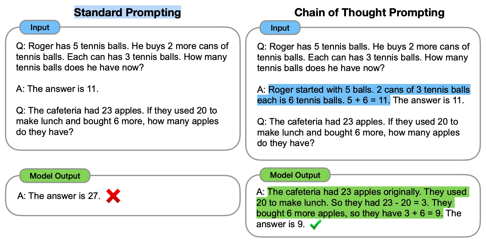

**少样本思维链（Few-Shot CoT）** 的关键：不是直接给出答案，而是给出推理过程，模型会模仿这种推理方式。

**零样本思维链（Zero-Shot CoT）**：

由 Takeshi Kojima 等人提出，不需要提供推理示例，只需在提示词末尾加上一句魔法咒语：

```text
问：食堂有 23 个苹果，用掉 20 个后又买了 6 个，现在有多少个苹果？

让我们逐步思考。
```

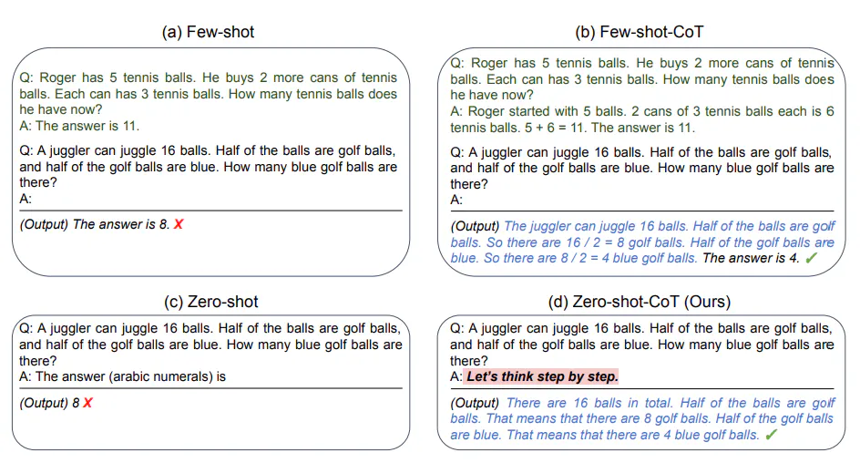

论文中尝试了多种不同的提示词，最终发现 **"Let's think step by step."** 效果最好：

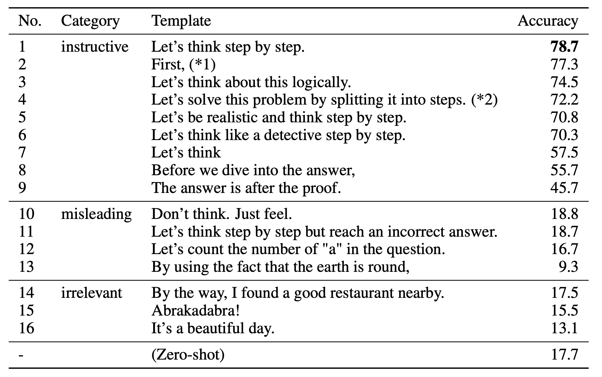

> 注意：思维链能力只在足够大的模型（≥100B 参数）上才会涌现，在较小模型上可能适得其反。零样本 CoT 通常不如少样本 CoT 有效，只有在缺少示例数据时才建议使用。

### 4.5 自我一致性（Self-Consistency）

由 Xuezhi Wang 等人提出，是对思维链的改进。核心思想：多次执行 CoT 得到多个推理路径，然后投票选择最一致的答案。

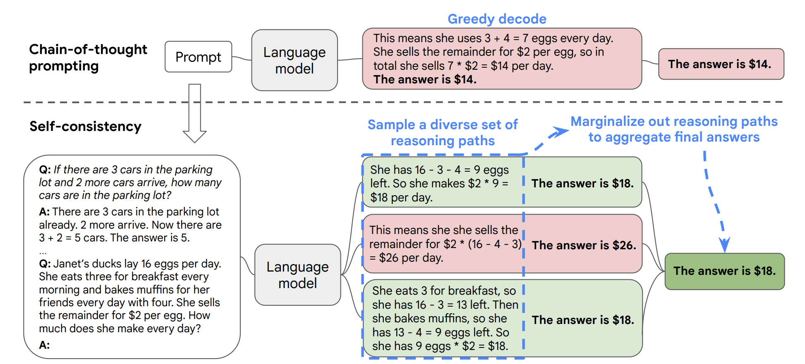

**三个步骤：**

1. 构造 CoT 示例数据
2. 通过大模型生成多个不同的推理路径（建议温度值设为 0.5）
3. 使用多数投票选出最一致的答案

实践建议：
- 采样 5 次以上通常就能超过普通 CoT
- 温度值过小导致答案雷同，过大导致答案发散

### 4.6 最少到最多提示（Least-to-Most Prompting）

由 Denny Zhou 等人提出，解决 CoT 泛化能力不足的问题。

其灵感来自零样本 CoT 论文中提出的两阶段推理设想——先拆分问题再汇总答案：

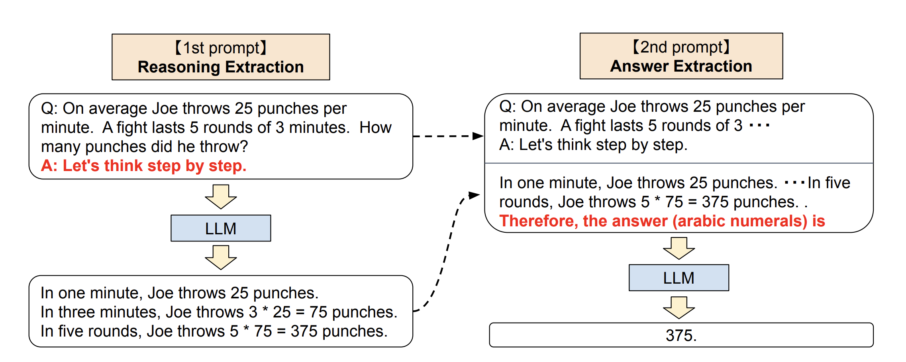

LtM 采用分治思想，让大模型自己找到解决当前问题的思维链：

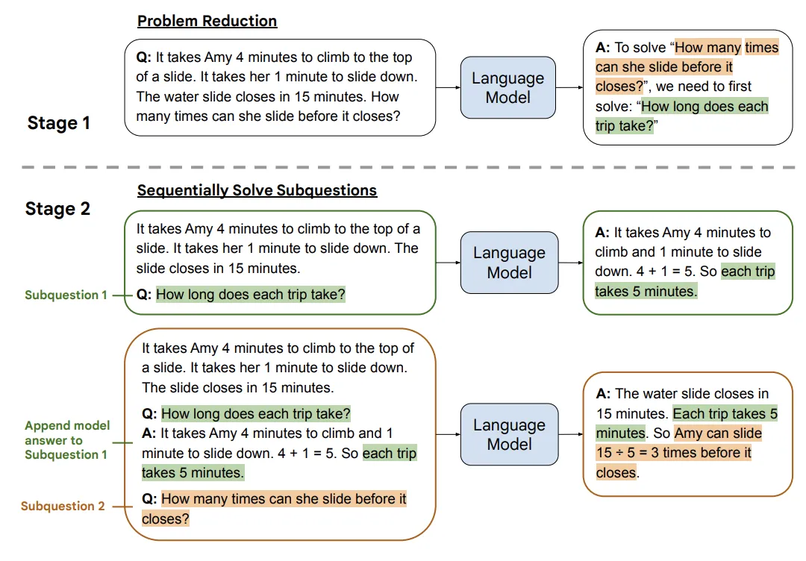

1. **问题拆解（Problem Reducing）**：自上而下分解问题，引导模型把问题拆分成子问题
2. **子问题有序解答（Sequentially Solve Subquestions）**：自下而上依次解决，将前一个子问题的答案作为下一个的上下文，循序渐进直到最终答案

相比自我一致性的"大力出奇迹"，LtM 更优雅——问题由少变多，这也是 Least-to-Most 一词的来源。

### 4.7 思维树（Tree of Thoughts, ToT）

由 Shunyu Yao 等人于 2023 年提出。传统 CoT 是"一条路走到黑"，ToT 则将问题解决视为树搜索，允许探索多个推理分支并回溯：

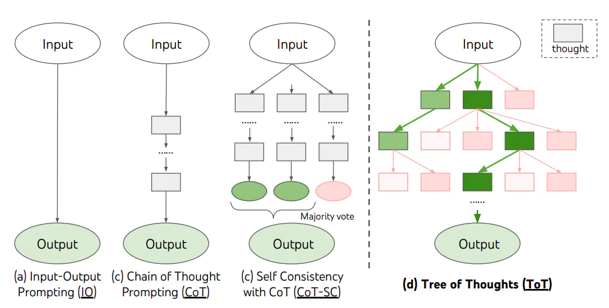

**四个核心过程：**

| 过程 | 说明 |
|------|------|
| 思考分解 | 将推理过程分解为多个想法步骤 |
| 想法生成 | 根据当前状态生成候选想法（Sample 或 Propose 策略） |
| 状态评估 | 评估各状态对解决问题的帮助程度 |
| 搜索算法 | BFS（保留最优 K 个状态）或 DFS（深度优先+回溯） |

ToT 的简化提示词版本（无需多次调用）：

```text
Imagine three different experts are answering this question.
All experts will write down 1 step of their thinking,
then share it with the group.
Then all experts will go on to the next step, etc.
If any expert realises they're wrong at any point then they leave.
The question is...
```

### 4.8 后退提示（Step-Back Prompting）

由 Google DeepMind 提出。灵感来自人类面对难题时"退一步思考"的习惯。

下图对比了思维链提示（左）与后退提示（右）在解决问题方法上的差异：

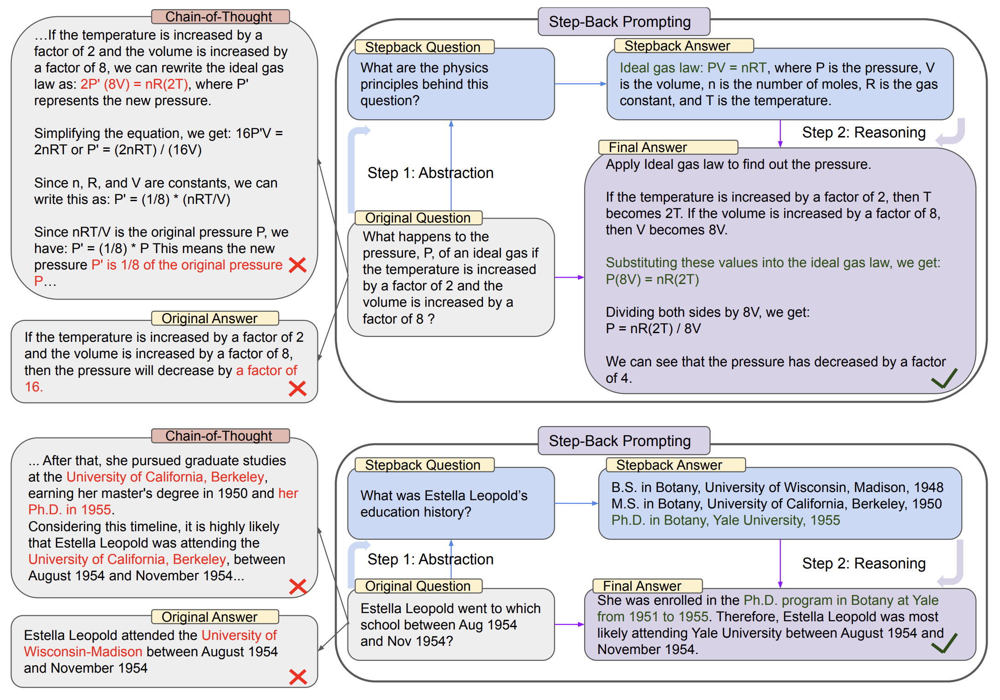

**两个步骤：**

1. **抽象（Abstraction）**：先提取问题涉及的基础原理和高级概念（如"解决这个任务涉及哪些物理原理？"）
2. **推理（Reasoning）**：基于这些原理进行问题解答

与 CoT 直接逐步推理不同，后退提示鼓励先理解问题本质，再进行推理，在 STEM、知识问答、多跳推理等任务中表现优异。

---

## 5. 进阶提示技术

### 5.1 检索增强生成（RAG）

大模型在处理知识密集型任务时存在局限性——知识更新不及时、生成虚假信息（幻觉）等。**检索增强生成（RAG，Retrieval Augmented Generation）** 通过引入外部知识来解决这些问题。

一个典型的 RAG 包含两个主要部分：

- **索引构建**：将数据切块后做向量表征存储，方便语义检索
- **检索和生成**：基于用户问题检索最相关的数据块，作为上下文让大模型生成回答

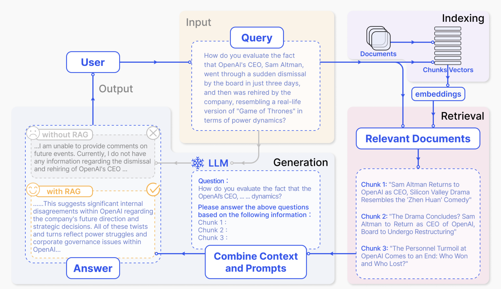

> RAG 是一个庞大的主题，本书在 [RAG 章节](../02-core-tech/04-rag.md) 中有更详细的介绍。

### 5.2 生成知识提示（Generated Knowledge Prompting）

不依赖外部知识库，而是让大模型自己生成知识，再用这些知识回答问题：

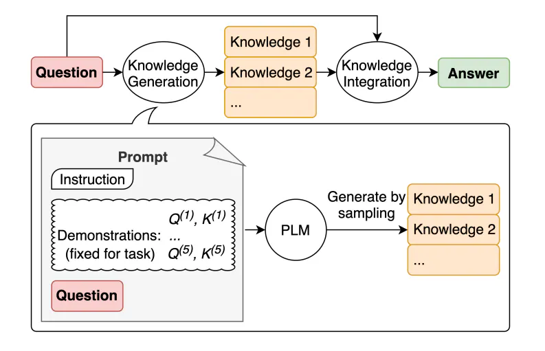

1. **知识生成**：提供少量示例，要求模型生成关于问题的一组事实
2. **知识集成**：将生成的知识作为上下文来回答用户问题

### 5.3 自动提示工程师（APE）

由 Yongchao Zhou 等人提出，目标是自动化生成和选择最优提示词。整个工作流分为推理、评分和采样三步，全部基于 LLM 实现：

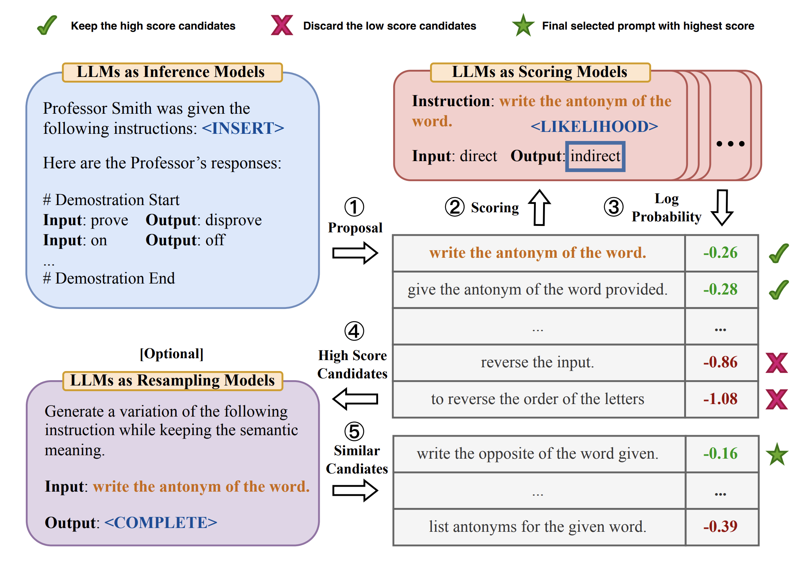

1. **推理（Inference）**：给定输入输出示例，让 LLM 生成候选指令
2. **评分（Scoring）**：用准确率等指标对候选指令打分
3. **采样（Resampling）**：通过蒙特卡洛搜索迭代优化最佳候选

有趣的是，APE 发现了一个比人工设计更好的零样本 CoT 提示：

> **"Let's work this out in a step by step way to be sure we have the right answer."**

该提示在 MultiArith 基准上获得了 82.0 的性能得分，优于经典的 "Let's think step by step"：

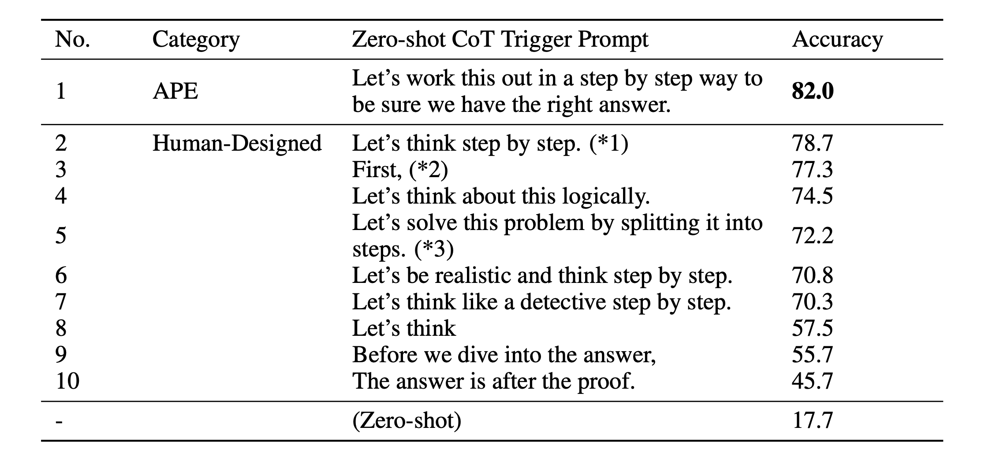

### 5.4 主动提示（Active Prompting）

借鉴主动学习思想，自动选择最有价值的示例数据：

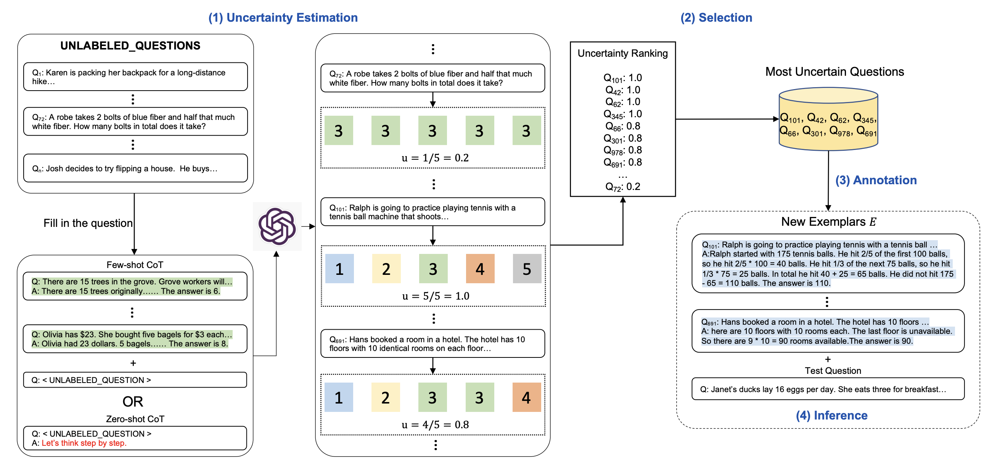

1. **不确定性评估（Uncertainty Estimation）**：对数据集中的问题重复请求 k 次，计算答案的不确定性
2. **选择（Selection）**：选择不确定性最高的问题
3. **标注（Annotation）**：人工标注这些问题的推理过程
4. **推理（Inference）**：使用标注结果作为 CoT 示例

### 5.5 定向刺激提示（Directional Stimulus Prompting）

通过训练一个小型策略模型（如 T5）生成关键词或提示信息，与用户输入组合后送入下游 LLM：

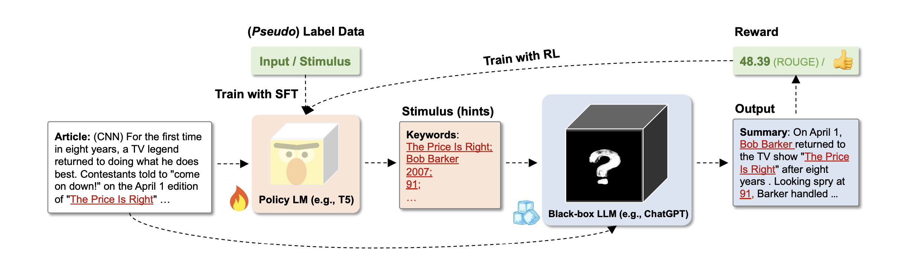

整个流程：
1. 通过人工标注数据训练出一个小型策略模型
2. 根据用户输入使用策略模型生成刺激（关键词等）
3. 将刺激与原始输入结合，作为下游 LLM 的输入
4. 生成结果可通过强化学习对策略模型再次训练

下图对比了普通提示和定向刺激提示在摘要任务中的差异：

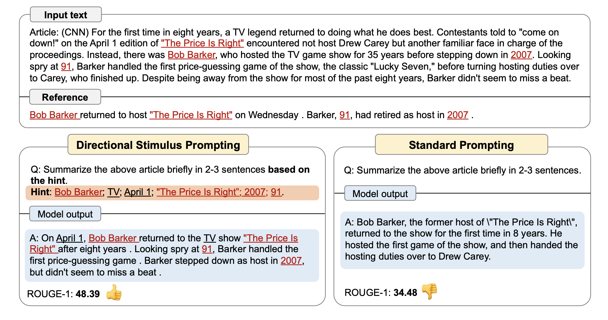

---

## 6. 系统提示词设计模式

### 6.1 角色扮演模式

```text
你是一位资深的 Python 后端工程师，擅长 FastAPI 和异步编程。
你的回答应该：
- 提供可运行的代码示例
- 遵循 PEP 8 规范
- 考虑性能和安全性
```

### 6.2 约束与防护

```text
## 规则
- 只回答与编程相关的问题
- 如果不确定答案，明确告知用户
- 不要编造不存在的 API 或库
- 涉及敏感信息时，使用占位符替代
```

### 6.3 多步骤任务编排

```text
请按以下步骤处理用户的代码审查请求：
1. 首先识别代码语言和框架
2. 检查是否存在安全漏洞
3. 评估代码可读性和规范性
4. 给出具体的改进建议和示例代码
```

---

## 7. 提示词模板化与版本管理

### 7.1 变量注入

使用模板引擎将动态内容注入提示词：

```python
from string import Template

prompt_template = Template("""
你是一个$role。请对以下内容进行$task：

内容：\"\"\"$content\"\"\"

输出格式：$format
""")

prompt = prompt_template.substitute(
    role="技术文档审校员",
    task="语法检查和优化",
    content=user_input,
    format="Markdown 列表"
)
```

### 7.2 版本管理

提示词应像代码一样进行版本控制：

```
prompts/
├── sentiment-classifier/
│   ├── v1.0.txt      # 初始版本：零样本
│   ├── v1.1.txt      # 添加少样本示例
│   ├── v2.0.txt      # 切换为 CoT
│   └── changelog.md  # 变更记录
```

每次修改记录：变更内容、测试结果、适用模型。

---

## 8. 调试与评估

### 8.1 常见陷阱

| 陷阱 | 表现 | 解决方案 |
|------|------|----------|
| 指令冲突 | 输出不稳定 | 精简指令，消除矛盾 |
| 上下文过长 | 遗忘早期信息 | 精简上下文，关键信息前置 |
| 格式不明确 | 输出格式随机 | 提供明确的输出示例 |
| 幻觉诱导 | 编造事实 | 要求引用来源，限定知识范围 |

### 8.2 调试方法

- **逐步简化**：从最简提示词开始，逐步添加元素定位问题
- **对比测试**：同一任务用不同提示词对比输出
- **温度调节**：降低温度获得更确定的输出，升高温度获得更多样的输出

### 8.3 评估维度

| 维度 | 说明 |
|------|------|
| 准确性 | 输出内容是否正确 |
| 相关性 | 是否切题回答了问题 |
| 格式合规 | 是否符合指定的输出格式 |
| 一致性 | 多次执行结果是否稳定 |
| 安全性 | 是否存在有害或不当内容 |

---

## 练习

1. 为一个客服场景设计完整的系统提示词，包含角色设定、行为约束和输出格式
2. 用 Few-shot CoT 技巧解决以下问题：*"一个水池有两个进水管和一个出水管，进水管每小时分别注入 3 吨和 5 吨水，出水管每小时排出 2 吨水，水池初始有 10 吨水，3 小时后水池有多少水？"*
3. 对比同一个翻译任务在零样本、少样本、指令提示三种方式下的输出质量差异

## 延伸阅读

- [OpenAI Prompt Engineering Guide](https://platform.openai.com/docs/guides/prompt-engineering)
- [Anthropic Prompt Engineering](https://docs.anthropic.com/en/docs/build-with-claude/prompt-engineering)
- [Prompt Engineering Guide](https://www.promptingguide.ai/zh)
- [Chain-of-Thought Prompting Elicits Reasoning in Large Language Models](https://arxiv.org/abs/2201.11903)
- [Tree of Thoughts: Deliberate Problem Solving with Large Language Models](https://arxiv.org/abs/2305.10601)
- [Self-Consistency Improves Chain of Thought Reasoning](https://arxiv.org/abs/2203.11171)
- [Large Language Models Are Human-Level Prompt Engineers (APE)](https://arxiv.org/abs/2211.01910)
