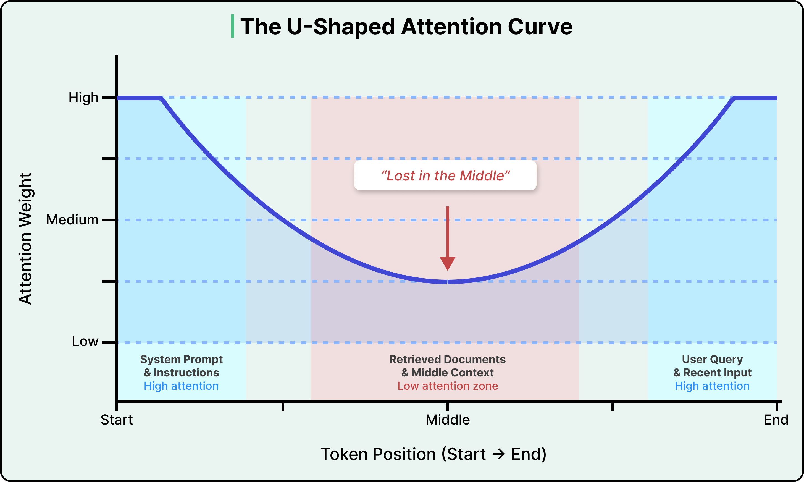
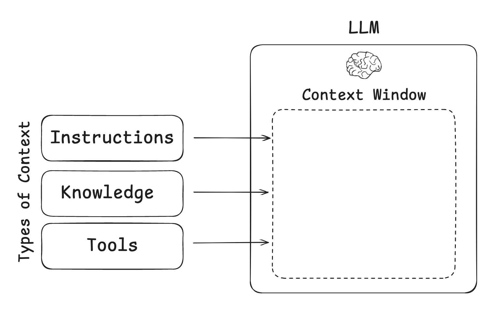
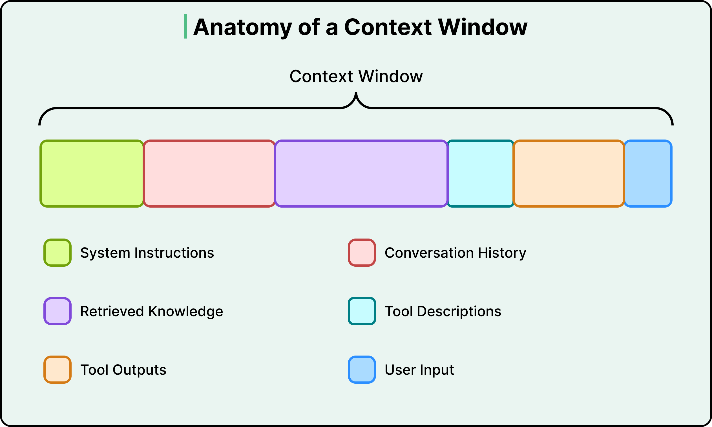
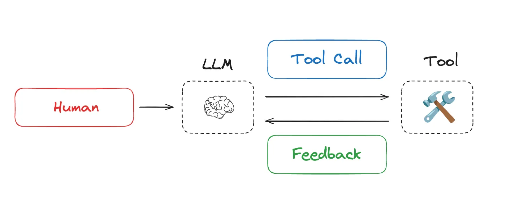
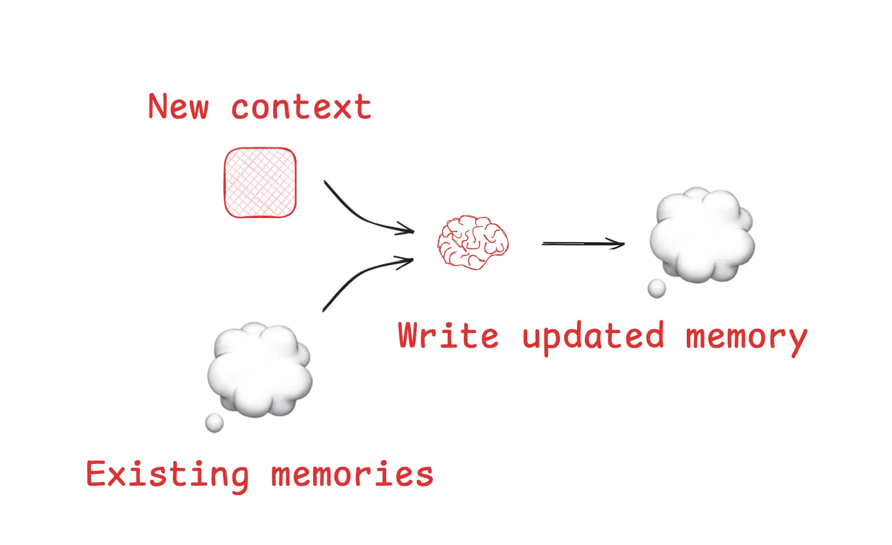
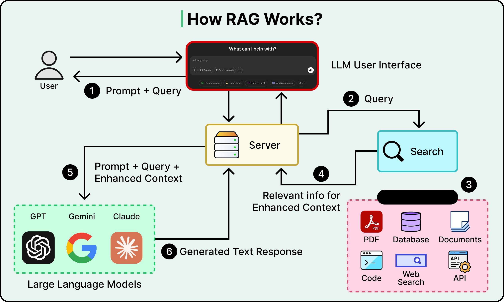
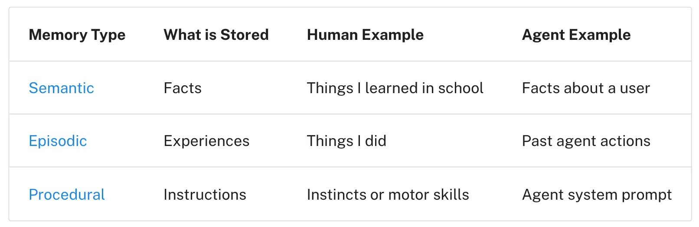
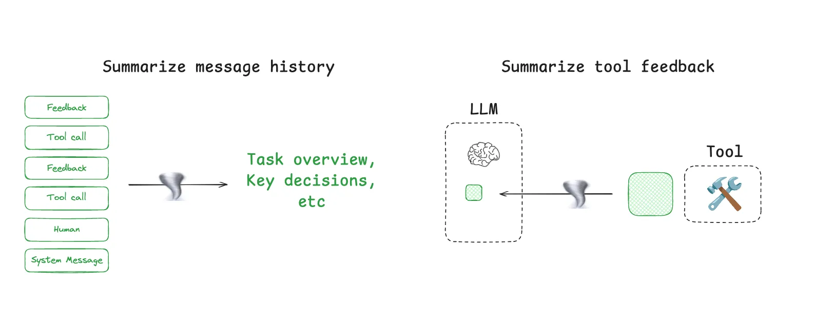
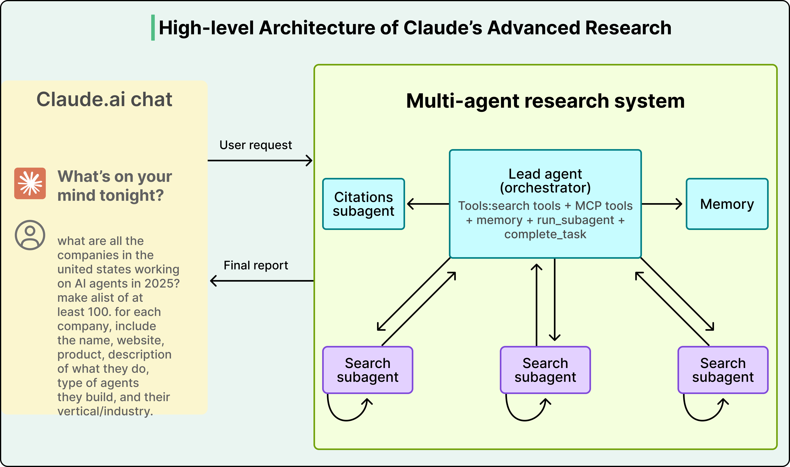
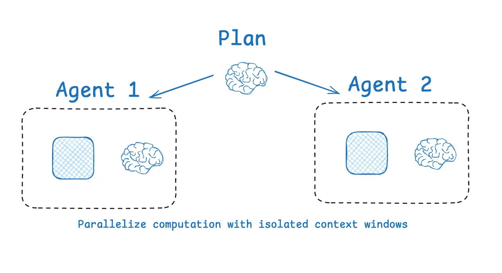

# Context Engineering

> 从 Prompt Engineering 到 Context Engineering——掌握 LLM 应用的信息架构设计

## 学习目标

- 理解 Context Engineering 与 Prompt Engineering 的本质区别
- 掌握上下文窗口的工作原理及其限制（注意力衰减、Context Rot）
- 学会四大核心策略：Write、Select、Compress、Isolate
- 能在 RAG、Agent 等实际项目中设计高效的上下文管理方案

---

## 1. 为什么需要 Context Engineering

### 1.1 从 Prompt Engineering 到 Context Engineering

Prompt Engineering 关注的是"怎么写指令"——措辞、格式、Few-shot 示例。但在真实的 AI 应用中，用户的问题往往只占上下文窗口的一小部分，真正决定模型表现的是**整个输入的信息组合**：

```
上下文窗口 = System Prompt + 对话历史 + 检索结果 + 工具描述 + 工具输出 + 用户问题
                                                                        ↑
                                                              用户问题只是冰山一角
```

简单说，**Prompt Engineering 是"手工制作每一个提示词"，而 Context Engineering 是"搭建一个能自动生成最优提示词的智能系统"。这就是从手动到自动化、从静态到动态、从单次任务到系统工程的进化。**

Andrej Karpathy 在 2025 年提出了一个精准的类比：

> "LLM 是 CPU，上下文窗口是 RAM，而你是操作系统。"
>
> Context Engineering 就是"在正确的时间，把正确的信息，以正确的格式，放进上下文窗口的艺术与科学。"

| 维度 | Prompt Engineering | Context Engineering |
|------|-------------------|-------------------|
| 关注点 | 怎么写指令 | 给模型看什么信息 |
| 范围 | System Prompt + 用户消息 | 全部输入：指令 + 知识 + 工具 + 历史 + 记忆 |
| 时机 | 静态，部署前设计好 | 动态，每次推理时实时组装 |
| 核心技能 | 措辞、格式、Few-shot、CoT | 信息筛选、窗口管理、压缩、隔离 |
| 适用场景 | 单次 LLM 调用 | RAG、Agent、多轮对话、长任务 |

### 1.2 更多信息 ≠ 更好结果

一个反直觉的事实：**给 LLM 更多信息可能让它变笨。**

Chroma 团队 2025 年的研究（[Context Rot](https://research.trychroma.com/context-rot)）测试了 18 个主流模型（GPT-4.1、Claude、Gemini 等），发现：

- **所有模型**的表现都随输入长度增加而下降
- 有些模型在 95% 准确率时突然暴跌到 60%
- 这种衰减不是线性的，而是不可预测的"悬崖式"下降

**为什么会这样？**

LLM 基于 Transformer 架构，其注意力机制让每个 Token 都要与所有其他 Token 计算关系（n² 复杂度）。随着输入增长：

1. **注意力稀释** — 每个 Token 分到的"注意力预算"减少
2. **Lost in the Middle** — 模型对输入开头和结尾的关注度远高于中间部分，中间位置的信息准确率可下降 30% 以上
3. **上下文污染** — 无关信息会干扰模型对关键信息的判断

下图展示了 LLM 的注意力分布曲线——开头和结尾是高注意力区，中间是"注意力低谷"：




> **核心原则：** Context Engineering 的目标不是塞满上下文窗口，而是找到**最小的高信号 Token 集合**，最大化期望输出的概率。

### 1.3 上下文的四种失败模式

当上下文管理不当时，会出现以下问题（来自 Drew Breunig 的总结）：

| 失败模式 | 说明 | 典型场景 |
|---------|------|---------|
| **Context Poisoning（中毒）** | 幻觉内容进入上下文，后续推理基于错误信息 | Agent 前一步生成了错误结论，后续步骤以此为前提 |
| **Context Distraction（分心）** | 过多上下文淹没了模型的训练知识 | 塞入大量文档后，模型反而忽略了自身已知的正确答案 |
| **Context Confusion（混淆）** | 无关上下文影响了模型的判断 | 检索到的文档主题相近但答案不同，模型无法分辨 |
| **Context Clash（冲突）** | 上下文中的信息相互矛盾 | System Prompt 说"简洁回答"，检索文档却包含大量细节 |

理解这些失败模式，才能有针对性地应用四大策略来防范。

---

## 2. 上下文的六大组成部分

LLM 应用中需要管理的上下文可以归为三大类：**指令（Instructions）、知识（Knowledge）、工具（Tools）**，它们共同竞争有限的上下文窗口空间：




展开来看，每次 LLM 调用时，上下文窗口中竞争空间的信息类型：

| 组成部分 | 说明 | 示例 |
|---------|------|------|
| **System Prompt** | 行为规则、角色定义、输出格式 | "你是一个专业的法律顾问..." |
| **用户输入** | 当前问题或指令 | "这份合同有什么风险？" |
| **对话历史** | 当前会话的多轮对话记录 | 之前 10 轮的问答 |
| **检索知识** | 从外部数据源检索的文档片段 | RAG 返回的 Top-5 文档块 |
| **工具描述** | Agent 可用工具的定义和参数 | search、calculator、database 等工具的 JSON Schema |
| **工具输出** | 之前工具调用的返回结果 | 搜索结果、SQL 查询结果、API 响应 |

用户的实际问题往往只占总 Token 的很小比例，**其余都是"基础设施"**——而 Context Engineering 就是设计这些基础设施的学问。

下图直观展示了一次典型 LLM 调用中，上下文窗口内各部分的组成：




---

## 3. 四大核心策略

Agent 在多轮交互中，工具调用的反馈不断累积，上下文窗口迅速膨胀——这正是需要 Context Engineering 的根本原因：




LangChain 和 Anthropic 将 Context Engineering 的实践归纳为四大策略：**Write（写入）、Select（选择）、Compress（压缩）、Isolate（隔离）**。


### 3.1 Write：将信息保存到上下文窗口之外

**解决的问题：** 上下文窗口有限，且 LLM 是无状态的（每次调用都从零开始）。

**Scratchpad（草稿本）**

Agent 在执行长任务时，将中间计划、笔记、关键发现写入外部存储，需要时再读回来。

```python
# Agent 将计划写入外部文件，避免上下文溢出时丢失
def save_to_scratchpad(agent_state: dict, key: str, content: str):
    """将关键信息持久化到草稿本"""
    agent_state["scratchpad"][key] = content

# 示例：Agent 在开始复杂任务时保存计划
save_to_scratchpad(state, "plan", """
1. 搜索相关文档
2. 提取关键信息
3. 交叉验证
4. 生成报告
""")
```

Anthropic 的多 Agent 研究系统就使用了这种模式：Lead Agent 在开始时将计划写入 Memory，因为一旦上下文超过 200K Token 就会被截断。

**Long-term Memory（长期记忆）**

跨会话持久化信息。ChatGPT 的记忆功能、Claude Code 的 `CLAUDE.md`、Cursor 的 Rules 文件都是这种模式——将用户偏好、项目规范等信息存储在外部，每次会话时注入。




### 3.2 Select：只拉取相关信息

**解决的问题：** 更多信息不等于更好结果，模型需要的是**正确的信息**而非全部信息。

**RAG（检索增强生成）**

这是最重要的 Select 策略——不把所有知识塞进上下文，而是根据当前问题动态检索最相关的文档片段：




```python
def select_context(query: str, knowledge_base, top_k: int = 5) -> list[str]:
    """从知识库中检索最相关的文档块"""
    # 1. 向量检索
    vector_results = knowledge_base.similarity_search(query, k=top_k * 2)
    # 2. Reranker 重排序，提高精度
    reranked = reranker.rerank(query, vector_results, top_k=top_k)
    return reranked
```

> **关键陷阱：** 如果检索精度不够，拉入"看起来相关但实际无关"的文档，反而会成为干扰项——消耗 Token 并把真正重要的信息推到低注意力区域。检索系统本身必须足够好，否则 RAG 会适得其反。

**工具选择**

当 Agent 有几十个工具时，把所有工具描述都塞进 Prompt 会浪费 Token 并导致模型困惑。更好的做法是根据当前任务动态选择相关工具：

```python
def select_tools(query: str, all_tools: list, max_tools: int = 5) -> list:
    """根据任务动态选择最相关的工具"""
    tool_descriptions = [t.description for t in all_tools]
    relevant = semantic_search(query, tool_descriptions, top_k=max_tools)
    return [all_tools[i] for i in relevant]
```

**Just-in-time 检索 vs 预加载**

Anthropic 在实践中发现，最有效的 Agent 往往采用**混合策略**：

- **预加载**：将少量关键信息（如 `CLAUDE.md` 规则文件）在每次会话开始时直接注入上下文
- **Just-in-time**：Agent 在运行过程中通过工具（如 `grep`、`search`、`database_query`）按需检索信息

这模拟了人类的认知方式——我们不会记住所有信息，而是记住"去哪里找"，然后按需检索。Claude Code 就是这种混合模式的典型：`CLAUDE.md` 预加载，代码文件通过 `glob` 和 `grep` 按需检索。

### 3.3 Compress：只保留必要的 Token

**解决的问题：** Context Rot 和长对话中不断累积的 Token 成本。

**对话摘要**

Agent 交互可能跨越数百轮，Token 不断累积。Claude Code 在上下文达到 95% 容量时自动触发 "auto-compact"，将整个交互历史压缩为摘要。压缩可以应用在两个地方：对消息历史做整体摘要，或对单次工具输出做压缩：




```python
def compress_history(messages: list[dict], max_tokens: int) -> list[dict]:
    """当对话历史过长时，压缩早期消息"""
    total_tokens = count_tokens(messages)
    if total_tokens <= max_tokens:
        return messages

    # 保留最近 5 条消息不压缩
    recent = messages[-5:]
    older = messages[:-5]

    # 用 LLM 摘要早期对话
    summary = llm.summarize(older, instruction="保留关键决策、未解决问题和重要发现")

    return [{"role": "system", "content": f"之前对话摘要：{summary}"}] + recent
```

**工具输出压缩**

搜索工具可能返回大量文本，但只有少部分与当前任务相关。在工具输出进入上下文前先做压缩：

```python
def compress_tool_output(tool_name: str, raw_output: str, query: str) -> str:
    """压缩工具输出，只保留与当前查询相关的部分"""
    if count_tokens(raw_output) < 500:
        return raw_output  # 短输出不需要压缩
    return llm.extract(raw_output, instruction=f"提取与'{query}'相关的关键信息，去除冗余")
```

> **压缩的风险：** 过度压缩可能丢失后续才会用到的关键细节。Cognition（Devin 的开发商）专门训练了一个模型来做摘要，说明这一步的质量至关重要。

### 3.4 Isolate：将上下文分割到不同空间

**解决的问题：** 太多类型的信息在同一个窗口中竞争注意力。

**多 Agent 架构**

将任务拆分给多个专门的 Agent，每个 Agent 有自己干净的上下文窗口：




```
Lead Agent（协调者）
├── Research Agent — 上下文：搜索工具 + 检索文档
├── Analysis Agent — 上下文：数据分析工具 + 数据集
└── Writer Agent   — 上下文：写作规范 + 大纲
```

Anthropic 的多 Agent 研究系统证明了这种方法的效果：多个 Agent 各自拥有独立上下文，在研究任务上比单 Agent 提升了 90.2%——**用的是同一系列模型，性能提升完全来自上下文管理**。




**State 隔离**

不一定需要多 Agent。通过设计 State Schema，将不同类型的信息存储在不同字段中，只在需要时暴露给 LLM：

```python
class AgentState:
    messages: list[dict]        # 暴露给 LLM 的对话
    scratchpad: dict            # 不直接暴露，Agent 主动读取
    tool_results_cache: dict    # 缓存工具结果，按需注入
    metadata: dict              # 内部追踪信息，不进入上下文
```

**沙箱隔离**

HuggingFace 的 Deep Researcher 展示了另一种隔离方式：Agent 生成代码在沙箱中执行，只将执行结果（而非完整的中间数据）传回 LLM。这对于处理大型数据对象（图片、音频、数据表）特别有效——数据留在沙箱环境中，LLM 只看到精炼的结果摘要。




---

## 4. 长任务的上下文管理

当任务跨越数十分钟甚至数小时（如大规模代码迁移、深度研究），上下文管理成为核心挑战。Anthropic 总结了三种关键技术：

### 4.1 Compaction（压实）

当对话接近上下文窗口上限时，将内容摘要后重新开始新的上下文窗口。Claude Code 的实现方式：

1. 将完整消息历史传给模型做摘要
2. 保留架构决策、未解决 Bug、实现细节
3. 丢弃冗余的工具输出和重复消息
4. 用压缩后的摘要 + 最近 5 个文件继续工作

### 4.2 Structured Note-taking（结构化笔记）

Agent 定期将关键信息写入外部持久化存储，后续需要时再读回来。就像人类做笔记一样——不是记住所有细节，而是记住"去哪里找"。

Claude 玩 Pokémon 的实验是一个生动的例子：Agent 在数千步游戏中维护精确的进度记录、地图笔记和战斗策略，即使上下文被重置，也能通过读取自己的笔记继续执行多小时的策略。

### 4.3 Sub-agent 架构

将大任务拆分给子 Agent，每个子 Agent 可能消耗数万 Token 进行深度探索，但只返回 1,000-2,000 Token 的精炼摘要给主 Agent。这实现了关注点分离——详细的搜索上下文隔离在子 Agent 内部，主 Agent 专注于综合分析。

---

## 5. 实战指南

### 5.1 System Prompt 设计原则

Anthropic 提出了"正确高度"（Right Altitude）的概念——在两个极端之间找到平衡：

| 极端 | 问题 |
|------|------|
| 过度具体（硬编码 if-else 逻辑） | 脆弱、难维护、无法处理边界情况 |
| 过度模糊（"做一个好助手"） | 模型缺乏具体指导，行为不可控 |

**最佳实践：**
- 用 XML 标签或 Markdown 标题分隔不同部分（`<instructions>`、`<tool_guidance>`、`<output_format>`）
- 从最简 Prompt 开始测试，根据失败案例逐步添加指令
- 追求**最小但完整**的信息集——不是越短越好，而是每条信息都有存在的理由

### 5.2 信息位置策略

利用 "Lost in the Middle" 效应，将最重要的信息放在输入的**开头或结尾**：

```
[System Prompt — 最重要的行为规则]     ← 高注意力区
[检索到的文档 — 按相关性排序]           ← 中间区域（注意力较低）
[对话历史摘要]                         ← 中间区域
[最近几轮对话]                         ← 高注意力区
[用户当前问题]                         ← 最高注意力区
```

### 5.3 上下文预算规划

```python
def plan_context_budget(model_context_limit: int) -> dict:
    """规划上下文窗口的 Token 分配"""
    return {
        "system_prompt": int(model_context_limit * 0.10),   # 10%
        "tool_descriptions": int(model_context_limit * 0.05), # 5%
        "retrieved_knowledge": int(model_context_limit * 0.30), # 30%
        "conversation_history": int(model_context_limit * 0.25), # 25%
        "current_turn": int(model_context_limit * 0.10),    # 10%
        "output_budget": int(model_context_limit * 0.20),   # 20% 留给输出
    }
```

---

## 6. 策略权衡

四大策略并非银弹，每种都有代价：

| 权衡 | 说明 |
|------|------|
| **压缩 vs 信息丢失** | 每次摘要都有丢失关键细节的风险，压缩越激进，风险越高 |
| **单 Agent vs 多 Agent** | 多 Agent 上下文更干净，但 Token 消耗可达单 Agent 的 15 倍（Anthropic 数据），且协调复杂 |
| **检索精度 vs 噪声** | RAG 引入知识，但不精确的检索引入的是干扰项，反而让结果更差 |
| **丰富度 vs 成本** | 每个 Token 都有金钱和延迟成本，注意力的 n² 复杂度让长上下文代价不成比例地增长 |

> **实战建议：** 没有通用的最优方案。从最简单的方法开始（精简 Prompt + 基础 RAG），用评估数据驱动决策，只在有明确证据表明需要时才引入更复杂的策略。

---

## 练习

1. **上下文审计：** 选择一个你正在使用的 AI 应用（如 ChatGPT、Claude），在一次复杂对话中分析：上下文窗口中各部分大约占多少比例？哪些信息是必要的，哪些可以压缩或移除？

2. **RAG 上下文优化：** 假设你的 RAG 系统检索了 10 个文档块，但上下文预算只允许放 5 个。设计一个选择和排序策略，说明你会如何决定保留哪些、丢弃哪些、以什么顺序排列。

3. **长对话压缩：** 设计一个对话压缩函数，输入是 50 轮对话历史，输出是压缩后的摘要 + 最近 5 轮原始对话。思考：哪些信息必须保留？哪些可以安全丢弃？

## 延伸阅读

- [Effective context engineering for AI agents](https://www.anthropic.com/engineering/effective-context-engineering-for-ai-agents) — Anthropic 官方博客，Context Engineering 的权威定义和实践指南
- [Context Engineering for Agents](https://blog.langchain.com/context-engineering-for-agents/) — LangChain 博客，Write/Select/Compress/Isolate 四大策略的系统梳理
- [A Guide to Context Engineering for LLMs](https://blog.bytebytego.com/p/a-guide-to-context-engineering-for) — ByteByteGo，图文并茂的入门指南，配有清晰的架构图
- [Context Rot: How Increasing Input Tokens Impacts LLM Performance](https://research.trychroma.com/context-rot) — Chroma 研究，18 个模型的上下文衰减实验数据
- [A Survey of Context Engineering for Large Language Models](https://arxiv.org/html/2507.13334v1) — 学术综述论文，Context Engineering 的形式化定义
- [AI Agent 中的上下文工程](https://www.breezedeus.com/article/ai-agent-context-engineering) — 中文详解，适合快速入门
