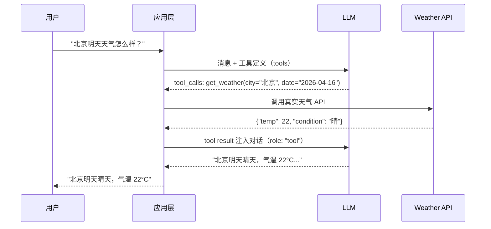

# Function Calling

> 让 LLM 与外部世界交互的核心机制

## 学习目标

- 理解 Function Calling 的工作原理和调用流程
- 掌握工具定义的 JSON Schema 规范与最佳实践
- 实现单工具、并行、顺序三种调用模式
- 使用结构化输出与 Pydantic 进行输出解析
- 构建带错误处理的生产级工具调用系统

---

## 1. 基本原理

### 1.1 什么是 Function Calling

Function Calling（函数调用）是 LLM 与外部系统交互的核心机制。它的本质是：**LLM 不直接执行函数，而是生成结构化的调用参数，由应用层负责实际执行，再将结果回传给 LLM**。

这个设计有三个关键点：

1. **LLM 只负责"决策"**：根据用户意图，判断是否需要调用工具、调用哪个工具、传什么参数
2. **应用层负责"执行"**：接收 LLM 生成的参数，调用真实的 API / 数据库 / 服务
3. **结果回传形成闭环**：执行结果作为新的上下文注入对话，LLM 基于结果生成最终回复

与传统 API 调用的区别：

| 对比维度 | 传统 API 调用 | Function Calling |
|---------|-------------|-----------------|
| 参数来源 | 开发者硬编码或用户表单 | LLM 从自然语言中提取 |
| 调用决策 | 代码逻辑（if/else） | LLM 自主判断 |
| 错误处理 | 固定策略 | 可将错误反馈给 LLM 重试 |
| 灵活性 | 固定流程 | 动态组合多个工具 |

### 1.2 调用流程

一次完整的 Function Calling 流程如下：



五个关键步骤：
1. **发送请求**：将用户消息和工具定义一起发给 LLM
2. **接收工具调用**：LLM 返回 `tool_calls`（函数名 + 参数 JSON）
3. **执行函数**：应用层用 LLM 生成的参数调用真实 API
4. **回传结果**：将执行结果作为 `role: "tool"` 消息注入对话
5. **获取最终回复**：LLM 基于工具结果生成自然语言回答

核心代码流程：

```python
from openai import OpenAI

client = OpenAI()

# 第一步：发送消息和工具定义
response = client.chat.completions.create(
    model="gpt-4o",
    messages=[{"role": "user", "content": "北京明天天气怎么样？"}],
    tools=[{
        "type": "function",
        "function": {
            "name": "get_weather",
            "description": "查询指定城市的天气预报",
            "parameters": {
                "type": "object",
                "properties": {
                    "city": {"type": "string", "description": "城市名称"},
                    "date": {"type": "string", "description": "日期，格式 YYYY-MM-DD"}
                },
                "required": ["city"]
            }
        }
    }]
)

message = response.choices[0].message

# 第二步：检查是否有工具调用
if message.tool_calls:
    tool_call = message.tool_calls[0]
    # tool_call.function.name == "get_weather"
    # tool_call.function.arguments == '{"city": "北京", "date": "2026-04-16"}'

    # 第三步：执行函数，获取结果
    import json
    args = json.loads(tool_call.function.arguments)
    result = get_weather(**args)  # 调用真实函数

    # 第四步：将结果回传给 LLM
    response = client.chat.completions.create(
        model="gpt-4o",
        messages=[
            {"role": "user", "content": "北京明天天气怎么样？"},
            message,  # 包含 tool_calls 的 assistant 消息
            {
                "role": "tool",
                "tool_call_id": tool_call.id,
                "content": json.dumps(result, ensure_ascii=False)
            }
        ],
        tools=[...]  # 同上
    )
    # 第五步：获取最终回复
    final_answer = response.choices[0].message.content
```

> **关键理解**：`role: "tool"` 消息必须包含 `tool_call_id`，与 assistant 消息中的 `tool_calls` 一一对应。这是 OpenAI API 的强制要求。

---

## 2. 工具定义

### 2.1 JSON Schema 定义

每个工具通过 JSON Schema 描述其名称、用途和参数结构。LLM 依赖这些信息来决定何时调用、如何传参。

```python
tools = [
    {
        "type": "function",
        "function": {
            "name": "search_products",
            "description": "在商品数据库中搜索商品。支持按名称、类别、价格范围筛选。",
            "parameters": {
                "type": "object",
                "properties": {
                    "query": {
                        "type": "string",
                        "description": "搜索关键词"
                    },
                    "category": {
                        "type": "string",
                        "enum": ["electronics", "clothing", "food", "books"],
                        "description": "商品类别"
                    },
                    "min_price": {
                        "type": "number",
                        "description": "最低价格（元）"
                    },
                    "max_price": {
                        "type": "number",
                        "description": "最高价格（元）"
                    }
                },
                "required": ["query"]
            }
        }
    }
]
```

参数类型支持：

| JSON Schema 类型 | 说明 | 示例 |
|-----------------|------|------|
| `string` | 字符串 | `"北京"` |
| `number` | 数字（含小数） | `99.9` |
| `integer` | 整数 | `10` |
| `boolean` | 布尔值 | `true` |
| `array` | 数组 | `["tag1", "tag2"]` |
| `object` | 嵌套对象 | `{"lat": 39.9, "lng": 116.4}` |
| `enum` | 枚举限定值 | `"category": {"enum": ["a","b"]}` |

### 2.2 工具描述最佳实践

工具描述的质量直接影响 LLM 的调用准确率。以下是关键原则：

**1. 描述要具体，说明"什么时候用"和"不能做什么"：**

```python
# ❌ 模糊描述
"description": "获取数据"

# ✅ 具体描述
"description": "从公司内部 CRM 系统查询客户信息。支持按姓名、手机号、公司名搜索。不支持模糊匹配，请提供完整关键词。"
```

**2. 参数描述包含格式和约束：**

```python
"date": {
    "type": "string",
    "description": "查询日期，格式为 YYYY-MM-DD。支持未来7天内的日期。"
}
```

**3. 用 `enum` 限制取值范围，减少幻觉：**

```python
"priority": {
    "type": "string",
    "enum": ["low", "medium", "high"],
    "description": "任务优先级"
}
```

### 2.3 多工具注册

当注册多个工具时，LLM 会根据用户意图自动选择合适的工具。你也可以通过 `tool_choice` 参数控制选择策略：

```python
# 自动选择（默认）：LLM 自行决定是否调用工具
response = client.chat.completions.create(
    model="gpt-4o",
    messages=messages,
    tools=tools,
    tool_choice="auto"
)

# 强制调用指定工具
response = client.chat.completions.create(
    model="gpt-4o",
    messages=messages,
    tools=tools,
    tool_choice={"type": "function", "function": {"name": "get_weather"}}
)

# 禁止调用任何工具
response = client.chat.completions.create(
    model="gpt-4o",
    messages=messages,
    tools=tools,
    tool_choice="none"
)
```

`tool_choice` 策略选择指南：

| 策略 | 场景 |
|------|------|
| `"auto"` | 通用对话，LLM 自主判断是否需要工具 |
| `{"type": "function", ...}` | 明确知道需要调用某个工具（如表单提交后必须保存） |
| `"none"` | 只需要 LLM 生成文本回复，不需要工具 |
| `"required"` | 强制 LLM 必须调用某个工具（不指定具体哪个） |

---

## 3. 调用模式

### 3.1 单工具调用

最基础的模式：LLM 判断需要调用一个工具，生成参数，应用执行后返回结果。

```python
import json
from openai import OpenAI

client = OpenAI()

def get_weather(city: str, date: str | None = None) -> dict:
    """模拟天气 API"""
    return {"city": city, "date": date or "today", "temp": 22, "condition": "晴"}

tools = [{
    "type": "function",
    "function": {
        "name": "get_weather",
        "description": "查询城市天气",
        "parameters": {
            "type": "object",
            "properties": {
                "city": {"type": "string", "description": "城市名"},
                "date": {"type": "string", "description": "日期 YYYY-MM-DD"}
            },
            "required": ["city"]
        }
    }
}]

# 工具函数映射表
tool_functions = {"get_weather": get_weather}

def chat_with_tools(user_message: str) -> str:
    messages = [{"role": "user", "content": user_message}]

    response = client.chat.completions.create(
        model="gpt-4o", messages=messages, tools=tools
    )
    msg = response.choices[0].message

    # 如果没有工具调用，直接返回文本
    if not msg.tool_calls:
        return msg.content

    # 执行工具调用
    messages.append(msg)
    for tool_call in msg.tool_calls:
        fn = tool_functions[tool_call.function.name]
        args = json.loads(tool_call.function.arguments)
        result = fn(**args)
        messages.append({
            "role": "tool",
            "tool_call_id": tool_call.id,
            "content": json.dumps(result, ensure_ascii=False)
        })

    # 获取最终回复
    final = client.chat.completions.create(
        model="gpt-4o", messages=messages, tools=tools
    )
    return final.choices[0].message.content

print(chat_with_tools("上海今天天气如何？"))
```

### 3.2 并行工具调用

当用户的请求涉及多个独立的信息查询时，LLM 会在一次响应中生成多个 `tool_calls`，应用层可以并行执行：

```python
import asyncio
import json
from openai import OpenAI

client = OpenAI()

def get_weather(city: str) -> dict:
    return {"city": city, "temp": 22, "condition": "晴"}

def get_exchange_rate(from_currency: str, to_currency: str) -> dict:
    return {"from": from_currency, "to": to_currency, "rate": 7.24}

tools = [
    {
        "type": "function",
        "function": {
            "name": "get_weather",
            "description": "查询城市天气",
            "parameters": {
                "type": "object",
                "properties": {"city": {"type": "string"}},
                "required": ["city"]
            }
        }
    },
    {
        "type": "function",
        "function": {
            "name": "get_exchange_rate",
            "description": "查询汇率",
            "parameters": {
                "type": "object",
                "properties": {
                    "from_currency": {"type": "string"},
                    "to_currency": {"type": "string"}
                },
                "required": ["from_currency", "to_currency"]
            }
        }
    }
]

tool_functions = {
    "get_weather": get_weather,
    "get_exchange_rate": get_exchange_rate,
}

# 用户问："北京天气怎么样？顺便查一下美元兑人民币汇率"
# LLM 会同时生成两个 tool_calls
response = client.chat.completions.create(
    model="gpt-4o",
    messages=[{"role": "user", "content": "北京天气怎么样？顺便查一下美元兑人民币汇率"}],
    tools=tools
)

msg = response.choices[0].message
print(f"工具调用数量: {len(msg.tool_calls)}")  # 输出: 2

# 并行执行所有工具调用
messages = [{"role": "user", "content": "北京天气怎么样？顺便查一下美元兑人民币汇率"}, msg]
for tool_call in msg.tool_calls:
    fn = tool_functions[tool_call.function.name]
    args = json.loads(tool_call.function.arguments)
    result = fn(**args)
    messages.append({
        "role": "tool",
        "tool_call_id": tool_call.id,
        "content": json.dumps(result, ensure_ascii=False)
    })

# 所有结果回传后，LLM 生成综合回复
final = client.chat.completions.create(
    model="gpt-4o", messages=messages, tools=tools
)
print(final.choices[0].message.content)
```

> **注意**：并行调用的所有 `tool` 消息必须在同一轮中全部返回，不能只返回部分结果。

### 3.3 顺序工具调用

有些场景中，后一个工具的输入依赖前一个工具的输出。这需要多轮交互，形成调用链：

```
用户: "帮我查一下北京的天气，如果气温超过25度就创建一个户外活动"

第一轮: LLM → get_weather(city="北京") → 返回 {temp: 28}
第二轮: LLM 看到气温28 > 25 → create_event(title="户外活动", ...) → 返回成功
第三轮: LLM 生成最终回复
```

实现多轮工具调用的通用循环：

```python
import json
from openai import OpenAI

client = OpenAI()

def run_conversation(user_message: str, tools: list, tool_functions: dict, max_rounds: int = 5) -> str:
    """通用多轮工具调用循环"""
    messages = [{"role": "user", "content": user_message}]

    for _ in range(max_rounds):
        response = client.chat.completions.create(
            model="gpt-4o", messages=messages, tools=tools
        )
        msg = response.choices[0].message
        messages.append(msg)

        # 没有工具调用，返回最终回复
        if not msg.tool_calls:
            return msg.content

        # 执行所有工具调用
        for tool_call in msg.tool_calls:
            fn_name = tool_call.function.name
            args = json.loads(tool_call.function.arguments)
            try:
                result = tool_functions[fn_name](**args)
            except Exception as e:
                result = {"error": str(e)}
            messages.append({
                "role": "tool",
                "tool_call_id": tool_call.id,
                "content": json.dumps(result, ensure_ascii=False)
            })

    return "达到最大调用轮次限制"
```

这个 `run_conversation` 函数是 Function Calling 应用的核心模式——一个循环，不断让 LLM 决策、执行工具、回传结果，直到 LLM 认为可以给出最终回复。

---

## 4. 结构化输出

Function Calling 本身就是一种结构化输出——LLM 生成符合 JSON Schema 的参数。但有时我们需要 LLM 直接输出结构化数据，而不是调用工具。

### 4.1 Response Format

**JSON Mode**：强制 LLM 输出合法 JSON，但不保证符合特定 Schema：

```python
response = client.chat.completions.create(
    model="gpt-4o",
    messages=[{
        "role": "user",
        "content": "分析这段评论的情感，返回 JSON 格式：'这家餐厅的菜品很好吃，但服务态度一般'"
    }],
    response_format={"type": "json_object"}
)
# 输出一定是合法 JSON，但结构不确定
print(json.loads(response.choices[0].message.content))
```

**Structured Outputs**：通过 JSON Schema 严格约束输出结构（推荐）：

```python
response = client.chat.completions.create(
    model="gpt-4o",
    messages=[{
        "role": "user",
        "content": "分析这段评论的情感：'这家餐厅的菜品很好吃，但服务态度一般'"
    }],
    response_format={
        "type": "json_schema",
        "json_schema": {
            "name": "sentiment_analysis",
            "strict": True,
            "schema": {
                "type": "object",
                "properties": {
                    "sentiment": {
                        "type": "string",
                        "enum": ["positive", "negative", "mixed"]
                    },
                    "confidence": {"type": "number"},
                    "aspects": {
                        "type": "array",
                        "items": {
                            "type": "object",
                            "properties": {
                                "aspect": {"type": "string"},
                                "sentiment": {"type": "string", "enum": ["positive", "negative", "neutral"]}
                            },
                            "required": ["aspect", "sentiment"],
                            "additionalProperties": False
                        }
                    }
                },
                "required": ["sentiment", "confidence", "aspects"],
                "additionalProperties": False
            }
        }
    }
)
```

### 4.2 输出解析

使用 Pydantic 模型配合 OpenAI SDK 的 `beta.chat.completions.parse` 方法，可以直接获得类型安全的 Python 对象：

```python
from pydantic import BaseModel
from openai import OpenAI

client = OpenAI()

class AspectSentiment(BaseModel):
    aspect: str
    sentiment: str  # positive / negative / neutral

class SentimentResult(BaseModel):
    sentiment: str  # positive / negative / mixed
    confidence: float
    aspects: list[AspectSentiment]

response = client.beta.chat.completions.parse(
    model="gpt-4o",
    messages=[{
        "role": "user",
        "content": "分析情感：'这家餐厅的菜品很好吃，但服务态度一般'"
    }],
    response_format=SentimentResult
)

result = response.choices[0].message.parsed  # 直接得到 SentimentResult 对象
print(f"整体情感: {result.sentiment}")
print(f"置信度: {result.confidence}")
for a in result.aspects:
    print(f"  {a.aspect}: {a.sentiment}")
```

Pydantic 解析的优势：

- **类型安全**：IDE 自动补全，运行时类型检查
- **自动验证**：字段缺失、类型错误会抛出明确异常
- **嵌套结构**：复杂的嵌套对象自动解析
- **与业务代码无缝集成**：直接传递 Pydantic 对象，无需手动 `json.loads`

---

## 5. 错误处理

生产环境中，工具调用会遇到各种失败情况。健壮的错误处理是 Function Calling 应用可靠运行的关键。

### 5.1 常见错误类型

| 错误类型 | 原因 | 示例 |
|---------|------|------|
| 参数错误 | LLM 生成了不符合预期的参数 | 日期格式错误、缺少必填字段 |
| 工具不存在 | LLM 幻觉出了未注册的工具名 | 调用 `send_email` 但只注册了 `get_weather` |
| 执行失败 | 外部 API 返回错误 | 网络超时、第三方服务 500 |
| JSON 解析失败 | LLM 返回的 arguments 不是合法 JSON | 极少见，但需要防御 |

### 5.2 重试策略

核心思路：**将错误信息作为 tool result 回传给 LLM，让它自行修正**。

```python
import json
import time
from openai import OpenAI

client = OpenAI()

def execute_tool_call(tool_call, tool_functions: dict, max_retries: int = 2) -> str:
    """执行单个工具调用，带重试"""
    fn_name = tool_call.function.name

    # 工具不存在
    if fn_name not in tool_functions:
        return json.dumps({"error": f"工具 '{fn_name}' 不存在。可用工具: {list(tool_functions.keys())}"})

    # 解析参数
    try:
        args = json.loads(tool_call.function.arguments)
    except json.JSONDecodeError:
        return json.dumps({"error": "参数 JSON 解析失败，请重新生成合法的 JSON 参数"})

    # 执行，带重试
    for attempt in range(max_retries + 1):
        try:
            result = tool_functions[fn_name](**args)
            return json.dumps(result, ensure_ascii=False)
        except TypeError as e:
            return json.dumps({"error": f"参数错误: {e}。请检查参数类型和名称。"})
        except Exception as e:
            if attempt < max_retries:
                time.sleep(2 ** attempt)  # 指数退避: 1s, 2s
                continue
            return json.dumps({"error": f"执行失败（已重试{max_retries}次）: {e}"})
```

当错误信息回传给 LLM 后，LLM 通常会：
- **参数错误**：修正参数后重新调用
- **工具不存在**：选择正确的工具或直接回复用户
- **执行失败**：告知用户服务暂时不可用

### 5.3 超时与降级

对于耗时较长的工具调用，需要设置超时并提供降级方案：

```python
import asyncio
import json
from concurrent.futures import ThreadPoolExecutor, TimeoutError

executor = ThreadPoolExecutor(max_workers=4)

def execute_with_timeout(fn, args: dict, timeout: float = 10.0) -> dict:
    """带超时的工具执行"""
    future = executor.submit(fn, **args)
    try:
        return future.result(timeout=timeout)
    except TimeoutError:
        future.cancel()
        return {"error": f"工具执行超时（{timeout}秒），请稍后重试或换一种方式查询"}
    except Exception as e:
        return {"error": f"执行异常: {e}"}

# 降级策略示例：主备工具切换
def get_weather_with_fallback(city: str) -> dict:
    """天气查询，主 API 失败时切换备用"""
    try:
        return call_primary_weather_api(city)
    except Exception:
        try:
            return call_backup_weather_api(city)
        except Exception:
            return {"error": "天气服务暂时不可用", "suggestion": "请稍后再试"}
```

生产环境错误处理清单：

- ✅ 所有工具调用包裹在 try/except 中
- ✅ 错误信息以 `tool` 消息回传给 LLM（而非抛出异常中断对话）
- ✅ 外部 API 调用设置超时
- ✅ 关键工具配置降级方案
- ✅ 设置最大调用轮次，防止无限循环
- ✅ 记录工具调用日志（函数名、参数、耗时、结果）

---

## 6. 实战：带工具的对话助手

### 6.1 需求设计

构建一个天气 + 日历管理助手，支持：

- **天气查询**：查询任意城市的天气预报
- **日历管理**：创建、查询、删除日程
- **智能联动**：根据天气自动建议日程调整（顺序调用）

### 6.2 代码实现

```python
"""天气 + 日历助手 —— 完整 Function Calling 示例"""

import json
from datetime import datetime
from openai import OpenAI

client = OpenAI()

# ========== 模拟后端服务 ==========

CALENDAR_DB: list[dict] = []

def get_weather(city: str, date: str | None = None) -> dict:
    """模拟天气 API"""
    weather_data = {
        "北京": {"temp": 28, "condition": "晴", "humidity": 35},
        "上海": {"temp": 24, "condition": "多云", "humidity": 72},
        "广州": {"temp": 31, "condition": "雷阵雨", "humidity": 88},
    }
    data = weather_data.get(city, {"temp": 20, "condition": "晴", "humidity": 50})
    return {"city": city, "date": date or datetime.now().strftime("%Y-%m-%d"), **data}

def create_event(title: str, date: str, time: str, location: str | None = None) -> dict:
    """创建日程"""
    event = {"id": len(CALENDAR_DB) + 1, "title": title, "date": date, "time": time, "location": location}
    CALENDAR_DB.append(event)
    return {"success": True, "event": event}

def list_events(date: str) -> dict:
    """查询指定日期的日程"""
    events = [e for e in CALENDAR_DB if e["date"] == date]
    return {"date": date, "count": len(events), "events": events}

def delete_event(event_id: int) -> dict:
    """删除日程"""
    for i, e in enumerate(CALENDAR_DB):
        if e["id"] == event_id:
            CALENDAR_DB.pop(i)
            return {"success": True, "deleted_event_id": event_id}
    return {"success": False, "error": f"日程 {event_id} 不存在"}

# ========== 工具定义 ==========

tools = [
    {
        "type": "function",
        "function": {
            "name": "get_weather",
            "description": "查询指定城市的天气预报。",
            "parameters": {
                "type": "object",
                "properties": {
                    "city": {"type": "string", "description": "城市名称，如'北京'"},
                    "date": {"type": "string", "description": "日期，格式 YYYY-MM-DD，默认今天"}
                },
                "required": ["city"]
            }
        }
    },
    {
        "type": "function",
        "function": {
            "name": "create_event",
            "description": "在日历中创建新日程。",
            "parameters": {
                "type": "object",
                "properties": {
                    "title": {"type": "string", "description": "日程标题"},
                    "date": {"type": "string", "description": "日期 YYYY-MM-DD"},
                    "time": {"type": "string", "description": "时间 HH:MM"},
                    "location": {"type": "string", "description": "地点（可选）"}
                },
                "required": ["title", "date", "time"]
            }
        }
    },
    {
        "type": "function",
        "function": {
            "name": "list_events",
            "description": "查询指定日期的所有日程。",
            "parameters": {
                "type": "object",
                "properties": {
                    "date": {"type": "string", "description": "日期 YYYY-MM-DD"}
                },
                "required": ["date"]
            }
        }
    },
    {
        "type": "function",
        "function": {
            "name": "delete_event",
            "description": "删除指定 ID 的日程。",
            "parameters": {
                "type": "object",
                "properties": {
                    "event_id": {"type": "integer", "description": "日程 ID"}
                },
                "required": ["event_id"]
            }
        }
    }
]

# ========== 工具执行引擎 ==========

TOOL_FUNCTIONS = {
    "get_weather": get_weather,
    "create_event": create_event,
    "list_events": list_events,
    "delete_event": delete_event,
}

def execute_tool(tool_call) -> str:
    """安全执行工具调用"""
    fn_name = tool_call.function.name
    if fn_name not in TOOL_FUNCTIONS:
        return json.dumps({"error": f"未知工具: {fn_name}"})
    try:
        args = json.loads(tool_call.function.arguments)
        result = TOOL_FUNCTIONS[fn_name](**args)
        return json.dumps(result, ensure_ascii=False)
    except Exception as e:
        return json.dumps({"error": str(e)})

# ========== 对话主循环 ==========

SYSTEM_PROMPT = """你是一个智能助手，可以查询天气和管理日历。
- 查询天气时，给出穿衣和出行建议
- 创建日程时，确认关键信息（标题、日期、时间）
- 如果天气恶劣，主动提醒用户是否需要调整户外日程"""

def chat(user_input: str, history: list[dict]) -> str:
    """单轮对话处理"""
    history.append({"role": "user", "content": user_input})

    max_rounds = 5
    for _ in range(max_rounds):
        response = client.chat.completions.create(
            model="gpt-4o", messages=history, tools=tools
        )
        msg = response.choices[0].message
        history.append(msg)

        if not msg.tool_calls:
            return msg.content

        # 执行所有工具调用
        for tc in msg.tool_calls:
            result = execute_tool(tc)
            print(f"  🔧 {tc.function.name}({tc.function.arguments}) → {result}")
            history.append({"role": "tool", "tool_call_id": tc.id, "content": result})

    return "抱歉，处理过程过于复杂，请简化您的请求。"

# ========== 运行 ==========

if __name__ == "__main__":
    history = [{"role": "system", "content": SYSTEM_PROMPT}]

    print("🤖 天气日历助手（输入 quit 退出）")
    print("-" * 40)

    while True:
        user_input = input("\n你: ").strip()
        if user_input.lower() in ("quit", "exit", "q"):
            break
        reply = chat(user_input, history)
        print(f"\n助手: {reply}")
```

### 6.3 测试与调试

运行上述代码后，可以测试以下场景：

**场景 1：单工具调用**
```
你: 北京今天天气怎么样？
🔧 get_weather({"city":"北京"}) → {"city":"北京","temp":28,"condition":"晴",...}
助手: 北京今天晴天，气温28°C，湿度35%。天气炎热，建议穿轻薄衣物，注意防晒。
```

**场景 2：并行调用**
```
你: 帮我查一下北京和上海的天气
🔧 get_weather({"city":"北京"}) → ...
🔧 get_weather({"city":"上海"}) → ...
助手: 北京晴天28°C，上海多云24°C...
```

**场景 3：顺序调用（智能联动）**
```
你: 广州明天天气怎么样？我想安排一个户外跑步
🔧 get_weather({"city":"广州","date":"2026-04-16"}) → {"condition":"雷阵雨",...}
助手: 广州明天有雷阵雨，不建议户外跑步。要不要改成室内运动，或者换个日期？
```

**场景 4：错误处理**
```
你: 删除日程 999
🔧 delete_event({"event_id":999}) → {"success":false,"error":"日程 999 不存在"}
助手: 没有找到 ID 为 999 的日程。要我帮你查一下现有的日程吗？
```

调试技巧：

- 打印每次 `tool_calls` 的内容，确认 LLM 的决策是否合理
- 检查 `arguments` 的 JSON 是否符合预期格式
- 观察多轮调用时 `messages` 列表的增长，确保消息顺序正确
- 使用 `tool_choice` 强制调用特定工具来隔离测试

---

## 练习

1. **工具调用循环**：定义 3 个工具（如：翻译、摘要、关键词提取），实现完整的调用循环，让 LLM 根据用户输入自动选择合适的工具
2. **并行调用优化**：实现一个"旅行助手"，用户输入目的地后，并行查询天气、机票、酒店信息，合并后给出建议
3. **错误处理与重试**：在练习 1 的基础上，模拟工具随机失败（50% 概率抛异常），实现带指数退避的重试机制，并将错误反馈给 LLM

## 延伸阅读

- [OpenAI Function Calling Guide](https://platform.openai.com/docs/guides/function-calling) — 官方指南，包含最新的 API 变更
- [OpenAI Structured Outputs](https://platform.openai.com/docs/guides/structured-outputs) — 结构化输出详细文档
- [Anthropic Tool Use](https://docs.anthropic.com/en/docs/build-with-claude/tool-use) — Claude 的工具调用实现，对比学习
- [JSON Schema 规范](https://json-schema.org/) — 深入理解工具参数定义的基础
