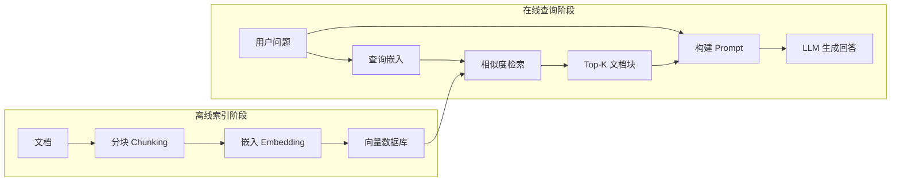
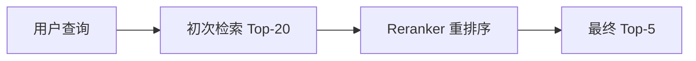
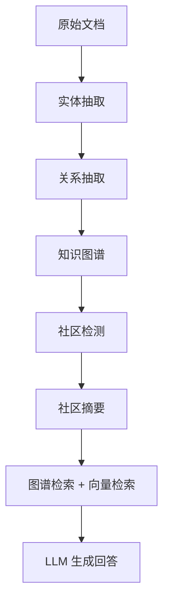
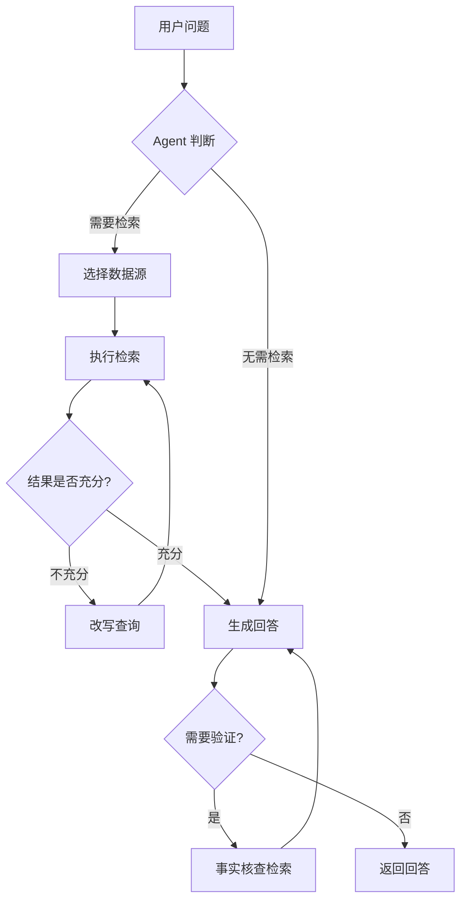
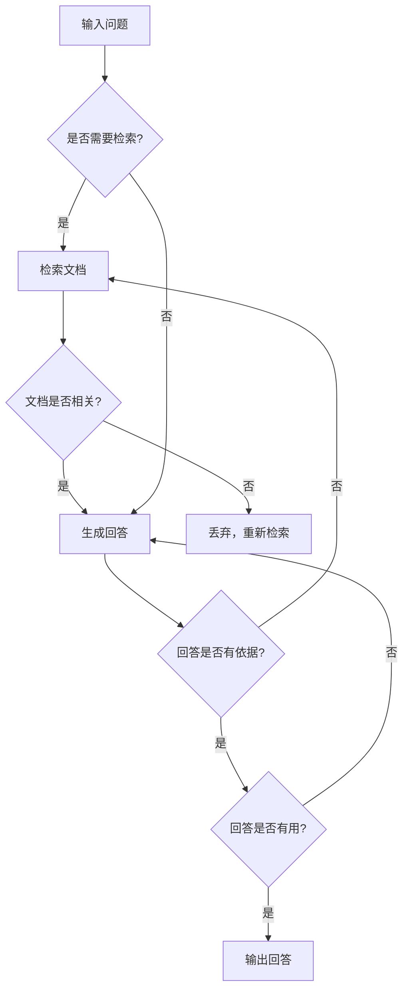

# RAG（检索增强生成）

> 让 LLM 基于你的数据回答问题

## 学习目标

- 理解 RAG 的完整架构与工作流程
- 掌握分块、检索、生成各环节的优化方法
- 了解高级 RAG 模式与评估框架

---

## 1. RAG 基础架构

### 1.1 为什么需要 RAG

大语言模型（LLM）虽然强大，但存在三个根本性限制：

**知识截止（Knowledge Cutoff）**：模型的训练数据有时间边界。GPT-4o 的训练数据截止到 2024 年初，无法回答之后发生的事件。对于快速变化的领域（法规、产品文档、新闻），模型的知识会迅速过时。

**幻觉（Hallucination）**：当模型缺乏相关知识时，会"自信地编造"看似合理但实际错误的答案。在医疗、法律、金融等高风险场景中，这是不可接受的。

**无法访问私有数据**：企业内部文档、客户数据、专有知识库等信息从未出现在模型训练集中，模型无从得知。

RAG（Retrieval-Augmented Generation）通过在生成前检索相关文档，将外部知识注入 LLM 的上下文窗口，从根本上解决了这三个问题：

- 检索最新文档 → 解决知识截止
- 基于真实文档生成 → 减少幻觉
- 连接私有数据源 → 访问企业知识

### 1.2 基本流程

RAG 系统分为两个阶段：**离线索引**和**在线查询**。



**离线索引阶段**：
1. **文档加载**：从各种数据源（PDF、网页、数据库）加载原始文档
2. **分块（Chunking）**：将长文档切分为适当大小的文本块
3. **嵌入（Embedding）**：用嵌入模型将文本块转换为向量
4. **存储（Indexing）**：将向量和原始文本存入向量数据库

**在线查询阶段**：
1. **查询嵌入**：将用户问题转换为向量
2. **检索（Retrieval）**：在向量数据库中找到最相似的 Top-K 文档块
3. **生成（Generation）**：将检索到的文档块与用户问题一起送入 LLM，生成最终回答

### 1.3 RAG vs 微调 vs 长上下文

三种让 LLM 获取新知识的方式各有优劣：

| 维度 | RAG | 微调（Fine-tuning） | 长上下文（Long Context） |
|------|-----|---------------------|------------------------|
| **知识更新** | 实时，更新文档即可 | 需要重新训练 | 实时，放入上下文即可 |
| **成本** | 中等（向量数据库 + 检索） | 高（训练 GPU + 数据标注） | 高（长上下文 Token 费用） |
| **准确性** | 高，可追溯来源 | 中，可能遗忘或混淆 | 高，但受上下文长度限制 |
| **私有数据** | ✅ 天然支持 | ✅ 需要训练数据 | ✅ 直接放入上下文 |
| **适用数据量** | 大规模（百万文档） | 中等（千到万条样本） | 小规模（上下文窗口内） |
| **延迟** | 中等（检索 + 生成） | 低（直接生成） | 高（长上下文推理慢） |

**决策框架**：

- **数据频繁更新、规模大** → RAG
- **需要改变模型行为/风格/格式** → 微调
- **数据量小、对延迟不敏感** → 长上下文
- **最佳实践**：RAG + 微调组合使用，微调让模型学会如何利用检索结果，RAG 提供最新知识

---

## 2. 文档加载与预处理

### 2.1 数据源

RAG 系统需要处理多种格式的数据源。LangChain 和 LlamaIndex 都提供了丰富的 Document Loader：

| 数据源 | 工具/库 | 说明 |
|--------|---------|------|
| PDF | `PyPDFLoader`, `PDFPlumberLoader` | 支持文本和表格提取 |
| 网页 | `WebBaseLoader`, `FireCrawlLoader` | 支持静态和动态页面 |
| Office | `UnstructuredWordDocumentLoader` | Word、PPT、Excel |
| 数据库 | `SQLDatabaseLoader` | MySQL、PostgreSQL 等 |
| API | 自定义 Loader | REST/GraphQL 接口 |
| Markdown | `UnstructuredMarkdownLoader` | 保留结构信息 |
| Notion/Confluence | 专用 Loader | 企业知识库集成 |

```python
from langchain_community.document_loaders import (
    PyPDFLoader,
    WebBaseLoader,
    DirectoryLoader,
)

# 加载单个 PDF
loader = PyPDFLoader("docs/technical_report.pdf")
pages = loader.load()  # 每页一个 Document 对象

# 批量加载目录下所有 PDF
dir_loader = DirectoryLoader(
    "docs/", glob="**/*.pdf", loader_cls=PyPDFLoader
)
all_docs = dir_loader.load()

# 加载网页
web_loader = WebBaseLoader("https://docs.example.com/guide")
web_docs = web_loader.load()

print(f"加载了 {len(all_docs)} 个文档")
print(f"第一个文档元数据: {all_docs[0].metadata}")
```

### 2.2 文档解析

不同格式的文档需要不同的解析策略：

**纯文本提取**：最基础的方式，适用于结构简单的文档。

**表格处理**：PDF 和 Office 中的表格需要特殊处理，否则会丢失结构信息。推荐使用 `pdfplumber` 或 `Unstructured` 库：

```python
import pdfplumber

with pdfplumber.open("report.pdf") as pdf:
    for page in pdf.pages:
        # 提取文本
        text = page.extract_text()
        # 提取表格（返回二维列表）
        tables = page.extract_tables()
        for table in tables:
            # 将表格转为 Markdown 格式保留结构
            header = "| " + " | ".join(table[0]) + " |"
            separator = "| " + " | ".join(["---"] * len(table[0])) + " |"
            rows = "\n".join(
                "| " + " | ".join(row) + " |" for row in table[1:]
            )
            markdown_table = f"{header}\n{separator}\n{rows}"
```

**图片 OCR**：对于扫描件或图片中的文字，使用 OCR 引擎提取：

```python
# 使用 Unstructured 库统一处理多种格式（含 OCR）
from unstructured.partition.auto import partition

elements = partition(filename="scanned_doc.pdf", strategy="hi_res")
text_content = "\n\n".join(str(el) for el in elements)
```

### 2.3 数据清洗

原始文档通常包含大量噪声，需要清洗后才能获得高质量的检索结果：

```python
import re

def clean_document(text: str) -> str:
    """文档清洗流水线"""
    # 移除多余空白
    text = re.sub(r"\s+", " ", text).strip()
    # 移除页眉页脚（根据实际格式调整）
    text = re.sub(r"第 \d+ 页.*?共 \d+ 页", "", text)
    # 移除特殊字符但保留中文标点
    text = re.sub(r"[^\w\s\u4e00-\u9fff，。！？、；：""''（）【】]", "", text)
    return text

def extract_metadata(doc) -> dict:
    """从文档中提取结构化元数据"""
    return {
        "source": doc.metadata.get("source", ""),
        "page": doc.metadata.get("page", 0),
        "title": doc.metadata.get("title", ""),
        # 自定义元数据用于后续过滤
        "doc_type": classify_document(doc.page_content),
    }
```

关键清洗步骤：
- **去噪**：移除页眉页脚、水印、广告等无关内容
- **格式标准化**：统一编码、统一标点、合并断行
- **元数据提取**：提取标题、日期、作者等结构化信息，用于后续的元数据过滤检索

---

## 3. 分块策略

分块（Chunking）是 RAG 中最关键的环节之一。分块质量直接决定检索质量，进而影响最终回答的准确性。

### 3.1 固定大小分块

最简单的策略：按固定字符数或 Token 数切分，相邻块之间保留重叠（overlap）以避免语义断裂。

```python
from langchain_text_splitters import CharacterTextSplitter, RecursiveCharacterTextSplitter

# 按字符数固定切分
splitter = CharacterTextSplitter(
    chunk_size=500,       # 每块最大 500 字符
    chunk_overlap=50,     # 相邻块重叠 50 字符
    separator="\n",       # 优先在换行处切分
)
chunks = splitter.split_documents(docs)

# 按 Token 数切分（更精确地控制 LLM 上下文用量）
from langchain_text_splitters import TokenTextSplitter

token_splitter = TokenTextSplitter(
    chunk_size=256,       # 每块最大 256 tokens
    chunk_overlap=32,
)
token_chunks = token_splitter.split_documents(docs)
```

**优点**：实现简单、速度快、行为可预测。

**缺点**：可能在句子或段落中间切断，破坏语义完整性。

### 3.2 递归分块

按文档的自然结构层级递归切分，优先在高层级分隔符处切分（如标题 > 段落 > 句子 > 字符）：

```python
# RecursiveCharacterTextSplitter 是 LangChain 推荐的默认分块器
recursive_splitter = RecursiveCharacterTextSplitter(
    chunk_size=500,
    chunk_overlap=50,
    separators=[
        "\n\n",   # 先按段落切分
        "\n",     # 再按换行切分
        "。",     # 再按中文句号切分
        ".",      # 英文句号
        " ",      # 空格
        "",       # 最后按字符切分
    ],
)
chunks = recursive_splitter.split_documents(docs)

# 针对 Markdown 文档的专用分块器
from langchain_text_splitters import MarkdownHeaderTextSplitter

md_splitter = MarkdownHeaderTextSplitter(
    headers_to_split_on=[
        ("#", "h1"),
        ("##", "h2"),
        ("###", "h3"),
    ]
)
md_chunks = md_splitter.split_text(markdown_text)
# 每个 chunk 自动携带所属标题层级作为元数据
```

**优点**：尊重文档结构，语义完整性好。

**缺点**：依赖文档格式良好，对非结构化文本效果有限。

### 3.3 语义分块

基于语义相似度动态决定分块边界。核心思想：当相邻句子的语义相似度低于阈值时，在此处切分。

```python
from langchain_experimental.text_splitter import SemanticChunker
from langchain_openai import OpenAIEmbeddings

embeddings = OpenAIEmbeddings(model="text-embedding-3-small")

# 基于语义相似度的分块
semantic_splitter = SemanticChunker(
    embeddings,
    breakpoint_threshold_type="percentile",  # 使用百分位数作为阈值
    breakpoint_threshold_amount=75,          # 相似度低于 75 分位时切分
)
semantic_chunks = semantic_splitter.split_documents(docs)
```

**工作原理**：
1. 将文档按句子切分
2. 计算每对相邻句子的嵌入向量余弦相似度
3. 当相似度显著下降（低于阈值）时，在该位置切分
4. 将连续的高相似度句子合并为一个 chunk

**优点**：语义边界精确，每个 chunk 主题内聚。

**缺点**：需要调用嵌入模型，速度慢、成本高；对嵌入模型质量敏感。

### 3.4 分块大小选择

没有万能的分块大小，需要根据场景调优：

| 场景 | 推荐 chunk_size | 推荐 overlap | 说明 |
|------|----------------|-------------|------|
| 精确问答（FAQ） | 128-256 tokens | 16-32 | 小块提高检索精度 |
| 文档摘要 | 512-1024 tokens | 64-128 | 大块保留更多上下文 |
| 代码检索 | 按函数/类切分 | 0 | 保持代码完整性 |
| 法律/合同 | 256-512 tokens | 64 | 平衡精度与上下文 |

**经验法则**：
- 从 512 tokens / 50 tokens overlap 开始，根据评估结果调整
- chunk 太小 → 缺乏上下文，回答不完整
- chunk 太大 → 引入噪声，检索精度下降
- 使用 **Parent Document Retriever** 模式：用小块检索，返回大块上下文

```python
from langchain.retrievers import ParentDocumentRetriever
from langchain.storage import InMemoryStore
from langchain_chroma import Chroma

# 小块用于检索，大块用于回答
child_splitter = RecursiveCharacterTextSplitter(chunk_size=200)
parent_splitter = RecursiveCharacterTextSplitter(chunk_size=1000)

vectorstore = Chroma(embedding_function=embeddings, collection_name="split_parents")
store = InMemoryStore()

retriever = ParentDocumentRetriever(
    vectorstore=vectorstore,
    docstore=store,
    child_splitter=child_splitter,
    parent_splitter=parent_splitter,
)
retriever.add_documents(docs)
# 检索时：用小块匹配 → 返回对应的大块父文档
results = retriever.invoke("什么是 RAG？")
```

---

## 4. 嵌入与索引

### 4.1 嵌入模型选型

嵌入模型将文本转换为稠密向量，是 RAG 检索质量的基石。主流选择：

| 模型 | 维度 | 特点 | 适用场景 |
|------|------|------|----------|
| `text-embedding-3-small` (OpenAI) | 1536 | 性价比高，多语言支持好 | 通用场景 |
| `text-embedding-3-large` (OpenAI) | 3072 | 精度最高，支持维度裁剪 | 高精度需求 |
| `embed-v4` (Cohere) | 1024 | 支持搜索/分类/聚类模式 | 多任务场景 |
| `BAAI/bge-large-zh-v1.5` | 1024 | 中文效果优秀，开源免费 | 中文场景、私有部署 |
| `jinaai/jina-embeddings-v3` | 1024 | 多语言、长文本支持 | 多语言场景 |

```python
from langchain_openai import OpenAIEmbeddings
from langchain_community.embeddings import HuggingFaceBgeEmbeddings

# OpenAI 嵌入
openai_emb = OpenAIEmbeddings(model="text-embedding-3-small")

# 开源 BGE 嵌入（本地运行，无 API 费用）
bge_emb = HuggingFaceBgeEmbeddings(
    model_name="BAAI/bge-large-zh-v1.5",
    model_kwargs={"device": "cuda"},
    encode_kwargs={"normalize_embeddings": True},
)

# 生成嵌入向量
vector = openai_emb.embed_query("什么是检索增强生成？")
print(f"向量维度: {len(vector)}")  # 1536
```

**选型建议**：
- 优先在 [MTEB Leaderboard](https://huggingface.co/spaces/mteb/leaderboard) 上查看最新排名
- 中文场景优先考虑 BGE 系列或 Jina 系列
- 嵌入模型一旦选定，更换成本很高（需要重新索引所有文档）

### 4.2 索引构建

将嵌入向量存入向量数据库，构建可检索的索引：

```python
from langchain_chroma import Chroma
from langchain_openai import OpenAIEmbeddings

embeddings = OpenAIEmbeddings(model="text-embedding-3-small")

# 构建向量索引并持久化
vectorstore = Chroma.from_documents(
    documents=chunks,
    embedding=embeddings,
    persist_directory="./chroma_db",
    collection_metadata={"hnsw:space": "cosine"},  # 使用余弦相似度
)

# 添加元数据过滤支持
vectorstore.add_documents(
    documents=new_chunks,
    ids=[f"doc_{i}" for i in range(len(new_chunks))],
)

# 带元数据过滤的检索
results = vectorstore.similarity_search(
    "2024年的营收数据",
    k=5,
    filter={"doc_type": "financial_report"},
)
```

**向量数据库选型**：

| 数据库 | 类型 | 特点 | 适用场景 |
|--------|------|------|----------|
| Chroma | 嵌入式 | 轻量、易上手 | 原型开发、小规模 |
| FAISS | 库 | Meta 开源、极快 | 本地高性能检索 |
| Pinecone | 云服务 | 全托管、自动扩展 | 生产环境、免运维 |
| Weaviate | 自托管/云 | 混合检索、GraphQL | 复杂查询需求 |
| Milvus | 自托管 | 分布式、亿级向量 | 大规模生产环境 |
| pgvector | PostgreSQL 扩展 | 与现有 PG 集成 | 已有 PG 基础设施 |

---

## 5. 检索策略

检索是 RAG 的核心环节。检索质量直接决定了最终回答的质量——"垃圾进，垃圾出"。

### 5.1 向量搜索

基于语义相似度的稠密检索（Dense Retrieval），是 RAG 最基础的检索方式：

```python
from langchain_chroma import Chroma
from langchain_openai import OpenAIEmbeddings

vectorstore = Chroma(
    persist_directory="./chroma_db",
    embedding_function=OpenAIEmbeddings(model="text-embedding-3-small"),
)

# 基础向量检索
retriever = vectorstore.as_retriever(
    search_type="similarity",
    search_kwargs={"k": 5},
)
docs = retriever.invoke("RAG 的工作原理是什么？")

# 带相似度分数的检索（用于设置阈值过滤）
results_with_scores = vectorstore.similarity_search_with_score(
    "RAG 的工作原理是什么？", k=5
)
for doc, score in results_with_scores:
    print(f"分数: {score:.4f} | {doc.page_content[:80]}...")
```

**优点**：理解语义，"机器学习"能匹配"ML"、"深度学习"等近义表达。

**缺点**：对专有名词、编号、精确关键词匹配较弱。

### 5.2 关键词搜索（BM25）

BM25 是经典的稀疏检索算法，基于词频（TF）和逆文档频率（IDF）计算相关性：

```python
from langchain_community.retrievers import BM25Retriever

# 构建 BM25 检索器
bm25_retriever = BM25Retriever.from_documents(chunks, k=5)

# 对中文需要先分词
import jieba

def chinese_tokenizer(text: str) -> list[str]:
    return list(jieba.cut(text))

bm25_retriever = BM25Retriever.from_documents(
    chunks, k=5, preprocess_func=chinese_tokenizer
)
results = bm25_retriever.invoke("GPT-4o 的上下文窗口大小")
```

**优点**：精确关键词匹配强，对专有名词、编号、代码片段效果好。

**缺点**：无法理解语义，"汽车"无法匹配"轿车"。

### 5.3 混合检索

结合向量搜索和 BM25 的优势，是生产环境中最推荐的检索策略：

```python
from langchain.retrievers import EnsembleRetriever

# 混合检索 = 向量检索 + BM25
ensemble_retriever = EnsembleRetriever(
    retrievers=[retriever, bm25_retriever],
    weights=[0.5, 0.5],  # 两种检索的权重
)
results = ensemble_retriever.invoke("GPT-4o 的上下文窗口是多少 tokens？")
```

**Reciprocal Rank Fusion（RRF）** 是最常用的分数融合算法。其核心思想是：不关心绝对分数，只关心排名。对每个文档，将其在各检索器中的排名取倒数后求和：

$$RRF(d) = \sum_{r \in R} \frac{1}{k + rank_r(d)}$$

其中 $k$ 通常取 60。RRF 的优势在于对不同检索器的分数分布不敏感，天然实现了归一化。

### 5.4 Reranking

初次检索（召回）后，使用更精确的模型对结果重新排序。Reranker 通常是 Cross-Encoder 模型，同时编码 query 和 document，精度远高于 Bi-Encoder（嵌入模型）：



```python
from langchain.retrievers import ContextualCompressionRetriever
from langchain_cohere import CohereRerank

# 使用 Cohere Rerank
reranker = CohereRerank(model="rerank-v3.5", top_n=5)

compression_retriever = ContextualCompressionRetriever(
    base_compressor=reranker,
    base_retriever=ensemble_retriever,  # 先用混合检索召回
)
reranked_results = compression_retriever.invoke("RAG 如何减少幻觉？")
```

也可以使用开源 Cross-Encoder 模型：

```python
from langchain_community.cross_encoders import HuggingFaceCrossEncoder
from langchain.retrievers.document_compressors import CrossEncoderReranker

# 开源 Reranker（本地运行）
cross_encoder = HuggingFaceCrossEncoder(model_name="BAAI/bge-reranker-v2-m3")
reranker = CrossEncoderReranker(model=cross_encoder, top_n=5)

compression_retriever = ContextualCompressionRetriever(
    base_compressor=reranker,
    base_retriever=ensemble_retriever,
)
```

**Reranking 的价值**：初次检索追求高召回率（宁可多召回），Reranking 追求高精度（精选最相关的）。两阶段配合，兼顾效率和精度。

### 5.5 查询改写

用户的原始查询往往不够精确或不适合直接检索。查询改写（Query Transformation）通过优化查询来提升检索质量。

**HyDE（Hypothetical Document Embeddings）**：让 LLM 先生成一个"假设性回答"，用这个回答去检索，而非用原始问题。因为假设性回答与真实文档的语义更接近：

```python
from langchain.prompts import ChatPromptTemplate
from langchain_openai import ChatOpenAI, OpenAIEmbeddings
from langchain_chroma import Chroma

llm = ChatOpenAI(model="gpt-4o-mini")
embeddings = OpenAIEmbeddings(model="text-embedding-3-small")

# HyDE: 先生成假设性回答，再用它检索
hyde_prompt = ChatPromptTemplate.from_template(
    "请针对以下问题写一段详细的回答（即使你不确定也请尝试）：\n{question}"
)

question = "HNSW 算法的时间复杂度是多少？"
hypothetical_answer = llm.invoke(hyde_prompt.format(question=question)).content

# 用假设性回答的嵌入去检索（而非原始问题）
vectorstore = Chroma(persist_directory="./chroma_db", embedding_function=embeddings)
results = vectorstore.similarity_search(hypothetical_answer, k=5)
```

**多查询（Multi-Query）**：将一个问题改写为多个不同角度的查询，分别检索后合并去重：

```python
from langchain.retrievers import MultiQueryRetriever

multi_retriever = MultiQueryRetriever.from_llm(
    retriever=vectorstore.as_retriever(search_kwargs={"k": 5}),
    llm=llm,
)
# 自动生成多个查询变体并合并结果
results = multi_retriever.invoke("RAG 系统如何处理多语言文档？")
```

---

## 6. 生成与后处理

检索到相关文档后，需要精心构建 Prompt 并处理 LLM 的输出。

### 6.1 上下文构建

将检索到的文档块组织成 LLM 能高效利用的 Prompt：

```python
from langchain_core.prompts import ChatPromptTemplate
from langchain_openai import ChatOpenAI
from langchain_core.output_parsers import StrOutputParser
from langchain_core.runnables import RunnablePassthrough

llm = ChatOpenAI(model="gpt-4o-mini", temperature=0)

# RAG Prompt 模板
rag_prompt = ChatPromptTemplate.from_template("""
基于以下参考资料回答用户问题。如果参考资料中没有相关信息，请明确说明"根据现有资料无法回答"。

参考资料：
{context}

用户问题：{question}

请用中文回答，并在回答末尾标注引用的资料来源。
""")

def format_docs(docs):
    """将检索到的文档格式化为带编号的文本"""
    return "\n\n".join(
        f"[资料{i+1}] (来源: {doc.metadata.get('source', '未知')})\n{doc.page_content}"
        for i, doc in enumerate(docs)
    )

# 构建 RAG Chain
rag_chain = (
    {"context": retriever | format_docs, "question": RunnablePassthrough()}
    | rag_prompt
    | llm
    | StrOutputParser()
)

answer = rag_chain.invoke("RAG 系统中分块大小如何选择？")
print(answer)
```

**上下文排序策略**：

研究表明 LLM 对上下文中不同位置的信息关注度不同（"Lost in the Middle" 现象）。最相关的文档应放在上下文的**开头和结尾**，中间放次相关的：

```python
def reorder_documents(docs):
    """将最相关的文档放在开头和结尾"""
    reordered = []
    for i, doc in enumerate(docs):
        if i % 2 == 0:
            reordered.insert(0, doc)  # 偶数位放开头
        else:
            reordered.append(doc)     # 奇数位放结尾
    return reordered
```

### 6.2 上下文压缩

当检索到的文档块过长或包含无关信息时，可以在送入 LLM 前进行压缩：

```python
from langchain.retrievers.document_compressors import LLMChainExtractor
from langchain.retrievers import ContextualCompressionRetriever

# 使用 LLM 提取与问题相关的关键信息
compressor = LLMChainExtractor.from_llm(llm)

compression_retriever = ContextualCompressionRetriever(
    base_compressor=compressor,
    base_retriever=retriever,
)

# 返回的文档只包含与问题相关的片段
compressed_docs = compression_retriever.invoke("HNSW 的时间复杂度")
```

压缩的好处：
- 减少 Token 消耗，降低成本
- 去除噪声信息，提高回答质量
- 在上下文窗口有限时，能放入更多相关信息

### 6.3 引用追踪

生产级 RAG 系统必须支持引用追踪，让用户能验证回答的来源：

```python
from pydantic import BaseModel, Field
from langchain_openai import ChatOpenAI

class Citation(BaseModel):
    source: str = Field(description="引用的文档来源")
    page: int = Field(description="页码")
    quote: str = Field(description="引用的原文片段")

class AnswerWithCitations(BaseModel):
    answer: str = Field(description="回答内容")
    citations: list[Citation] = Field(description="引用列表")

llm = ChatOpenAI(model="gpt-4o-mini", temperature=0)
structured_llm = llm.with_structured_output(AnswerWithCitations)

citation_prompt = ChatPromptTemplate.from_template("""
基于以下参考资料回答问题，并标注每个关键信息的来源。

参考资料：
{context}

问题：{question}
""")

chain = citation_prompt | structured_llm
result = chain.invoke({
    "context": format_docs(retrieved_docs),
    "question": "RAG 的主要优势是什么？"
})

print(f"回答: {result.answer}")
for cite in result.citations:
    print(f"  来源: {cite.source} 第{cite.page}页")
    print(f"  原文: {cite.quote}")
```

---

## 7. 高级 RAG 模式

基础 RAG 在简单问答场景表现良好，但面对复杂需求时需要更高级的架构。

### 7.1 GraphRAG

传统 RAG 基于文本块的独立检索，难以回答需要跨文档推理的问题（如"公司所有产品线的共同技术栈是什么？"）。GraphRAG 通过构建知识图谱，捕获实体间的关系，实现跨文档的关联推理。



**微软 GraphRAG 的核心流程**：
1. **实体与关系抽取**：用 LLM 从文档中提取实体（人、组织、概念）和关系
2. **图谱构建**：将实体和关系构建为知识图谱
3. **社区检测**：使用 Leiden 算法将图谱划分为语义社区
4. **社区摘要**：为每个社区生成摘要，捕获全局主题
5. **检索**：结合图谱遍历和向量检索，找到相关的实体、关系和社区摘要

```python
from langchain_community.graphs import Neo4jGraph
from langchain_experimental.graph_transformers import LLMGraphTransformer
from langchain_openai import ChatOpenAI

llm = ChatOpenAI(model="gpt-4o-mini", temperature=0)

# 用 LLM 从文档中抽取知识图谱
transformer = LLMGraphTransformer(llm=llm)
graph_documents = transformer.convert_to_graph_documents(docs)

# 存入 Neo4j 图数据库
graph = Neo4jGraph()
graph.add_graph_documents(graph_documents, baseEntityLabel=True, include_source=True)

# 查看抽取的实体和关系
print(graph.schema)
```

**适用场景**：企业知识管理、学术文献分析、需要全局摘要和跨文档推理的场景。

### 7.2 Agentic RAG

将 RAG 与 Agent 结合，让 LLM 自主决定何时检索、检索什么、是否需要多次检索：



```python
from langgraph.graph import StateGraph, START, END
from typing import TypedDict, Annotated
from langchain_openai import ChatOpenAI

class RAGState(TypedDict):
    question: str
    documents: list
    generation: str
    retry_count: int

llm = ChatOpenAI(model="gpt-4o-mini", temperature=0)

def should_retrieve(state: RAGState) -> str:
    """Agent 判断是否需要检索"""
    response = llm.invoke(
        f"判断以下问题是否需要检索外部资料才能回答（回答 yes 或 no）：{state['question']}"
    )
    return "retrieve" if "yes" in response.content.lower() else "generate"

def retrieve(state: RAGState) -> RAGState:
    """执行检索"""
    docs = retriever.invoke(state["question"])
    return {"documents": docs, "retry_count": state.get("retry_count", 0)}

def grade_documents(state: RAGState) -> str:
    """评估检索结果是否充分"""
    if not state["documents"]:
        return "retry" if state["retry_count"] < 2 else "generate"
    return "generate"

def generate(state: RAGState) -> RAGState:
    """基于检索结果生成回答"""
    context = "\n".join(doc.page_content for doc in state.get("documents", []))
    response = llm.invoke(
        f"基于以下资料回答问题：\n{context}\n\n问题：{state['question']}"
    )
    return {"generation": response.content}

# 构建 Agentic RAG 工作流
workflow = StateGraph(RAGState)
workflow.add_node("retrieve", retrieve)
workflow.add_node("generate", generate)

workflow.add_conditional_edges(START, should_retrieve, {"retrieve": "retrieve", "generate": "generate"})
workflow.add_conditional_edges("retrieve", grade_documents, {"retry": "retrieve", "generate": "generate"})
workflow.add_edge("generate", END)

app = workflow.compile()
result = app.invoke({"question": "HNSW 算法的原理是什么？", "retry_count": 0})
```

**Agentic RAG 的优势**：
- 自适应检索：简单问题直接回答，复杂问题多次检索
- 多数据源路由：根据问题类型选择不同的知识库
- 自我纠错：检索结果不佳时自动改写查询重试

### 7.3 多模态 RAG

处理图片、表格、图表等非文本内容的检索与生成：

**方案一：多模态嵌入**——使用多模态嵌入模型（如 CLIP、Jina CLIP）将图片和文本映射到同一向量空间：

```python
# 使用 LlamaIndex 的多模态 RAG
from llama_index.core import SimpleDirectoryReader, VectorStoreIndex
from llama_index.multi_modal_llms.openai import OpenAIMultiModal
from llama_index.core.schema import ImageDocument

# 加载包含图片的文档
documents = SimpleDirectoryReader(
    input_dir="./docs_with_images",
    required_exts=[".pdf", ".png", ".jpg"],
).load_data()

# 构建多模态索引
index = VectorStoreIndex.from_documents(documents)

# 使用多模态 LLM 生成回答
mm_llm = OpenAIMultiModal(model="gpt-4o", max_new_tokens=1024)
query_engine = index.as_query_engine(multi_modal_llm=mm_llm)
response = query_engine.query("请描述图表中的销售趋势")
```

**方案二：图片转文本**——用多模态 LLM 将图片描述为文本后，按常规文本 RAG 处理。适用于不支持多模态嵌入的场景。

### 7.4 Self-RAG

Self-RAG（Self-Reflective RAG）让模型在生成过程中自我反思，动态决定是否需要检索以及评估生成质量：



Self-RAG 的四个反思 Token：
1. **Retrieve**：判断是否需要检索
2. **IsRel**：判断检索到的文档是否与问题相关
3. **IsSup**：判断生成的回答是否有文档支持
4. **IsUse**：判断回答是否对用户有用

```python
# Self-RAG 的简化实现（使用 LangGraph）
def assess_relevance(state: RAGState) -> str:
    """评估检索文档与问题的相关性"""
    prompt = f"""判断以下文档是否与问题相关（回答 relevant 或 irrelevant）：
    问题：{state['question']}
    文档：{state['documents'][0].page_content[:500]}"""
    response = llm.invoke(prompt)
    return "relevant" if "relevant" in response.content.lower() else "irrelevant"

def check_hallucination(state: RAGState) -> str:
    """检查回答是否有文档支持"""
    prompt = f"""判断以下回答是否完全基于给定文档（回答 grounded 或 not_grounded）：
    文档：{state['documents'][0].page_content[:500]}
    回答：{state['generation']}"""
    response = llm.invoke(prompt)
    return "grounded" if "grounded" in response.content.lower() else "not_grounded"
```

**Self-RAG 的价值**：通过多步反思显著减少幻觉，提高回答的可靠性。代价是增加了推理延迟和 LLM 调用次数。
