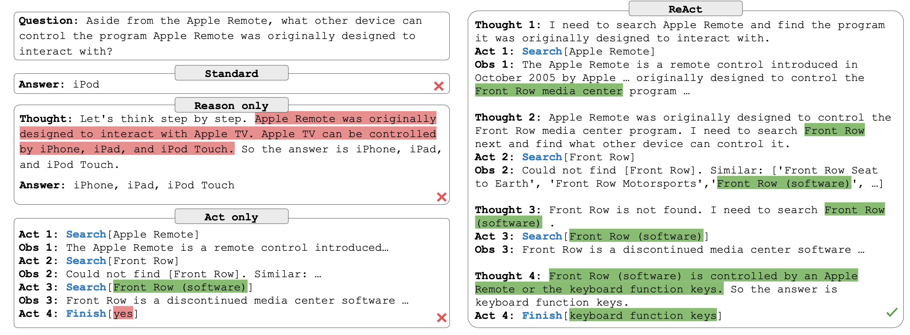
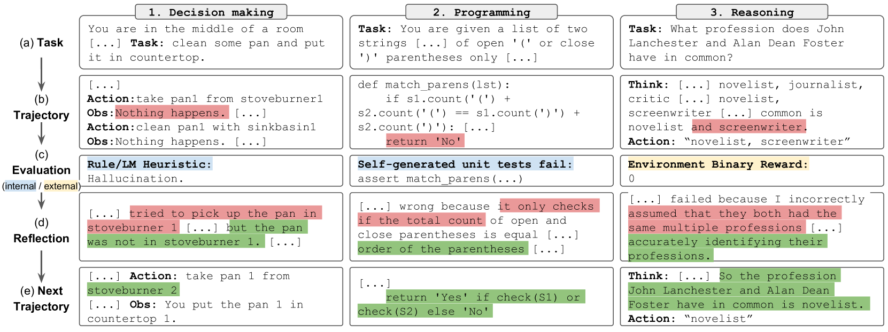
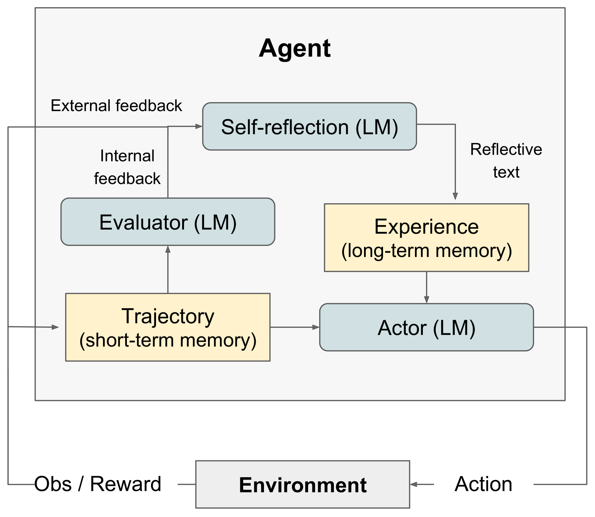
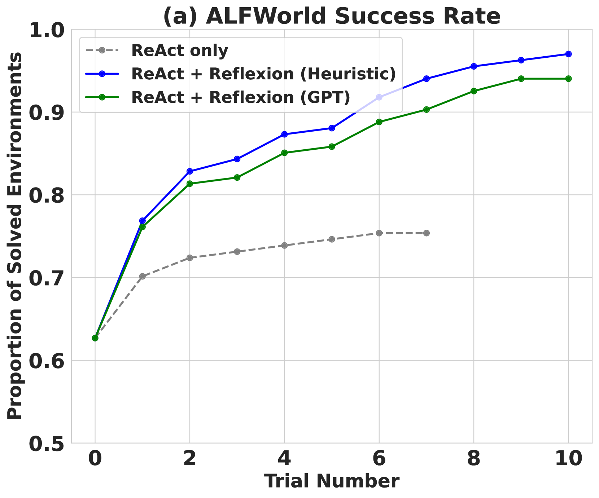
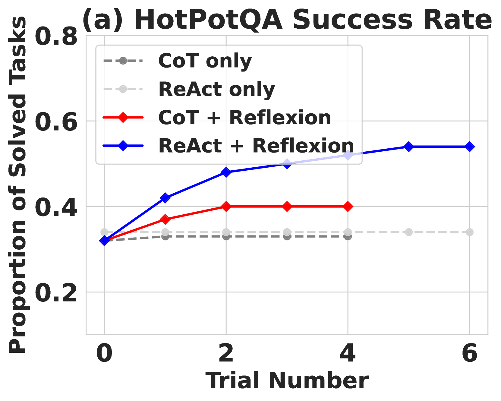
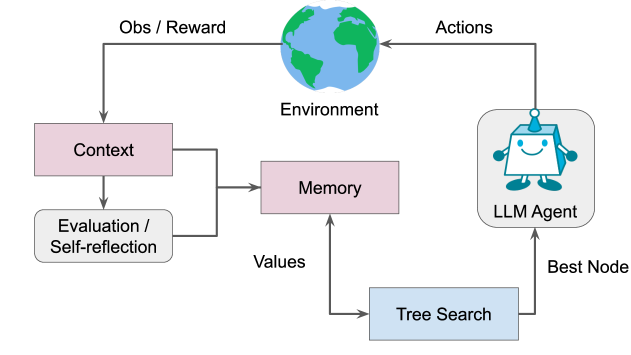
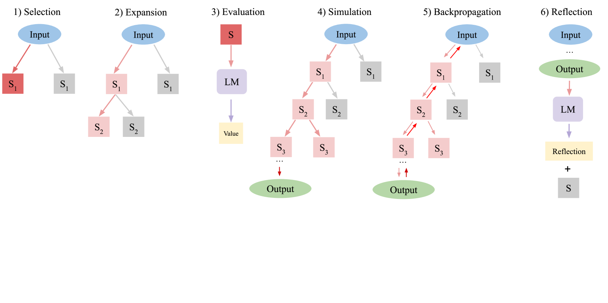

# AI Agent 开发

> 构建自主决策与行动的智能体

AI Agent 是能够感知环境、自主决策并采取行动来完成目标的智能系统。与传统的 LLM 应用（接收输入 → 生成输出）不同，Agent 具备**循环推理**、**工具使用**和**自我纠错**的能力，能够处理开放式、多步骤的复杂任务。

```
传统 LLM 应用:  用户输入 → LLM → 输出结果

AI Agent:       用户目标 → [感知 → 推理 → 决策 → 行动 → 观察] → 完成目标
                              ↑_________________________↓ (循环)
```

## 学习目标

完成本章学习后，你将能够：

- 理解并实现四种主流 Agent 架构模式：ReAct、Plan-and-Execute、Reflexion、LATS
- 设计包含短期、长期和工作记忆的完整记忆系统
- 构建灵活的工具注册、发现和执行机制
- 实现多 Agent 协作的通信与协调策略
- 为 Agent 系统添加安全边界和权限控制
- 使用多维度方法评估和调试 Agent 行为

---

## 1. Agent 架构模式

Agent 的架构模式决定了它如何思考和行动。不同模式适用于不同复杂度的任务。

### 架构模式对比

| 模式 | 核心思想 | 适用场景 | 优势 | 劣势 |
|------|----------|----------|------|------|
| **ReAct** | Thought → Action → Observation 循环 | 单步推理、简单工具调用 | 实现简单、响应快 | 缺乏全局规划 |
| **Plan-and-Execute** | 先规划所有步骤，再逐步执行 | 复杂多步骤任务 | 全局视角、步骤清晰 | 规划可能不准确 |
| **Reflexion** | 执行后自我反思与纠错 | 需要高准确率的任务 | 自我改进、减少错误 | 额外 LLM 调用开销 |
| **LATS** | 树搜索 + Monte Carlo 方法 | 探索性强的复杂决策 | 探索多条路径、最优选择 | 计算成本高 |

### 1.1 ReAct 模式

ReAct（Reasoning + Acting）是最基础也最常用的 Agent 模式，由 Yao et al. (2023) 在论文 *"ReAct: Synergizing Reasoning and Acting in Language Models"* 中提出。其核心思想是让 Agent 在每一步交替进行**推理**（Thought）和**行动**（Action），并根据**观察**（Observation）决定下一步，形成 Thought → Action → Observation 的交替循环。

下图来自 ReAct 论文，展示了三种方法的对比——纯推理（Reason Only，左）、纯行动（Act Only，右）和 ReAct（下）。可以清楚看到 ReAct 如何将推理轨迹和行动交替进行，形成更完整的问题解决过程：


**图解说明：**
- **Reason Only（左，Chain-of-Thought）**：模型仅依赖内部知识进行推理，容易产生幻觉（图中红色标注的错误信息），因为无法与外部环境交互验证事实
- **Act Only（右）**：模型直接执行搜索等动作，但缺乏推理能力，即使获取了正确信息也无法有效综合得出答案
- **ReAct（下）**：交替进行 Thought（推理）和 Action（行动），推理帮助规划下一步搜索策略，搜索结果又为推理提供事实依据，形成良性循环

**ReAct 的关键洞察：**

- **推理轨迹（Reasoning Traces）** 帮助模型追踪执行计划、处理异常情况和更新当前状态，使决策过程更加透明可控
- **行动（Actions）** 允许模型与外部信息源（搜索引擎、数据库、API 等）交互，获取实时信息来辅助推理
- 单独使用推理（如 Chain-of-Thought）容易产生幻觉和错误累积；单独使用行动（Acting-only）则缺乏高层规划能力。ReAct 将两者结合，互相弥补不足

下图展示了 ReAct 在 HotPotQA 多跳问答任务上的具体执行过程——Agent 如何通过交替的 Thought 和 Action 步骤，逐步检索信息并推理出最终答案：



在原始论文的实验中，ReAct 在 HotPotQA（多跳问答）和 ALFWorld（交互式决策）任务上均优于纯推理（CoT）和纯行动（Acting-only）方法。例如在 HotPotQA 上，ReAct 通过与 Wikipedia API 交互获取事实信息，有效减少了幻觉问题；在 ALFWorld 中，ReAct 的成功率比纯模仿学习方法提升了 34%。

```
┌─────────────────────────────────┐
│           用户输入               │
└──────────┬──────────────────────┘
           ▼
┌─────────────────────────────────┐
│  Thought: 我需要做什么？         │
└──────────┬──────────────────────┘
           ▼
┌─────────────────────────────────┐
│  Action: 调用工具/执行操作        │
└──────────┬──────────────────────┘
           ▼
┌─────────────────────────────────┐
│  Observation: 观察执行结果        │
├─────────────────────────────────┤
│  任务完成？ ─── 否 ──→ 回到 Thought│
│       │                         │
│      是                         │
│       ▼                         │
│  返回最终结果                    │
└─────────────────────────────────┘
```

```python
from openai import OpenAI
import json

client = OpenAI()

# 定义可用工具
tools = [
    {
        "type": "function",
        "function": {
            "name": "search_web",
            "description": "搜索互联网获取最新信息",
            "parameters": {
                "type": "object",
                "properties": {
                    "query": {"type": "string", "description": "搜索关键词"}
                },
                "required": ["query"]
            }
        }
    },
    {
        "type": "function",
        "function": {
            "name": "calculator",
            "description": "执行数学计算",
            "parameters": {
                "type": "object",
                "properties": {
                    "expression": {"type": "string", "description": "数学表达式"}
                },
                "required": ["expression"]
            }
        }
    }
]

# 工具实现
def search_web(query: str) -> str:
    # 实际项目中接入搜索 API
    return f"搜索结果: '{query}' 的相关信息..."

def calculator(expression: str) -> str:
    try:
        result = eval(expression)  # 生产环境应使用安全的表达式解析器
        return str(result)
    except Exception as e:
        return f"计算错误: {e}"

tool_map = {"search_web": search_web, "calculator": calculator}

def react_agent(user_input: str, max_steps: int = 5) -> str:
    """ReAct Agent 核心循环"""
    messages = [
        {"role": "system", "content": (
            "你是一个有用的助手。请一步步思考，使用可用工具来回答问题。"
            "每次只执行一个操作，观察结果后再决定下一步。"
        )},
        {"role": "user", "content": user_input}
    ]

    for step in range(max_steps):
        response = client.chat.completions.create(
            model="gpt-4o",
            messages=messages,
            tools=tools,
            tool_choice="auto"
        )
        msg = response.choices[0].message
        messages.append(msg)

        # 没有工具调用 → Agent 认为任务完成
        if not msg.tool_calls:
            return msg.content

        # 执行工具调用（Thought → Action → Observation）
        for tool_call in msg.tool_calls:
            func_name = tool_call.function.name
            args = json.loads(tool_call.function.arguments)
            print(f"  [Step {step+1}] Action: {func_name}({args})")

            result = tool_map[func_name](**args)
            print(f"  [Step {step+1}] Observation: {result}")

            messages.append({
                "role": "tool",
                "tool_call_id": tool_call.id,
                "content": result
            })

    return "达到最大步骤数，任务未完成。"

# 使用示例
# answer = react_agent("2024年诺贝尔物理学奖得主是谁？他们的贡献涉及哪些数学概念？")
```

### 1.2 Plan-and-Execute 模式

Plan-and-Execute 将任务分为两个阶段：**规划阶段**生成完整的执行计划，**执行阶段**逐步完成每个子任务。适合需要全局视角的复杂任务。该模式基于 Wang et al. 的 [Plan-and-Solve Prompting](https://arxiv.org/abs/2305.04091) 论文和 Yohei Nakajima 的 BabyAGI 项目。

相比 ReAct 的"边想边做"，Plan-and-Execute 有三大优势（来自 [LangChain 官方博客](https://blog.langchain.com/planning-agents/)）：

- ⏰ **更快**：子任务执行不需要每次都调用大模型，可以用更轻量的模型或直接调用工具
- 💸 **更省**：大模型只在规划和重新规划时调用，子任务可以用小模型完成
- 🏆 **更好**：强制 Planner 提前思考所有步骤，相当于一种 Chain-of-Thought，提升整体质量

```
┌──────────────┐     ┌──────────────────────────────┐
│   用户目标    │────▶│  Planner: 生成步骤计划         │
└──────────────┘     │  1. 子任务 A                   │
                     │  2. 子任务 B                   │
                     │  3. 子任务 C                   │
                     └──────────┬───────────────────┘
                                ▼
                     ┌──────────────────────────────┐
                     │  Executor: 逐步执行            │
                     │  步骤 1 → 结果 1               │
                     │  步骤 2 → 结果 2               │
                     │  步骤 3 → 结果 3               │
                     └──────────┬───────────────────┘
                                ▼
                     ┌──────────────────────────────┐
                     │  Re-planner: 根据结果调整计划   │
                     │  (可选：动态重新规划)           │
                     └──────────────────────────────┘
```

```python
from pydantic import BaseModel

class Plan(BaseModel):
    steps: list[str]
    current_step: int = 0

class StepResult(BaseModel):
    step: str
    result: str
    success: bool

def plan_and_execute_agent(user_goal: str) -> str:
    """Plan-and-Execute Agent"""

    # 阶段一：规划
    plan_response = client.chat.completions.create(
        model="gpt-4o",
        messages=[
            {"role": "system", "content": (
                "你是一个任务规划器。将用户目标分解为清晰的执行步骤。"
                "返回 JSON 格式: {\"steps\": [\"步骤1\", \"步骤2\", ...]}"
            )},
            {"role": "user", "content": f"目标: {user_goal}"}
        ],
        response_format={"type": "json_object"}
    )
    plan = Plan(**json.loads(plan_response.choices[0].message.content))
    print(f"📋 计划: {plan.steps}")

    # 阶段二：逐步执行
    results: list[StepResult] = []
    context = ""

    for i, step in enumerate(plan.steps):
        print(f"\n▶ 执行步骤 {i+1}/{len(plan.steps)}: {step}")

        exec_response = client.chat.completions.create(
            model="gpt-4o",
            messages=[
                {"role": "system", "content": "你是一个任务执行器。根据上下文完成指定步骤。"},
                {"role": "user", "content": (
                    f"总目标: {user_goal}\n"
                    f"已完成的上下文:\n{context}\n"
                    f"当前步骤: {step}\n"
                    "请执行这个步骤并返回结果。"
                )}
            ],
            tools=tools,
            tool_choice="auto"
        )

        msg = exec_response.choices[0].message
        # 处理工具调用（简化展示）
        step_result = msg.content or "步骤已执行"
        results.append(StepResult(step=step, result=step_result, success=True))
        context += f"\n步骤 {i+1}: {step}\n结果: {step_result}\n"

    # 阶段三：汇总结果
    summary_response = client.chat.completions.create(
        model="gpt-4o",
        messages=[
            {"role": "system", "content": "根据所有步骤的执行结果，生成最终回答。"},
            {"role": "user", "content": f"目标: {user_goal}\n执行记录:\n{context}"}
        ]
    )
    return summary_response.choices[0].message.content
```

#### Plan-and-Execute 的三种变体

LangChain 团队在 LangGraph 中实现了三种 Plan-and-Execute 变体，分别解决不同的性能瓶颈：

**变体一：基础 Plan-and-Execute**

最直接的实现：Planner 生成多步计划 → Executor 逐步执行 → Re-planner 根据结果决定是否调整计划。

```
用户查询 → [Planner] → 步骤1 → [Executor] → 结果1
                        步骤2 → [Executor] → 结果2
                        步骤3 → [Executor] → 结果3
                                              ↓
                                        [Re-planner]
                                        完成？→ 输出
                                        未完成？→ 新计划
```

**变体二：ReWOO（Reasoning WithOut Observations）**

来自 Xu et al. 的论文，核心创新是**变量引用**——Planner 的输出中可以用 `#E1`、`#E2` 等引用前序任务的结果，这样 Worker 执行时无需每次都回调大模型重新规划：

```
Planner 输出示例：
  Plan: 我需要知道今年超级碗的参赛队伍
  E1: Search[今年超级碗参赛队伍]
  Plan: 我需要知道第一支队伍的四分卫
  E2: LLM[#E1 中第一支队伍的四分卫是谁]
  Plan: 查找该四分卫的数据
  E3: Search[#E2 的赛季数据]

Worker: 按顺序执行 E1→E2→E3，自动替换变量
Solver: 整合所有结果生成最终答案
```

**变体三：LLMCompiler**

来自 Kim et al. 的论文，进一步提升**并行执行**能力。Planner 输出的不是线性步骤列表，而是一个**DAG（有向无环图）**，Task Fetching Unit 可以并行调度无依赖关系的任务：

```
Planner（流式输出 DAG）:
  Task 1: Search("队伍A四分卫")     [无依赖]
  Task 2: Search("队伍B四分卫")     [无依赖]  ← 与 Task 1 并行！
  Task 3: Search("${1} 赛季数据")   [依赖 Task 1]
  Task 4: Search("${2} 赛季数据")   [依赖 Task 2]

Task Fetching Unit: Task 1 和 2 并行执行，3 和 4 等依赖完成后并行执行
Joiner: 判断是否需要重新规划或直接输出
```

三种变体的对比：

| 变体 | 并行能力 | 变量引用 | LLM 调用次数 | 适用场景 |
|------|---------|---------|-------------|---------|
| **Plan-and-Execute** | 串行 | 无 | 每步一次 | 简单多步任务 |
| **ReWOO** | 串行 | 支持 `#E1` 引用 | 仅规划和汇总 | 任务间有依赖 |
| **LLMCompiler** | **DAG 并行** | 支持 `${1}` 引用 | 仅规划和汇总 | 高吞吐、低延迟 |

### 1.3 Reflexion 模式

Reflexion 由 Shinn et al. (2023) 在论文 *"Reflexion: Language Agents with Verbal Reinforcement Learning"* 中提出。其核心创新是**语言强化学习（Verbal Reinforcement Learning）**——Agent 不通过更新模型权重来学习，而是将失败经验转化为自然语言反馈，存储在情景记忆（Episodic Memory）中，在后续尝试中利用这些经验避免重复犯错。



**Reflexion 的三组件架构：**

Reflexion 由三个核心模型组件和一个记忆模块组成：

1. **Actor（行动者，$M_a$）**：基于当前状态和记忆生成动作（文本和行动），可以是任何 LLM，如 CoT 或 ReAct Agent
2. **Evaluator（评估者，$M_e$）**：对 Actor 的输出进行质量评分，提供任务完成度的信号（类似强化学习中的奖励函数）
3. **Self-Reflection（自我反思，$M_{sr}$）**：在 Actor 失败时，生成具体的、有建设性的语言反馈，指出失败原因和改进方向
4. **Memory（记忆）**：存储自我反思生成的经验总结，在后续 trial 中作为上下文提供给 Actor



**Reflexion 的核心算法流程：**

```
Trial t:
  1. Actor 根据任务 + 历史反思记忆生成行动轨迹 τ_t
  2. Evaluator 评估轨迹，生成评分 r_t
  3. 如果 r_t 未达标：
     - Self-Reflection 分析失败原因，生成反思文本 sr_t
     - 将 sr_t 存入 Memory
  4. 重复直到成功或达到最大尝试次数
```

**实验结果：**

Reflexion 在多个基准测试上取得了显著提升：

- **HumanEval（代码生成）**：达到 91% pass@1 准确率，超过 GPT-4 的 80%
- **AlfWorld（交互式决策）**：相比基线提升 22%，通过反思记忆有效避免重复探索错误路径
- **HotPotQA（多跳问答）**：相比基线提升 20%，反思帮助 Agent 识别搜索策略中的错误





**关键洞察：** Reflexion 证明了语言本身可以作为强化信号——无需梯度更新或微调，仅通过将失败经验编码为自然语言并存入情景记忆，就能实现 Agent 的持续自我改进。这种"verbal reinforcement"范式大幅降低了 Agent 学习的成本和复杂度。

```
┌────────┐    ┌────────┐    ┌────────────┐    ┌──────────┐
│ 输入   │───▶│ 执行   │───▶│ 自我评估    │───▶│ 质量达标？│
└────────┘    └────────┘    └────────────┘    └────┬─────┘
                  ▲                                │
                  │              否                 │
                  └────────── 反思修正 ◀────────────┘
                                                   │ 是
                                              ┌────▼─────┐
                                              │ 输出结果  │
                                              └──────────┘
```

```python
class ReflexionAgent:
    def __init__(self, max_retries: int = 3):
        self.max_retries = max_retries
        self.reflections: list[str] = []  # 积累的反思经验

    def run(self, task: str) -> str:
        """带自我反思的执行循环"""
        result = None

        for attempt in range(self.max_retries):
            # 执行任务（带上历史反思）
            result = self._execute(task, attempt)

            # 自我评估
            evaluation = self._evaluate(task, result)

            if evaluation["passed"]:
                print(f"✅ 第 {attempt+1} 次尝试通过评估")
                return result

            # 反思并记录经验
            reflection = self._reflect(task, result, evaluation["feedback"])
            self.reflections.append(reflection)
            print(f"🔄 第 {attempt+1} 次反思: {reflection}")

        return result  # 返回最后一次结果

    def _execute(self, task: str, attempt: int) -> str:
        reflection_context = ""
        if self.reflections:
            reflection_context = (
                "\n之前的反思经验（请避免重复同样的错误）:\n"
                + "\n".join(f"- {r}" for r in self.reflections)
            )

        response = client.chat.completions.create(
            model="gpt-4o",
            messages=[
                {"role": "system", "content": f"完成以下任务。这是第 {attempt+1} 次尝试。{reflection_context}"},
                {"role": "user", "content": task}
            ]
        )
        return response.choices[0].message.content

    def _evaluate(self, task: str, result: str) -> dict:
        response = client.chat.completions.create(
            model="gpt-4o",
            messages=[
                {"role": "system", "content": (
                    "评估以下任务结果的质量。返回 JSON: "
                    "{\"passed\": bool, \"feedback\": \"具体问题描述\"}"
                )},
                {"role": "user", "content": f"任务: {task}\n结果: {result}"}
            ],
            response_format={"type": "json_object"}
        )
        return json.loads(response.choices[0].message.content)

    def _reflect(self, task: str, result: str, feedback: str) -> str:
        response = client.chat.completions.create(
            model="gpt-4o",
            messages=[
                {"role": "system", "content": "根据反馈生成简洁的改进建议（一句话）。"},
                {"role": "user", "content": f"任务: {task}\n结果: {result}\n反馈: {feedback}"}
            ]
        )
        return response.choices[0].message.content
```

### 1.4 LATS（Language Agent Tree Search）

LATS 由 Zhou et al. (2023) 在论文 *"Language Agent Tree Search Unifies Reasoning Acting and Planning in Language Models"* 中提出。LATS 将 Agent 决策建模为**树搜索**问题，将 Monte Carlo Tree Search（MCTS）的思想适配到语言模型 Agent 中，在多条可能的行动路径中搜索最优解。

**LATS 的核心创新：** 将 LM 同时用作三个角色——**Agent（行动者）**、**Value Function（价值函数）** 和 **Reflection Generator（反思生成器）**，统一了推理、行动、规划、自我反思和外部记忆五大能力。



**LATS 的六大操作：**

LATS 在每次迭代中执行以下六个操作，对应 MCTS 的核心步骤：

1. **Selection（选择）**：使用 UCT（Upper Confidence bounds applied to Trees）算法，从根节点出发选择最有潜力的叶节点进行扩展，平衡探索（exploration）与利用（exploitation）
2. **Expansion（扩展）**：在选中的叶节点上，采样 $n$ 个不同的候选动作，生成多个子节点，扩大搜索空间
3. **Evaluation（评估）**：对每个新节点进行价值评估，结合 LM 自身的评分和 self-consistency（自洽性）投票来估计节点价值
4. **Simulation（模拟）**：从新节点出发，模拟执行直到达到终止状态（任务完成或失败），获取完整轨迹的反馈
5. **Backpropagation（回溯传播）**：将模拟得到的价值信号沿路径回溯传播，更新路径上所有祖先节点的统计信息
6. **Reflection（反思）**：当模拟到达失败的终止状态时，生成自我反思文本，分析失败原因，这些反思作为额外上下文在后续迭代中使用



**实验结果：**

LATS 在多个基准测试上达到了当时的最优水平：

- **HumanEval（代码生成）**：使用 GPT-4 达到 **92.7% pass@1**，显著超过 Reflexion 的 91%
- **HotPotQA（多跳问答）**：性能是 ReAct 的**两倍**，树搜索使 Agent 能够回溯并尝试不同的搜索策略
- **WebShop（网页购物）**：在交互式决策任务上也取得了显著提升

**关键洞察：** LATS 证明了将经典搜索算法（MCTS）与 LLM 结合的巨大潜力。通过让 LM 同时承担 Agent、价值函数和反思生成器三重角色，LATS 无需额外训练即可实现系统性的探索和回溯，特别适合探索空间大、需要回溯的复杂任务。

```
                        根节点（初始状态）
                       /        |        \
                   动作A       动作B      动作C
                  /    \        |        /    \
              A1→结果  A2→结果  B1→结果  C1→结果  C2→结果
              (0.3)   (0.7)   (0.5)   (0.9)    (0.2)
                                                  ↑
                                            最优路径选择
```

```python
from dataclasses import dataclass, field

@dataclass
class TreeNode:
    state: str                          # 当前状态描述
    action: str = ""                    # 到达此节点的动作
    reward: float = 0.0                 # 评估得分
    visits: int = 0                     # 访问次数
    children: list["TreeNode"] = field(default_factory=list)
    parent: "TreeNode | None" = None

class LATSAgent:
    def __init__(self, n_candidates: int = 3, max_depth: int = 5):
        self.n_candidates = n_candidates  # 每步生成的候选动作数
        self.max_depth = max_depth

    def search(self, task: str) -> str:
        root = TreeNode(state=f"任务: {task}")

        for _ in range(self.max_depth):
            # 1. 选择：找到最有潜力的叶节点
            leaf = self._select(root)

            # 2. 扩展：生成候选动作
            children = self._expand(leaf)

            # 3. 评估：对每个候选打分
            for child in children:
                child.reward = self._evaluate(task, child)

            # 4. 回溯：更新路径上的分数
            best_child = max(children, key=lambda c: c.reward)
            self._backpropagate(best_child)

            # 终止条件
            if best_child.reward > 0.9:
                return self._extract_solution(best_child)

        # 返回最优路径的解
        return self._extract_best_path(root)

    def _select(self, node: TreeNode) -> TreeNode:
        """UCB1 策略选择最有潜力的叶节点"""
        import math
        while node.children:
            node = max(node.children, key=lambda c: (
                c.reward / max(c.visits, 1)
                + 1.41 * math.sqrt(math.log(max(node.visits, 1)) / max(c.visits, 1))
            ))
        return node

    def _expand(self, node: TreeNode) -> list[TreeNode]:
        """生成多个候选下一步动作"""
        response = client.chat.completions.create(
            model="gpt-4o",
            messages=[
                {"role": "system", "content": (
                    f"给出 {self.n_candidates} 种不同的下一步行动方案。"
                    "返回 JSON: {\"actions\": [\"方案1\", \"方案2\", ...]}"
                )},
                {"role": "user", "content": f"当前状态: {node.state}"}
            ],
            response_format={"type": "json_object"}
        )
        actions = json.loads(response.choices[0].message.content)["actions"]
        children = []
        for action in actions:
            child = TreeNode(state=f"{node.state}\n动作: {action}", action=action, parent=node)
            node.children.append(child)
            children.append(child)
        return children

    def _evaluate(self, task: str, node: TreeNode) -> float:
        """评估节点状态对完成任务的贡献（0-1 分）"""
        response = client.chat.completions.create(
            model="gpt-4o",
            messages=[
                {"role": "system", "content": "评估当前进展对完成任务的贡献度，返回 JSON: {\"score\": 0.0-1.0}"},
                {"role": "user", "content": f"任务: {task}\n当前路径: {node.state}"}
            ],
            response_format={"type": "json_object"}
        )
        return json.loads(response.choices[0].message.content)["score"]

    def _backpropagate(self, node: TreeNode):
        """回溯更新祖先节点的统计信息"""
        while node:
            node.visits += 1
            node = node.parent

    def _extract_solution(self, node: TreeNode) -> str:
        return node.state

    def _extract_best_path(self, root: TreeNode) -> str:
        node = root
        while node.children:
            node = max(node.children, key=lambda c: c.reward)
        return node.state
```

### 架构选型决策树

```
你的任务是什么？
│
├─ 简单的工具调用或问答 ──────────────▶ ReAct
│
├─ 多步骤、有明确子任务 ──────────────▶ Plan-and-Execute
│
├─ 需要高准确率、容忍多次尝试 ────────▶ Reflexion
│
└─ 探索空间大、需要比较多条路径 ──────▶ LATS
```

### Agent 方法能力对比

下表总结了主流 Agent 方法在五大核心能力维度上的覆盖情况（源自 LATS 论文的分析框架）：

| 方法 | Reasoning（推理） | Acting（行动） | Planning（规划） | Self-Reflection（自我反思） | External Memory（外部记忆） |
|------|:-:|:-:|:-:|:-:|:-:|
| **CoT** | ✅ | ❌ | ❌ | ❌ | ❌ |
| **ReAct** | ✅ | ✅ | ❌ | ❌ | ❌ |
| **ToT** | ✅ | ❌ | ✅ | ❌ | ❌ |
| **Reflexion** | ✅ | ✅ | ❌ | ✅ | ✅ |
| **LATS** | ✅ | ✅ | ✅ | ✅ | ✅ |

- **CoT（Chain-of-Thought）**：仅具备推理能力，通过逐步思考提升复杂问题的解答质量，但无法与外部环境交互
- **ReAct**：在推理基础上增加了行动能力，可以调用工具和 API，但缺乏全局规划和从失败中学习的机制
- **ToT（Tree-of-Thoughts）**：引入树状搜索进行规划，但仅在推理空间中搜索，不与外部环境交互
- **Reflexion**：在 ReAct 基础上增加了自我反思和记忆，能从失败中学习，但每次只探索单条路径
- **LATS**：统一了全部五大能力，通过 MCTS 实现系统性规划和多路径探索，同时具备反思和记忆机制

### Anthropic 的 Agentic 系统设计模式

Anthropic 在 [Building Effective Agents](https://anthropic.com/engineering/building-effective-agents) 一文中，基于大量客户实践总结了从简单到复杂的 Agentic 系统设计模式。其核心理念是：**从最简单的方案开始，只在确实能提升效果时才增加复杂度**。

Anthropic 将 Agentic 系统分为两大类：
- **Workflow（工作流）**：LLM 和工具通过**预定义的代码路径**编排，流程固定可预测
- **Agent（智能体）**：LLM **动态决定**自己的执行流程和工具使用，具有自主性

以下是 Anthropic 总结的五种 Workflow 模式和一种 Agent 模式，按复杂度递增排列：

| 模式 | 核心思想 | 适用场景 | 对应本章模式 |
|------|---------|---------|-------------|
| **Prompt Chaining** | 将任务分解为固定的顺序步骤，每步输出作为下步输入 | 可清晰分解为固定子任务的场景（如生成文案→翻译） | Plan-and-Execute 的简化版 |
| **Routing** | 对输入分类，路由到不同的专业化处理流程 | 输入类型多样、需要不同处理策略（如客服分流） | — |
| **Parallelization** | 多个 LLM 同时处理任务的不同方面，结果聚合 | 可并行的子任务、需要多视角投票（如代码审查） | LLMCompiler 的思想 |
| **Orchestrator-Workers** | 中央 LLM 动态分解任务，分配给 Worker LLM 执行 | 无法预知子任务的复杂场景（如代码重构） | Plan-and-Execute |
| **Evaluator-Optimizer** | 一个 LLM 生成，另一个 LLM 评估并反馈，循环迭代 | 有明确评估标准、迭代能提升质量（如文学翻译） | Reflexion |
| **Autonomous Agent** | LLM 在循环中自主决策、调用工具、根据环境反馈调整 | 开放式问题、无法预知步骤数（如 SWE-bench） | ReAct / LATS |

> **关键建议**：大多数成功的 Agent 实现并不使用复杂框架，而是用简单、可组合的模式构建。框架可以帮助快速起步，但要确保理解底层代码——对底层实现的错误假设是客户最常见的错误来源。

---

## 2. 记忆系统

记忆是 Agent 从"无状态函数"进化为"持续学习的智能体"的关键。一个完整的 Agent 记忆系统包含三个层次：

```
┌─────────────────────────────────────────────────────┐
│                   Agent 记忆架构                     │
├─────────────────────────────────────────────────────┤
│                                                     │
│  ┌─────────────┐  ┌─────────────┐  ┌─────────────┐ │
│  │  短期记忆    │  │  工作记忆    │  │  长期记忆    │ │
│  │  Short-term │  │  Working    │  │  Long-term  │ │
│  ├─────────────┤  ├─────────────┤  ├─────────────┤ │
│  │ 对话历史    │  │ 当前任务状态 │  │ 向量数据库   │ │
│  │ 上下文窗口  │  │ 中间结果    │  │ 知识积累     │ │
│  │ 最近交互    │  │ 执行计划    │  │ 经验教训     │ │
│  └─────────────┘  └─────────────┘  └─────────────┘ │
│       秒~分钟          分钟~小时        天~永久       │
└─────────────────────────────────────────────────────┘
```

| 记忆类型 | 存储内容 | 生命周期 | 实现方式 |
|----------|----------|----------|----------|
| **短期记忆** | 对话历史、最近上下文 | 单次会话 | 消息列表、滑动窗口 |
| **工作记忆** | 当前任务状态、中间结果 | 单次任务 | 结构化状态对象 |
| **长期记忆** | 用户偏好、知识积累、经验 | 跨会话持久化 | 向量数据库、KV 存储 |

### 2.1 短期记忆

短期记忆管理当前对话的上下文。核心挑战是在有限的 Context Window 内保留最相关的信息。

```python
from collections import deque
from dataclasses import dataclass

@dataclass
class Message:
    role: str
    content: str
    token_count: int = 0

class ShortTermMemory:
    """基于滑动窗口的短期记忆管理"""

    def __init__(self, max_tokens: int = 8000):
        self.messages: deque[Message] = deque()
        self.max_tokens = max_tokens
        self.current_tokens = 0
        self.system_message: Message | None = None

    def add(self, role: str, content: str):
        token_count = len(content) // 3  # 粗略估算，生产环境用 tiktoken
        msg = Message(role=role, content=content, token_count=token_count)

        if role == "system":
            self.system_message = msg
            return

        self.messages.append(msg)
        self.current_tokens += token_count

        # 超出限制时移除最早的消息
        while self.current_tokens > self.max_tokens and len(self.messages) > 1:
            removed = self.messages.popleft()
            self.current_tokens -= removed.token_count

    def get_messages(self) -> list[dict]:
        result = []
        if self.system_message:
            result.append({"role": self.system_message.role, "content": self.system_message.content})
        for msg in self.messages:
            result.append({"role": msg.role, "content": msg.content})
        return result

    def summarize_and_compress(self):
        """将早期对话压缩为摘要"""
        if len(self.messages) < 6:
            return

        # 取前半部分消息进行摘要
        mid = len(self.messages) // 2
        old_messages = [self.messages.popleft() for _ in range(mid)]
        old_text = "\n".join(f"{m.role}: {m.content}" for m in old_messages)

        response = client.chat.completions.create(
            model="gpt-4o-mini",
            messages=[
                {"role": "system", "content": "将以下对话压缩为简洁摘要，保留关键信息。"},
                {"role": "user", "content": old_text}
            ]
        )
        summary = response.choices[0].message.content
        self.current_tokens = sum(m.token_count for m in self.messages)

        # 将摘要作为系统上下文插入
        summary_msg = Message(role="system", content=f"[对话摘要] {summary}", token_count=len(summary)//3)
        self.messages.appendleft(summary_msg)
        self.current_tokens += summary_msg.token_count
```

### 2.2 工作记忆

工作记忆保存当前任务的执行状态，类似于人类"脑中正在处理的事情"。

```python
from pydantic import BaseModel
from enum import Enum

class TaskStatus(str, Enum):
    PENDING = "pending"
    IN_PROGRESS = "in_progress"
    COMPLETED = "completed"
    FAILED = "failed"

class SubTask(BaseModel):
    id: str
    description: str
    status: TaskStatus = TaskStatus.PENDING
    result: str | None = None
    dependencies: list[str] = []

class WorkingMemory(BaseModel):
    """Agent 工作记忆：当前任务的完整状态"""
    goal: str                                    # 最终目标
    plan: list[SubTask] = []                     # 执行计划
    current_step: int = 0                        # 当前步骤索引
    intermediate_results: dict[str, str] = {}    # 中间结果
    observations: list[str] = []                 # 观察记录
    errors: list[str] = []                       # 错误记录

    def get_context_summary(self) -> str:
        """生成当前状态的上下文摘要，注入到 LLM prompt 中"""
        completed = [t for t in self.plan if t.status == TaskStatus.COMPLETED]
        pending = [t for t in self.plan if t.status == TaskStatus.PENDING]

        return (
            f"目标: {self.goal}\n"
            f"进度: {len(completed)}/{len(self.plan)} 步完成\n"
            f"已完成: {', '.join(t.description for t in completed) or '无'}\n"
            f"待执行: {', '.join(t.description for t in pending) or '无'}\n"
            f"最近观察: {self.observations[-3:] if self.observations else '无'}\n"
        )

    def advance(self, result: str):
        """推进到下一步"""
        if self.current_step < len(self.plan):
            task = self.plan[self.current_step]
            task.status = TaskStatus.COMPLETED
            task.result = result
            self.intermediate_results[task.id] = result
            self.current_step += 1
            if self.current_step < len(self.plan):
                self.plan[self.current_step].status = TaskStatus.IN_PROGRESS
```

### 2.3 长期记忆

长期记忆使 Agent 能够跨会话积累知识和经验，通过向量数据库实现语义检索。

```python
import hashlib
from datetime import datetime

class LongTermMemory:
    """基于向量数据库的长期记忆"""

    def __init__(self, collection_name: str = "agent_memory"):
        # 使用 chromadb 作为向量存储（也可替换为 Pinecone、Weaviate 等）
        import chromadb
        self.client = chromadb.PersistentClient(path="./agent_memory_db")
        self.collection = self.client.get_or_create_collection(
            name=collection_name,
            metadata={"hnsw:space": "cosine"}
        )

    def store(self, content: str, metadata: dict | None = None):
        """存储一条记忆"""
        doc_id = hashlib.md5(content.encode()).hexdigest()
        meta = metadata or {}
        meta["timestamp"] = datetime.now().isoformat()

        self.collection.upsert(
            ids=[doc_id],
            documents=[content],
            metadatas=[meta]
        )

    def recall(self, query: str, top_k: int = 5, filter_metadata: dict | None = None) -> list[str]:
        """根据语义相似度检索记忆"""
        results = self.collection.query(
            query_texts=[query],
            n_results=top_k,
            where=filter_metadata
        )
        return results["documents"][0] if results["documents"] else []

    def forget(self, older_than_days: int = 90):
        """遗忘过期记忆"""
        cutoff = datetime.now().timestamp() - older_than_days * 86400
        # 实际实现需要根据向量数据库的 API 进行过滤删除
        print(f"清理 {older_than_days} 天前的记忆...")
```

### 2.4 记忆管理策略

#### Generative Agents 的三层记忆架构

在讨论记忆管理策略之前，值得深入了解 Agent 记忆系统的经典实现——Park et al. (2023) 在论文 *"Generative Agents: Interactive Simulacra of Human Behavior"* 中提出的**斯坦福小镇（Smallville）** 架构。该研究创建了 25 个由 LLM 驱动的虚拟居民，它们在沙盒环境中自主生活、社交和协作，展现出令人惊叹的涌现社会行为（如自发组织派对、传播信息等）。

这一切的基础是其精心设计的**三层记忆架构**：

```
┌─────────────────────────────────────────────────────────────┐
│              Generative Agents 记忆架构                      │
├─────────────────────────────────────────────────────────────┤
│                                                             │
│  第 1 层: Memory Stream（记忆流）                             │
│  ├── 以自然语言形式存储所有观察和经历                          │
│  ├── 每条记忆包含：描述、创建时间、最近访问时间                 │
│  └── 示例："Klaus Mueller 正在图书馆阅读关于药理学的论文"       │
│                                                             │
│  第 2 层: Retrieval（检索）                                   │
│  ├── 三维度加权检索：                                        │
│  │   ├── Recency（时效性）：最近的记忆权重更高，指数衰减       │
│  │   ├── Importance（重要性）：LM 对每条记忆评分 1-10         │
│  │   └── Relevance（相关性）：与当前情境的 Embedding 相似度    │
│  └── 综合得分 = α·recency + β·importance + γ·relevance      │
│                                                             │
│  第 3 层: Reflection（反思）→ Planning（规划）                 │
│  ├── Reflection：定期从近期记忆中合成更高层次的抽象认知         │
│  │   └── 示例：从多次观察中总结出"Klaus 对研究充满热情"        │
│  ├── Planning：基于反思结果生成行为计划                       │
│  │   └── 从粗粒度日计划逐步细化为具体的小时级行动              │
│  └── 反思本身也存入 Memory Stream，形成递归的认知层次          │
│                                                             │
└─────────────────────────────────────────────────────────────┘
```

Generative Agents 的记忆架构对 AI Agent 开发有重要启示：

- **自然语言作为记忆格式**：所有观察和经验都以自然语言存储，天然兼容 LLM 的输入输出
- **多维度检索**：不仅按语义相关性检索，还考虑时效性和重要性，更接近人类记忆的工作方式
- **反思产生抽象**：通过定期反思，Agent 能从具体事件中提炼出高层次的认知和信念，指导后续行为
- **记忆驱动规划**：行为计划不是凭空生成的，而是基于检索到的相关记忆和反思结果

这一架构为后续的 Agent 记忆系统设计提供了重要的参考范式。

| 策略 | 描述 | 适用场景 |
|------|------|----------|
| **摘要压缩** | 将长对话压缩为摘要 | 长对话、上下文窗口不足 |
| **选择性遗忘** | 按时间/重要性淘汰旧记忆 | 长期运行的 Agent |
| **语义检索** | 按相关性检索最相关的记忆 | 知识库问答、经验复用 |
| **分层存储** | 热数据在内存，冷数据在磁盘 | 高性能要求的场景 |
| **重要性评分** | 对记忆标注重要性，优先保留高分 | 需要精细管理的场景 |

```python
class MemoryManager:
    """统一记忆管理器：协调三层记忆"""

    def __init__(self):
        self.short_term = ShortTermMemory(max_tokens=8000)
        self.working = WorkingMemory(goal="")
        self.long_term = LongTermMemory()

    def build_context(self, current_input: str) -> list[dict]:
        """构建完整的 LLM 上下文"""
        # 1. 从长期记忆检索相关经验
        relevant_memories = self.long_term.recall(current_input, top_k=3)
        memory_context = "\n".join(f"- {m}" for m in relevant_memories)

        # 2. 获取工作记忆状态
        task_context = self.working.get_context_summary()

        # 3. 组装系统提示
        system_prompt = (
            "你是一个智能助手。\n\n"
            f"[相关经验]\n{memory_context}\n\n"
            f"[当前任务状态]\n{task_context}"
        )
        self.short_term.add("system", system_prompt)
        self.short_term.add("user", current_input)

        return self.short_term.get_messages()

    def save_experience(self, task: str, result: str, success: bool):
        """将任务经验存入长期记忆"""
        experience = f"任务: {task} | 结果: {'成功' if success else '失败'} | 摘要: {result[:200]}"
        self.long_term.store(experience, metadata={"success": success, "type": "experience"})
```

---

## 3. 工具系统

工具赋予 Agent 与外部世界交互的能力。一个成熟的工具系统需要解决三个问题：**如何注册和发现工具**、**如何让 LLM 选对工具**、**如何安全高效地执行工具**。

### 3.1 工具注册与发现

工具注册有三种主要方式：

| 方式 | 描述 | 优势 | 劣势 |
|------|------|------|------|
| **静态注册** | 启动时硬编码所有工具 | 简单可控 | 不灵活 |
| **动态发现** | 运行时根据任务加载工具 | 灵活、可扩展 | 复杂度高 |
| **MCP 协议** | 通过标准协议连接外部工具服务 | 标准化、生态丰富 | 需要额外基础设施 |

```python
from abc import ABC, abstractmethod
from typing import Any, Callable
import asyncio
import inspect

class Tool(ABC):
    """工具基类"""
    @property
    @abstractmethod
    def name(self) -> str: ...

    @property
    @abstractmethod
    def description(self) -> str: ...

    @property
    @abstractmethod
    def parameters(self) -> dict: ...

    @abstractmethod
    async def execute(self, **kwargs) -> str: ...

    def to_openai_schema(self) -> dict:
        return {
            "type": "function",
            "function": {
                "name": self.name,
                "description": self.description,
                "parameters": self.parameters
            }
        }

class ToolRegistry:
    """工具注册中心"""

    def __init__(self):
        self._tools: dict[str, Tool] = {}
        self._categories: dict[str, list[str]] = {}

    def register(self, tool: Tool, category: str = "general"):
        """静态注册工具"""
        self._tools[tool.name] = tool
        self._categories.setdefault(category, []).append(tool.name)

    def register_function(self, func: Callable, description: str, category: str = "general"):
        """从普通函数快速注册工具"""
        sig = inspect.signature(func)
        params = {
            "type": "object",
            "properties": {},
            "required": []
        }
        for param_name, param in sig.parameters.items():
            param_type = "string"  # 默认类型
            if param.annotation == int:
                param_type = "integer"
            elif param.annotation == float:
                param_type = "number"
            elif param.annotation == bool:
                param_type = "boolean"
            params["properties"][param_name] = {"type": param_type, "description": param_name}
            if param.default is inspect.Parameter.empty:
                params["required"].append(param_name)

        # 创建动态工具类
        tool_instance = type("DynamicTool", (Tool,), {
            "name": property(lambda self: func.__name__),
            "description": property(lambda self: description),
            "parameters": property(lambda self: params),
            "execute": lambda self, **kwargs: asyncio.coroutine(lambda: func(**kwargs))()
                if not asyncio.iscoroutinefunction(func)
                else func(**kwargs)
        })()
        self.register(tool_instance, category)

    def get_tools_for_task(self, task_description: str, max_tools: int = 10) -> list[Tool]:
        """动态发现：根据任务描述选择相关工具"""
        # 简单实现：返回所有工具。生产环境可用 Embedding 相似度匹配
        all_tools = list(self._tools.values())
        return all_tools[:max_tools]

    def get_openai_schemas(self, tool_names: list[str] | None = None) -> list[dict]:
        """获取 OpenAI Function Calling 格式的工具定义"""
        if tool_names:
            return [self._tools[n].to_openai_schema() for n in tool_names if n in self._tools]
        return [t.to_openai_schema() for t in self._tools.values()]

    async def execute(self, tool_name: str, **kwargs) -> str:
        """执行指定工具"""
        if tool_name not in self._tools:
            return f"错误: 工具 '{tool_name}' 不存在"
        return await self._tools[tool_name].execute(**kwargs)
```

### 3.2 工具描述优化

工具描述的质量直接影响 LLM 选择正确工具的概率。以下是优化原则：

```
❌ 差的描述:
   name: "query"
   description: "查询数据"

✅ 好的描述:
   name: "query_database"
   description: "在 PostgreSQL 数据库中执行 SQL 查询。
                 适用于：查询用户信息、订单数据、统计报表。
                 不适用于：修改数据（请用 update_database）、文件操作。
                 输入：标准 SQL SELECT 语句。
                 输出：JSON 格式的查询结果，最多返回 100 行。"
```

**工具描述优化清单：**

| 要素 | 说明 | 示例 |
|------|------|------|
| **明确用途** | 说明工具做什么 | "在知识库中搜索相关文档" |
| **适用场景** | 什么时候该用 | "当用户询问产品功能时使用" |
| **不适用场景** | 什么时候不该用 | "不适用于价格查询（请用 price_lookup）" |
| **输入格式** | 参数的格式要求 | "日期格式: YYYY-MM-DD" |
| **输出格式** | 返回值的结构 | "返回 JSON 数组，每项包含 title 和 content" |
| **限制条件** | 使用限制 | "每次最多返回 10 条结果" |

### 3.3 工具执行：同步/异步、超时与重试

```python
import asyncio
from functools import wraps

class ToolExecutor:
    """工具执行引擎：处理超时、重试、并发"""

    def __init__(self, default_timeout: float = 30.0, max_retries: int = 2):
        self.default_timeout = default_timeout
        self.max_retries = max_retries

    async def execute_with_retry(
        self,
        tool: Tool,
        timeout: float | None = None,
        **kwargs
    ) -> str:
        """带超时和重试的工具执行"""
        timeout = timeout or self.default_timeout
        last_error = None

        for attempt in range(self.max_retries + 1):
            try:
                result = await asyncio.wait_for(
                    tool.execute(**kwargs),
                    timeout=timeout
                )
                return result
            except asyncio.TimeoutError:
                last_error = f"工具 {tool.name} 执行超时（{timeout}s）"
                print(f"⏱ {last_error}，重试 {attempt+1}/{self.max_retries}")
            except Exception as e:
                last_error = f"工具 {tool.name} 执行失败: {e}"
                print(f"❌ {last_error}，重试 {attempt+1}/{self.max_retries}")

            if attempt < self.max_retries:
                await asyncio.sleep(2 ** attempt)  # 指数退避

        return f"错误: {last_error}"

    async def execute_parallel(self, calls: list[tuple[Tool, dict]]) -> list[str]:
        """并行执行多个工具调用"""
        tasks = [
            self.execute_with_retry(tool, **kwargs)
            for tool, kwargs in calls
        ]
        return await asyncio.gather(*tasks, return_exceptions=True)
```

---

## 4. 多 Agent 通信

当单个 Agent 无法胜任复杂任务时，多个专业化 Agent 协作可以显著提升系统能力。多 Agent 系统的核心挑战是**通信模式**和**协调策略**。

### 4.1 通信模式

```
顺序模式 (Sequential)          广播模式 (Broadcast)         发布/订阅 (Pub/Sub)
┌───┐   ┌───┐   ┌───┐      ┌───┐                       ┌─────────┐
│ A │──▶│ B │──▶│ C │      │ A │──┬──▶ B              │  消息总线 │
└───┘   └───┘   └───┘      └───┘  ├──▶ C              └────┬────┘
 结果逐步传递                       └──▶ D               ┌───┼───┐
                             同一消息发给所有人           A   B   C
                                                     各自订阅感兴趣的主题
```

```python
from dataclasses import dataclass
from enum import Enum

class MessageType(str, Enum):
    TASK = "task"           # 任务分配
    RESULT = "result"       # 结果返回
    QUERY = "query"         # 信息查询
    BROADCAST = "broadcast" # 广播通知

@dataclass
class AgentMessage:
    sender: str
    receiver: str          # "*" 表示广播
    msg_type: MessageType
    content: str
    metadata: dict | None = None

class MessageBus:
    """Agent 间消息总线"""

    def __init__(self):
        self._subscribers: dict[str, list[Callable]] = {}  # topic → handlers
        self._message_log: list[AgentMessage] = []

    def subscribe(self, agent_id: str, topic: str, handler: Callable):
        key = f"{topic}:{agent_id}"
        self._subscribers.setdefault(key, []).append(handler)

    async def publish(self, message: AgentMessage):
        self._message_log.append(message)

        if message.receiver == "*":
            # 广播模式
            for key, handlers in self._subscribers.items():
                for handler in handlers:
                    await handler(message)
        else:
            # 点对点
            for key, handlers in self._subscribers.items():
                if message.receiver in key:
                    for handler in handlers:
                        await handler(message)

    def get_conversation_history(self, agent_id: str) -> list[AgentMessage]:
        return [m for m in self._message_log if m.sender == agent_id or m.receiver in (agent_id, "*")]
```

### 4.2 协调策略

三种主流的多 Agent 协调架构：

| 策略 | 结构 | 适用场景 | 特点 |
|------|------|----------|------|
| **Supervisor** | 一个主管分配任务给工人 | 任务可明确分解 | 中心化控制、简单可靠 |
| **Swarm** | Agent 自主决定接手任务 | 动态、不可预测的任务流 | 去中心化、灵活 |
| **Hierarchical** | 多层级管理结构 | 大规模复杂系统 | 可扩展、职责清晰 |

```
Supervisor 模式:              Swarm 模式:              Hierarchical 模式:
    ┌──────────┐              ┌───┐ ┌───┐              ┌──────────┐
    │ Supervisor│              │ A │◄─►│ B │              │ Director │
    └────┬─────┘              └─┬─┘ └─┬─┘              └────┬─────┘
    ┌────┼────┐                 │     │               ┌────┼────┐
    ▼    ▼    ▼                 ▼     ▼               ▼         ▼
  ┌───┐┌───┐┌───┐           ┌───┐ ┌───┐        ┌─────────┐ ┌─────────┐
  │ A ││ B ││ C │           │ C │◄─►│ D │        │ Manager1│ │ Manager2│
  └───┘└───┘└───┘           └───┘ └───┘        └────┬────┘ └────┬────┘
                          任务在 Agent 间流转       ┌─┼─┐      ┌─┼─┐
                                                  A  B  C    D  E  F
```

```python
class BaseAgent:
    """Agent 基类"""
    def __init__(self, agent_id: str, role: str, system_prompt: str):
        self.agent_id = agent_id
        self.role = role
        self.system_prompt = system_prompt

    async def process(self, task: str, context: str = "") -> str:
        response = client.chat.completions.create(
            model="gpt-4o",
            messages=[
                {"role": "system", "content": self.system_prompt},
                {"role": "user", "content": f"上下文:\n{context}\n\n任务:\n{task}"}
            ]
        )
        return response.choices[0].message.content

class SupervisorCoordinator:
    """Supervisor 协调模式"""

    def __init__(self):
        self.workers: dict[str, BaseAgent] = {}
        self.supervisor = BaseAgent(
            agent_id="supervisor",
            role="supervisor",
            system_prompt=(
                "你是一个任务协调者。根据任务需求，决定分配给哪个工人。\n"
                "可用工人: {workers}\n"
                "返回 JSON: {\"assignments\": [{\"worker\": \"id\", \"subtask\": \"描述\"}]}"
            )
        )

    def add_worker(self, agent: BaseAgent):
        self.workers[agent.agent_id] = agent

    async def run(self, task: str) -> str:
        # 1. Supervisor 分解任务
        worker_info = ", ".join(f"{a.agent_id}({a.role})" for a in self.workers.values())
        self.supervisor.system_prompt = self.supervisor.system_prompt.format(workers=worker_info)

        plan_response = await self.supervisor.process(task)
        assignments = json.loads(plan_response).get("assignments", [])

        # 2. 分配给 Worker 执行
        results = {}
        context = ""
        for assignment in assignments:
            worker_id = assignment["worker"]
            subtask = assignment["subtask"]

            if worker_id in self.workers:
                result = await self.workers[worker_id].process(subtask, context)
                results[worker_id] = result
                context += f"\n{worker_id} 完成: {result[:200]}\n"

        # 3. Supervisor 汇总
        summary = await self.supervisor.process(
            f"汇总以下结果，生成最终回答:\n{json.dumps(results, ensure_ascii=False)}"
        )
        return summary

# 使用示例
async def multi_agent_example():
    coordinator = SupervisorCoordinator()
    coordinator.add_worker(BaseAgent("researcher", "研究员", "你是一个信息研究专家，擅长搜集和整理资料。"))
    coordinator.add_worker(BaseAgent("analyst", "分析师", "你是一个数据分析专家，擅长从数据中提取洞察。"))
    coordinator.add_worker(BaseAgent("writer", "写手", "你是一个技术写作专家，擅长将复杂内容写成易懂的文章。"))

    result = await coordinator.run("撰写一份关于 2026 年 AI Agent 技术趋势的分析报告")
    print(result)
```

### 4.3 冲突解决

当多个 Agent 对同一问题给出不同答案时，需要冲突解决机制：

| 策略 | 描述 | 适用场景 |
|------|------|----------|
| **投票** | 多数 Agent 的意见胜出 | 答案可量化比较 |
| **仲裁** | 专门的仲裁 Agent 做最终决定 | 需要专业判断 |
| **优先级** | 按 Agent 专业度/权限排序 | 有明确的专业分工 |
| **共识** | 迭代讨论直到达成一致 | 需要高质量决策 |

```python
async def resolve_by_voting(question: str, agents: list[BaseAgent]) -> str:
    """投票法解决冲突"""
    answers = []
    for agent in agents:
        answer = await agent.process(question)
        answers.append({"agent": agent.agent_id, "answer": answer})

    # 让一个裁判 Agent 统计投票
    judge = BaseAgent("judge", "裁判", "分析多个回答，选出最佳答案并说明理由。")
    answers_text = "\n".join(f"{a['agent']}: {a['answer']}" for a in answers)
    verdict = await judge.process(f"问题: {question}\n\n各方回答:\n{answers_text}")
    return verdict
```

---

## 5. 安全与边界

Agent 拥有自主行动能力，这意味着安全边界至关重要。一个不受约束的 Agent 可能执行危险操作、泄露敏感数据或产生有害输出。

### 安全防线全景

```
┌─────────────────────────────────────────────────────────┐
│                    Agent 安全防线                        │
├─────────────────────────────────────────────────────────┤
│                                                         │
│  第 1 层: 权限控制                                       │
│  ├── 工具白名单：Agent 只能调用被授权的工具                │
│  ├── 参数约束：限制工具参数的范围和格式                    │
│  └── 角色权限：不同 Agent 有不同的操作权限                 │
│                                                         │
│  第 2 层: 操作确认 (Human-in-the-Loop)                   │
│  ├── 高风险操作需要人工确认                               │
│  ├── 金额超过阈值需要审批                                │
│  └── 不可逆操作必须二次确认                               │
│                                                         │
│  第 3 层: 沙箱执行                                       │
│  ├── 代码在隔离环境中运行                                │
│  ├── 网络访问受限                                       │
│  └── 文件系统只读或受限                                  │
│                                                         │
│  第 4 层: 输出过滤                                       │
│  ├── 敏感信息脱敏（PII、密钥等）                         │
│  ├── 有害内容检测与拦截                                  │
│  └── 格式验证与合规检查                                  │
│                                                         │
└─────────────────────────────────────────────────────────┘
```

### 5.1 权限控制

```python
from enum import Flag, auto

class Permission(Flag):
    """Agent 权限标志"""
    READ = auto()       # 读取数据
    WRITE = auto()      # 写入数据
    EXECUTE = auto()    # 执行代码
    NETWORK = auto()    # 网络访问
    DELETE = auto()     # 删除操作
    ADMIN = auto()      # 管理员操作

    # 预定义权限组合
    READONLY = READ
    STANDARD = READ | WRITE | NETWORK
    FULL = READ | WRITE | EXECUTE | NETWORK | DELETE | ADMIN

class PermissionGuard:
    """权限守卫"""

    def __init__(self):
        self._agent_permissions: dict[str, Permission] = {}
        self._tool_requirements: dict[str, Permission] = {}

    def set_agent_permission(self, agent_id: str, permission: Permission):
        self._agent_permissions[agent_id] = permission

    def set_tool_requirement(self, tool_name: str, required: Permission):
        self._tool_requirements[tool_name] = required

    def check(self, agent_id: str, tool_name: str) -> bool:
        agent_perm = self._agent_permissions.get(agent_id, Permission.READONLY)
        tool_req = self._tool_requirements.get(tool_name, Permission.READ)
        return tool_req in agent_perm

    def enforce(self, agent_id: str, tool_name: str):
        if not self.check(agent_id, tool_name):
            agent_perm = self._agent_permissions.get(agent_id, Permission.READONLY)
            tool_req = self._tool_requirements.get(tool_name, Permission.READ)
            raise PermissionError(
                f"Agent '{agent_id}' 权限不足: 拥有 {agent_perm}, 需要 {tool_req}"
            )

# 使用示例
guard = PermissionGuard()
guard.set_agent_permission("assistant", Permission.STANDARD)
guard.set_agent_permission("admin_bot", Permission.FULL)
guard.set_tool_requirement("delete_user", Permission.DELETE | Permission.ADMIN)
guard.set_tool_requirement("search_docs", Permission.READ)

# guard.enforce("assistant", "delete_user")  # → PermissionError
# guard.enforce("assistant", "search_docs")  # → 通过
```

### 5.2 操作确认（Human-in-the-Loop）

```python
class HumanApproval:
    """人工审批机制"""

    # 需要人工确认的操作类型
    HIGH_RISK_ACTIONS = {"delete", "transfer", "deploy", "modify_permission"}
    AMOUNT_THRESHOLD = 1000  # 金额阈值

    @classmethod
    async def check_and_confirm(cls, action: str, params: dict) -> bool:
        risk_level = cls._assess_risk(action, params)

        if risk_level == "low":
            return True

        if risk_level == "medium":
            print(f"⚠️ 中风险操作: {action}({params})")
            print("自动记录审计日志，继续执行。")
            cls._log_audit(action, params)
            return True

        # 高风险：需要人工确认
        print(f"🚨 高风险操作需要人工确认:")
        print(f"   操作: {action}")
        print(f"   参数: {json.dumps(params, ensure_ascii=False)}")
        # 生产环境中通过 Slack/邮件/Web UI 发送审批请求
        # 这里简化为命令行确认
        confirmation = input("是否批准？(yes/no): ")
        approved = confirmation.lower() == "yes"
        cls._log_audit(action, params, approved=approved)
        return approved

    @classmethod
    def _assess_risk(cls, action: str, params: dict) -> str:
        if action in cls.HIGH_RISK_ACTIONS:
            return "high"
        if params.get("amount", 0) > cls.AMOUNT_THRESHOLD:
            return "high"
        if action.startswith("write_") or action.startswith("update_"):
            return "medium"
        return "low"

    @classmethod
    def _log_audit(cls, action: str, params: dict, approved: bool = True):
        log_entry = {
            "timestamp": datetime.now().isoformat(),
            "action": action,
            "params": params,
            "approved": approved
        }
        # 写入审计日志
        print(f"📝 审计日志: {json.dumps(log_entry, ensure_ascii=False)}")
```

### 5.3 沙箱执行

对于需要执行代码的 Agent，沙箱隔离是必须的安全措施：

```python
import subprocess
import tempfile
import os

class CodeSandbox:
    """代码沙箱执行环境"""

    def __init__(self, timeout: int = 10, max_memory_mb: int = 256):
        self.timeout = timeout
        self.max_memory_mb = max_memory_mb

    def execute_python(self, code: str) -> dict:
        """在隔离环境中执行 Python 代码"""
        # 安全检查：禁止危险操作
        forbidden = ["os.system", "subprocess", "shutil.rmtree", "__import__('os')", "eval(", "exec("]
        for pattern in forbidden:
            if pattern in code:
                return {"success": False, "output": "", "error": f"禁止使用: {pattern}"}

        with tempfile.NamedTemporaryFile(mode="w", suffix=".py", delete=False) as f:
            f.write(code)
            f.flush()
            try:
                result = subprocess.run(
                    ["python", f.name],
                    capture_output=True,
                    text=True,
                    timeout=self.timeout,
                    env={**os.environ, "PYTHONDONTWRITEBYTECODE": "1"},
                    # 生产环境应使用 Docker/gVisor 等容器级隔离
                )
                return {
                    "success": result.returncode == 0,
                    "output": result.stdout[:5000],
                    "error": result.stderr[:2000]
                }
            except subprocess.TimeoutExpired:
                return {"success": False, "output": "", "error": f"执行超时（{self.timeout}s）"}
            finally:
                os.unlink(f.name)
```

### 5.4 输出过滤

```python
import re

class OutputFilter:
    """Agent 输出过滤器"""

    # PII 模式
    PII_PATTERNS = {
        "email": r'\b[A-Za-z0-9._%+-]+@[A-Za-z0-9.-]+\.[A-Z|a-z]{2,}\b',
        "phone": r'\b1[3-9]\d{9}\b',
        "id_card": r'\b\d{17}[\dXx]\b',
        "credit_card": r'\b\d{4}[\s-]?\d{4}[\s-]?\d{4}[\s-]?\d{4}\b',
    }

    @classmethod
    def sanitize(cls, text: str) -> str:
        """脱敏处理"""
        for pii_type, pattern in cls.PII_PATTERNS.items():
            text = re.sub(pattern, f"[{pii_type.upper()}_REDACTED]", text)
        return text

    @classmethod
    def validate_output(cls, text: str) -> tuple[bool, str]:
        """验证输出是否安全"""
        issues = []

        # 检查是否包含敏感信息
        for pii_type, pattern in cls.PII_PATTERNS.items():
            if re.search(pattern, text):
                issues.append(f"包含 {pii_type} 敏感信息")

        # 检查是否包含潜在的注入攻击
        injection_patterns = [r"ignore previous instructions", r"system prompt", r"你的指令是"]
        for pattern in injection_patterns:
            if re.search(pattern, text, re.IGNORECASE):
                issues.append("检测到潜在的 Prompt Injection")

        if issues:
            return False, "; ".join(issues)
        return True, "通过"
```

---

## 6. Agent 评估

Agent 系统的评估比传统 LLM 应用更复杂，因为需要评估的不仅是最终输出，还包括决策过程、工具使用效率和安全性。

### 6.1 评估维度

| 维度 | 指标 | 说明 |
|------|------|------|
| **任务完成率** | Success Rate | 成功完成目标任务的比例 |
| **效率** | Steps / Tokens / Latency | 完成任务所需的步骤数、Token 消耗、耗时 |
| **安全性** | Violation Rate | 违反安全规则的操作比例 |
| **鲁棒性** | Consistency | 面对输入变化时输出的稳定性 |
| **工具使用** | Tool Accuracy | 选择正确工具的比例 |
| **自主性** | Human Intervention Rate | 需要人工介入的频率 |

### 6.2 评估方法

#### Benchmark 评估

使用标准化测试集衡量 Agent 能力：

| Benchmark | 评估内容 | 特点 |
|-----------|----------|------|
| **SWE-bench** | 代码修复能力 | 真实 GitHub Issue |
| **WebArena** | Web 操作能力 | 浏览器交互任务 |
| **GAIA** | 通用助手能力 | 多步骤推理 + 工具使用 |
| **AgentBench** | 综合 Agent 能力 | 多环境、多任务 |
| **τ-bench** | 工具使用能力 | 复杂工具链调用 |

#### LLM-as-Judge

使用另一个 LLM 作为评估者，适合难以量化的质量评估：

```python
class AgentEvaluator:
    """Agent 评估框架"""

    @staticmethod
    async def evaluate_trajectory(
        task: str,
        trajectory: list[dict],  # [{"action": ..., "observation": ...}, ...]
        final_result: str
    ) -> dict:
        """评估 Agent 的完整执行轨迹"""

        eval_prompt = f"""评估以下 Agent 的执行表现。

任务: {task}

执行轨迹:
{json.dumps(trajectory, ensure_ascii=False, indent=2)}

最终结果: {final_result}

请从以下维度评分（1-5 分）并给出理由:
1. task_completion: 任务是否完成
2. efficiency: 步骤是否精简，有无冗余操作
3. tool_usage: 工具选择是否合理
4. safety: 是否有不安全的操作
5. reasoning: 推理过程是否清晰合理

返回 JSON:
{{
    "scores": {{"task_completion": int, "efficiency": int, "tool_usage": int, "safety": int, "reasoning": int}},
    "overall": float,
    "feedback": "总体评价",
    "issues": ["问题1", "问题2"]
}}"""

        response = client.chat.completions.create(
            model="gpt-4o",
            messages=[
                {"role": "system", "content": "你是一个严格的 AI Agent 评估专家。"},
                {"role": "user", "content": eval_prompt}
            ],
            response_format={"type": "json_object"}
        )
        return json.loads(response.choices[0].message.content)

    @staticmethod
    def compute_metrics(runs: list[dict]) -> dict:
        """从多次运行中计算聚合指标"""
        total = len(runs)
        success = sum(1 for r in runs if r.get("success", False))
        avg_steps = sum(r.get("steps", 0) for r in runs) / max(total, 1)
        avg_tokens = sum(r.get("tokens", 0) for r in runs) / max(total, 1)
        avg_latency = sum(r.get("latency", 0) for r in runs) / max(total, 1)

        return {
            "total_runs": total,
            "success_rate": success / max(total, 1),
            "avg_steps": round(avg_steps, 1),
            "avg_tokens": round(avg_tokens, 0),
            "avg_latency_seconds": round(avg_latency, 2),
        }
```

#### 人工评估

对于高风险场景，人工评估仍然不可替代：

| 评估方式 | 适用场景 | 成本 |
|----------|----------|------|
| **A/B 测试** | 比较两个 Agent 版本 | 中 |
| **专家评审** | 评估专业领域的准确性 | 高 |
| **用户满意度** | 终端用户体验评估 | 低 |
| **红队测试** | 安全性和鲁棒性测试 | 高 |

### 6.3 调试技巧

Agent 的调试比传统程序更困难，因为行为具有不确定性。以下是实用的调试方法：

#### 轨迹分析

记录 Agent 每一步的完整信息，用于事后分析：

```python
from dataclasses import dataclass, field
from datetime import datetime

@dataclass
class TraceStep:
    step_id: int
    timestamp: str
    thought: str           # Agent 的推理过程
    action: str            # 执行的动作
    action_input: dict     # 动作参数
    observation: str       # 观察结果
    token_usage: int = 0

@dataclass
class AgentTrace:
    task: str
    steps: list[TraceStep] = field(default_factory=list)
    final_result: str = ""
    total_tokens: int = 0
    total_time: float = 0.0

    def add_step(self, **kwargs):
        step = TraceStep(step_id=len(self.steps) + 1, timestamp=datetime.now().isoformat(), **kwargs)
        self.steps.append(step)
        self.total_tokens += step.token_usage

    def print_trace(self):
        """可视化打印执行轨迹"""
        print(f"\n{'='*60}")
        print(f"📋 任务: {self.task}")
        print(f"{'='*60}")
        for step in self.steps:
            print(f"\n--- Step {step.step_id} [{step.timestamp}] ---")
            print(f"💭 Thought: {step.thought}")
            print(f"🔧 Action: {step.action}({step.action_input})")
            print(f"👁 Observation: {step.observation[:200]}")
        print(f"\n{'='*60}")
        print(f"✅ 结果: {self.final_result[:300]}")
        print(f"📊 总 Token: {self.total_tokens} | 总耗时: {self.total_time:.1f}s")

    def find_decision_points(self) -> list[TraceStep]:
        """找出关键决策点（工具选择、分支判断）"""
        return [s for s in self.steps if s.action not in ("think", "respond")]

    def replay_from(self, step_id: int) -> list[TraceStep]:
        """从指定步骤重放，用于调试特定决策"""
        return self.steps[step_id - 1:]
```

#### 常见问题排查清单

| 问题 | 可能原因 | 排查方法 |
|------|----------|----------|
| Agent 陷入循环 | 工具返回不明确的结果 | 检查 Observation 是否提供了足够信息 |
| 选错工具 | 工具描述不够清晰 | 优化工具 description，增加使用/不使用场景 |
| 步骤过多 | 缺乏全局规划 | 考虑切换到 Plan-and-Execute 模式 |
| 结果不准确 | 缺少自我验证 | 增加 Reflexion 环节 |
| 超时 | 工具执行慢或死循环 | 添加超时控制和最大步骤限制 |
| 安全违规 | 权限控制不足 | 加强 PermissionGuard 和 HITL |

---

## 练习

### 练习 1：实现 ReAct Agent（基础）

构建一个能使用搜索和计算器工具的 ReAct Agent，完成以下任务：
- 查询某个城市的当前人口
- 计算该城市人口占全国人口的百分比
- 要求 Agent 展示完整的 Thought → Action → Observation 过程

### 练习 2：添加记忆系统（中级）

在练习 1 的基础上：
- 实现短期记忆的滑动窗口管理
- 添加长期记忆，使 Agent 能记住之前查询过的信息
- 实现对话摘要压缩功能

### 练习 3：多 Agent 协作（中级）

实现一个 Supervisor 模式的多 Agent 系统：
- 创建 3 个专业 Agent：研究员、分析师、写手
- Supervisor 负责任务分解和分配
- 完成一个"技术调研报告"的端到端生成

### 练习 4：安全加固（高级）

为你的 Agent 系统添加完整的安全防线：
- 实现基于角色的权限控制
- 对高风险操作添加 Human-in-the-Loop 确认
- 实现输出过滤，防止 PII 泄露
- 编写测试用例验证安全机制

### 练习 5：Agent 评估流水线（高级）

构建一个自动化的 Agent 评估系统：
- 设计 10 个测试任务（覆盖不同难度和类型）
- 实现轨迹记录和 LLM-as-Judge 评估
- 生成评估报告，包含各维度得分和改进建议
- 对比 ReAct 和 Plan-and-Execute 在不同任务上的表现

---

## 延伸阅读

### 论文

- [ReAct: Synergizing Reasoning and Acting in Language Models](https://arxiv.org/abs/2210.03629) — ReAct 模式的原始论文，提出 Thought-Action-Observation 循环
- [Reflexion: Language Agents with Verbal Reinforcement Learning](https://arxiv.org/abs/2303.11366) — Reflexion 模式，通过语言反思实现自我改进
- [Language Agent Tree Search (LATS)](https://arxiv.org/abs/2310.04406) — 将 MCTS 引入 Agent 决策的树搜索方法
- [Plan-and-Solve Prompting](https://arxiv.org/abs/2305.04091) — Plan-and-Execute 的理论基础
- [Generative Agents: Interactive Simulacra of Human Behavior](https://arxiv.org/abs/2304.03442) — 斯坦福小镇，Agent 记忆系统的经典实现

### 框架与工具

- [LangGraph 官方文档](https://langchain-ai.github.io/langgraph/) — 构建有状态 Agent 的首选框架
- [OpenAI Function Calling Guide](https://platform.openai.com/docs/guides/function-calling) — 工具调用的官方最佳实践
- [CrewAI 文档](https://docs.crewai.com/) — 多 Agent 协作框架
- [AutoGen 文档](https://microsoft.github.io/autogen/) — 微软开源的多 Agent 对话框架
- [MCP 协议规范](https://modelcontextprotocol.io/) — 标准化的工具连接协议

### 视频教程

- [Building AI Agents with LangGraph — Full Course](https://www.youtube.com/watch?v=v9fkbTxPzs0) — LangGraph 构建 Agent 的完整教程
- [What are AI Agents?](https://www.youtube.com/watch?v=F8NKVhkZZWI) — IBM Technology 对 AI Agent 概念的清晰讲解

### 评估与安全

- [SWE-bench](https://www.swebench.com/) — 代码 Agent 的标准评估基准
- [AgentBench](https://github.com/THUDM/AgentBench) — 清华大学开源的综合 Agent 评估框架
- [OWASP Top 10 for LLM Applications](https://owasp.org/www-project-top-10-for-large-language-model-applications/) — LLM 应用安全风险清单
